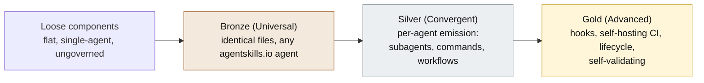

<a id="readme-top"></a>

<div align="center">

# [agent-skills-toolkit](https://github.com/product-on-purpose/agent-skills-toolkit)

**A toolkit and standard for building advanced, cross-agent skill libraries - Claude Code and Codex - to a tiered Bronze / Silver / Gold quality bar.**

Most skill collections are a flat, single-agent, ungoverned pile. This is the Standard that defines what a best-in-class, multi-agent skill library actually is, plus the portable tooling that authors components, grades a plugin against the Standard, and emits each component in the right format for each agent. The repository is built to its own Standard and self-validates at Gold in CI: it is meant to be the proof.

<p>
  <a href="#what-it-is"><strong>What it is</strong></a>
  &nbsp;&middot;&nbsp;
  <a href="#quick-start"><strong>Quick start</strong></a>
  &nbsp;&middot;&nbsp;
  <a href="#the-tier-model"><strong>Tiers</strong></a>
  &nbsp;&middot;&nbsp;
  <a href="#the-catalog"><strong>Catalog</strong></a>
  &nbsp;&middot;&nbsp;
  <a href="STANDARD.md"><strong>The Standard</strong></a>
  &nbsp;&middot;&nbsp;
  <a href="https://product-on-purpose.github.io/agent-skills-toolkit/"><strong>Live docs</strong></a>
</p>

<p>
  <a href="https://github.com/product-on-purpose/agent-skills-toolkit/issues/new?labels=bug">Report a Bug</a>
  &nbsp;&middot;&nbsp;
  <a href="https://github.com/product-on-purpose/agent-skills-toolkit/issues/new?labels=enhancement">Request a Feature</a>
  &nbsp;&middot;&nbsp;
  <a href="https://product-on-purpose.github.io/agent-skills-toolkit/">Read the Docs</a>
</p>

<p>
  
  <a href="LICENSE"></a>
  
  
  <a href="#the-catalog"></a>
  
  <a href="https://agentskills.io/specification"></a>
</p>

</div>

---

<details>
<summary><strong>Table of Contents</strong></summary>

- [What it is](#what-it-is)
- [Quick start](#quick-start)
- [What makes it different](#what-makes-it-different)
- [The tier model](#the-tier-model)
- [The catalog](#the-catalog)
- [Find your way in](#find-your-way-in)
- [Documentation](#documentation)
- [Status](#status)
- [Terminology](#terminology)
- [Repository map](#repository-map)

</details>

## What it is

`agent-skills-toolkit` is two things working together:

- **The [Advanced Skill Library Standard](STANDARD.md)** - a normative (RFC-2119) definition of what a best-in-class, multi-agent skill library is: components, conformance tiers, manifest, CI, and lifecycle.
- **The toolkit** - skills, subagents, and portable Node validators that author components, grade a plugin against the Standard, and emit each component in the right format for each target agent. The validators are zero-dependency and run anywhere Node 22.12+ does.

The path is a flat pile of skills becoming a coherent, versioned **plugin** that conforms to a defined quality bar and works across more than one agent.

| It is | It is not |
|---|---|
| A deterministic gate that grades a **whole library** at once and reports the tier it earns | A per-skill linter or a style guide |
| **Cross-agent**: one canonical `library.json`, emitted per agent (Claude Code and Codex) | A single-agent or Claude-only format |
| **Self-proving**: the repository validates itself against the Standard in CI | An aspirational spec with no reference implementation |
| A **grade** a plugin earns (Bronze / Silver / Gold) | A separate artifact you install |



## Quick start

The validation spine is live and zero-dependency. From a plugin's root:

```bash
node scripts/check.mjs
```

It prints the highest tier the plugin satisfies and exactly what blocks the next one:

```
Tier: Advanced (no blockers detected)

0 error(s), 0 warning(s).
```

`node scripts/tier-report.mjs --json` emits the same result as JSON for tooling (`{ "tier": "advanced", "satisfies": [...], "blocked": {} }`). The toolkit is not yet installable as a plugin; install and usage instructions will be documented as it becomes installable, with marketplace registration planned at the first Gold-tagged release (`v1.0.0`).

<div align="right">(<a href="#readme-top">back to top</a>)</div>

## What makes it different

Cross-agent emission is increasingly common. The defensible, less-occupied position is **grading a whole library, deterministically, against a tier you can climb and verify**:

- **Library-level, not per-unit.** The gate grades the entire plugin - manifest, components, cross-agent emission, CI, and lifecycle - not one skill in isolation. The unit of governance is the library.
- **Deterministic, not vibes.** A portable Node gate with real exit codes, not an LLM opinion. Judgment-based evaluation (behavioral and qualitative) exists too, but it sits **beside** the gate as opt-in evidence and never decides a pass or fail.
- **Tiered and climbable.** Bronze, Silver, Gold are monotonic: each includes everything below it. The tier report hands back a burndown that names exactly what blocks the next tier, so the climb is a worklist, not a guess.
- **Cross-agent by construction.** One authored `library.json` is the single source of truth; the native per-agent manifests are generated from it, so Claude Code and Codex stay in lockstep.
- **Self-proving.** The repository is the Gold-grade reference implementation of its own Standard, and it runs that Standard against itself in CI.

<div align="right">(<a href="#readme-top">back to top</a>)</div>

## The tier model

A bare folder of agentskills.io skills is just **loose components**: the skills work a la carte, but the collection is not yet a plugin. Adding a minimal `library.json` turns it into a **Bronze** plugin that parses and self-describes; **Silver** makes it emit cleanly across Claude and Codex; **Gold** makes it a self-proving reference that validates itself in CI. The tiers are monotonic by construction, so a Bronze plugin grows into Silver and Gold without rework: the bar rises, and the earlier work still counts.

| Tier | Name | What it certifies | Checks |
|---|---|---|---|
| **Bronze** | Universal | Identical files run unchanged on any agentskills.io-compliant agent | `U1-U11` |
| **Silver** | Convergent | The multi-agent machinery is emitted in the correct format for every target | `+ S1-S8` |
| **Gold** | Advanced | Deep lifecycle plus self-hosting CI: the plugin proves itself | `+ G1-G6` |

A tier is reported only when its checks actually pass; the tooling flags any claim above what is met. The spine is **25 checks** total (`U1-U11`, `S1-S8`, `G1-G6`); the Gold requirement `G7` is tier inclusion, satisfied structurally rather than by a separate check.

### Bronze (Universal)

> The plugin parses and self-describes with portable, agent-agnostic files that run unchanged on any agentskills.io-compliant agent.

- **Requires:** a minimal `library.json` carrying at least `name`, `version`, and `tier` (`U1`); valid agentskills.io skill anatomy and frontmatter, with a name that equals its directory (`U2`, `U3`, `U4`); a description that clears the what-plus-when-plus-trigger quality bar (`U5`); reference links that resolve (`U6`); an instruction-budget warning so context stays scarce (`U7`); native-manifest and version agreement and the house no-em-dash / no-en-dash rule (`U8`, `U9`, `U10`); and well-formed MCP entries that commit no secrets (`U11`). A root `AGENTS.md` entrypoint is part of the required anatomy.
- **Why it matters:** the manifest (`U1`) is the line between a reusable folder and a release unit that carries a version, so tooling can grade and version it. Frontmatter and name discipline make skills discoverable and unambiguous; the description bar protects the one signal an agent uses to decide relevance; the reference-link and budget rules keep context scarce and progressively disclosed, which is how frontier models actually follow instructions.
- **How it helps:** a Bronze plugin is installable and behaves the same on Claude Code, Codex, and the broader agentskills.io ecosystem at once - write once, run anywhere. It is the beginner on-ramp: the smallest commitment that turns a pile of skills into a gradeable, portable plugin, and the floor every higher tier builds on.

### Silver (Convergent)

> The plugin adds the multi-agent machinery - subagents, commands, workflows, chain contracts - emitted in the correct format for every agent it targets.

- **Requires:** declared `agent-targets` and a short component `prefix` carried by every component (`S1`, `S2`); a components index that mirrors what is on disk, in both directions (`S3`, `S8`); valid chain contracts in `agents/_chain-permitted.yaml` with no orphans or phantoms, and workflow steps that reference skills that exist (`S4`, `S5`); and per-target emission, with a native manifest and a command contract present for each declared target (`S6`, `S7`). Governance steps up too: per-component `HISTORY.md`, a `CHANGELOG`, and semver throughout.
- **Why it matters:** Claude and Codex support the same concepts in different file formats, so a single file cannot serve both - per-target emission (`S6`) is what keeps a plugin genuinely cross-agent instead of secretly Claude-only. The prefix (`S2`) stops generic names like `init` from colliding on agents that lack plugin namespacing. The index mirroring disk (`S3`, `S8`) keeps the manifest honest as the single source of truth, and chain contracts (`S4`) make inter-component calls explicit and safe rather than implicit.
- **How it helps:** a Silver plugin delivers the same intent across Claude and Codex with verified format parity and collision-proof names. It is the tier for real multi-component plugins - workflows, subagents, slash commands - that need to compose safely and ship to more than one agent.

### Gold (Advanced)

> The self-proving bar: deep lifecycle capability plus CI that validates the plugin against this Standard and passes.

- **Requires:** every hook documents its event, trigger, matcher, scope, and failure behavior (`G1`); the plugin ships self-hosting CI that runs the full tier-applicable gate and passes it (`G2`); each chain edge and hook carries at least one eval or regression case CI executes, so changing one component cannot silently break a consumer (`G3`); `INDEX.md` and the native manifests are generated from the authored sources and drift-checked, so a hand-edited generated file is an error (`G4`); a curated `RELEASE-NOTES.md` distinct from `CHANGELOG.md` (`G5`); and a deprecation policy with `status` / `deprecated-by` / `remove-in` that tooling recognizes (`G6`). `G7` is tier inclusion: all Bronze and Silver requirements.
- **Why it matters:** self-hosting CI (`G2`) closes the credibility loop - a Standard whose own reference plugin cannot pass its validators is not trustworthy, so the prover must be the proof. Regression coverage (`G3`) turns "changing X broke Y" from a surprise into a CI failure. Generating `INDEX` and the manifests from one authored source (`G4`) is what keeps the agent view and the human view from drifting apart at scale, and the release and deprecation rules (`G5`, `G6`) make a library's evolution legible and its removals safe.
- **How it helps:** a Gold plugin is a maintainable, best-in-class library that demonstrably conforms to the Standard. It is the tier this toolkit itself declares (`tier: advanced`) and passes against itself, with an empty blocked list as the proof. It is for maintainers running plugins at scale who need lifecycle guarantees: documented hooks, regression-protected chains, drift-free generated docs, and a disciplined release and deprecation story.

<div align="right">(<a href="#readme-top">back to top</a>)</div>

## The catalog

**23 skills, 7 subagents, 2 commands** on disk. Skills carry the `askit-` prefix and emit for both agents unless a one-liner notes a Claude-only output; subagents and commands are Claude-only. Full per-component reference lives in [`docs/reference/`](docs/reference/) and on the [live docs site](https://product-on-purpose.github.io/agent-skills-toolkit/); [`INDEX.md`](INDEX.md) is the generated map.

### Authoring (11)

The `askit-build-*` family scaffolds and improves each component type to the Standard.

| Component | What it does |
|---|---|
| **askit-build-skill** | Author or improve an agentskills.io `SKILL.md`, scaffold a skill directory, and raise its conformance and description quality. |
| **askit-build-subagent** | Create or improve a Claude subagent in `agents/<name>.md`, declaring tools and chain; the produced subagent is Claude-only. |
| **askit-build-command** | Create or improve a Claude slash command that maps to a skill, giving it an explicit `/command` entry point. |
| **askit-build-mcp** | Author or extend a portable `.mcp.json` server definition and wire the per-target `mcpServers` manifest pointer. |
| **askit-build-hook** | Add Advanced-tier event-driven hooks that guard tool or session events, inject context, and document failure behavior. |
| **askit-build-chain-contract** | Declare permitted inter-component invocations in `agents/_chain-permitted.yaml`; use to resolve `S4` orphan or phantom findings. |
| **askit-build-agents-md** | Author or sync `AGENTS.md`, the agent navigation entrypoint, aligning it with the component index and trimming overgrowth. |
| **askit-build-output-style** | Author or improve a Claude Code output style defining a response mode; the produced output style is Claude-only. |
| **askit-build-workflow** | Formalize a recurring multi-skill sequence as a `_workflows` file with ordered steps and exit criteria; resolves `S5` findings. |
| **askit-build-statusline** | Author a Claude Code status line script and wire its settings registration; the produced status line is Claude-only. |
| **askit-build-settings** | Author per-target settings and permissions, scope least-privilege allowlists, wire env vars, and register hooks. |

### Assessment (1)

Evaluating a skill or plugin against the Standard for conformance, behavior, and quality.

| Component | What it does |
|---|---|
| **askit-evaluate** | Audit a skill or plugin against the Standard in three modes: deterministic conformance plus tier, behavioral pass, and qualitative review. |

### Docs and samples (2)

Authoring documentation and the sample/eval sets that prove a skill behaves and triggers correctly.

| Component | What it does |
|---|---|
| **askit-build-docs** | Author or refresh docs across modes (readme, tutorial, reference, faq, and more) and stand up an Astro Starlight docs site. |
| **askit-build-samples** | Create and validate a skill's golden examples, anti-examples, and triggering cases, and detect drift against current behavior. |

### Governance and lifecycle (5)

Managing backlogs, decisions, releases, deprecations, and templates over a plugin's lifetime.

| Component | What it does |
|---|---|
| **askit-backlog** | Capture new-component proposals through the why-gate, prioritize backlog items, and prune stale or completed enhancements. |
| **askit-decision** | Record MADR architecture decision records and RFCs in `docs/internal`, plus the TL;DR companion for long decision docs. |
| **askit-release** | Cut a release: compute the version, promote the changelog, curate release notes, and run the readiness gate. |
| **askit-deprecate** | Record a component's deprecation (status, replacement, removal target) and keep deprecated components validating until removal. |
| **askit-template-manager** | Add or update the global templates directory and keep templates in sync with the shapes the scaffolders produce. |

### Onboarding and adoption (4)

Starting new plugins and marketplaces, migrating existing repos, and advising on targets and tier.

| Component | What it does |
|---|---|
| **askit-init-plugin** | Scaffold a new Bronze-anatomy plugin from scratch and onboard the maintainer via interview, questionnaire, or hybrid mode. |
| **askit-init-marketplace** | Stand up or validate a marketplace index that catalogs plugins, checking each entry, plugin reference, and version. |
| **askit-migrate** | Assess an existing skills repo against the Standard, write the minimal manifest, and produce a staged bring-to-conformance plan. |
| **askit-capability-advisor** | Report which component types a target agent can run and recommend a conformance tier before a plugin is built. |

### Subagents (7, Claude-only)

The bounded delegate roles the toolkit's skills invoke; each is Claude-only and cannot ship to Codex.

| Component | What it does |
|---|---|
| **askit-skill-author** | Author and improve agentskills.io skills to the Standard; the bounded delegate behind `askit-build-skill`. |
| **askit-evaluator** | Assess a skill or plugin against the Standard and report findings with remediation; the read-only role behind `askit-evaluate`. |
| **askit-reviewer** | Review a component or change for correctness, conformance, and quality, reporting findings with severity. |
| **askit-quality-grader** | Run a skill against its eval-set and grade the outputs; the opt-in LLM-judge behind `askit-evaluate`'s behavioral mode. |
| **askit-explorer** | Survey a repository broadly and report a structural map of its components and layout. |
| **askit-file-search** | Locate specific files, symbols, or text and report matching paths and lines. |
| **askit-file-ops** | Apply a specified set of file create and edit operations precisely; the bounded mutation role for authoring. |

### Commands (2, Claude-only)

The Claude slash commands that give the core flows an explicit `/command` entry point.

| Component | What it does |
|---|---|
| **/askit-evaluate** | Invoke the `askit-evaluate` skill to report per-rule findings, the tier, and remediation for a path. |
| **/askit-build-skill** | Invoke the `askit-build-skill` skill to scaffold a new `SKILL.md` or raise an existing skill's conformance. |

<div align="right">(<a href="#readme-top">back to top</a>)</div>

## Find your way in

| If you want to... | Start here |
|---|---|
| Understand what a best-in-class library is | [`STANDARD.md`](STANDARD.md) and [The tier model](#the-tier-model) |
| Grade a plugin you already have | `node scripts/check.mjs`, then read the burndown |
| Build your first skill | `askit-build-skill` (or the `/askit-build-skill` command) |
| Start a brand-new plugin | `askit-init-plugin` |
| Bring an existing skills repo up to the Standard | `askit-migrate` |
| See whether your agent supports a component type | `askit-capability-advisor` |
| Read the full reference | [`docs/`](docs/) and the [live docs site](https://product-on-purpose.github.io/agent-skills-toolkit/) |

<div align="right">(<a href="#readme-top">back to top</a>)</div>

## Documentation

- [`STANDARD.md`](STANDARD.md) - the normative Standard that every tool here enforces (component model, tiers, manifest schema, CI and release expectations, lifecycle).
- [Live docs site](https://product-on-purpose.github.io/agent-skills-toolkit/) - the published Diataxis docs (Astro Starlight, deployed to GitHub Pages).
- [`docs/`](docs/) - tutorials, how-to guides, per-component reference, and explanation in-repo.
- [`INDEX.md`](INDEX.md) - the generated human map of every component.
- [`AGENTS.md`](AGENTS.md) - the agent navigation entrypoint.

<div align="right">(<a href="#readme-top">back to top</a>)</div>

## Status

**Public `0.x` preview, Gold grade.** The repository declares `tier: advanced` and self-validates at Advanced in CI: the full gate is green and `tier-report` prints `advanced` with an empty burndown, so the toolkit is a self-proving example of the Standard it defines. Two Gold checks (`G1` hooks, `G6` deprecation) are currently satisfied without exercise, since the toolkit ships no hooks and no deprecated components yet; a demonstrative hook is a planned follow-up. The toolkit is **not yet installable**; marketplace registration is planned at the first Gold-tagged release (`v1.0.0`).

| | |
|---|---|
| **Version** | `0.3.0` (Standard `v0.8`) |
| **Tier** | Advanced (Gold), self-validated |
| **Components** | 23 skills, 7 subagents, 2 commands |
| **Validation spine** | 25 checks (`U1-U11`, `S1-S8`, `G1-G6`) |
| **Agents** | Claude Code and Codex; agentskills.io-compatible at Bronze |
| **License** | Apache-2.0 |
| **Docs site** | [product-on-purpose.github.io/agent-skills-toolkit](https://product-on-purpose.github.io/agent-skills-toolkit/) |

The Phase 0 Bronze bootstrap is historical context (see [`docs/internal/BOOTSTRAP.md`](docs/internal/BOOTSTRAP.md)).

<div align="right">(<a href="#readme-top">back to top</a>)</div>

## Terminology

The vocabulary is strict because two independent axes never mix.

- **Structure (what a thing physically is):** a *component* (the unit of reuse) sits inside a *plugin* (the unit of release, which carries the one version), which sits inside a *workspace*; a *marketplace* catalogs plugins for discovery and install.
- **Quality (how good a plugin is):** a *skill library* is the grade a plugin earns by conforming to this Standard (Bronze / Silver / Gold). It is a grade, not a separate artifact.

The path is **loose components into a plugin into a skill library**.

## Repository map

- [`STANDARD.md`](STANDARD.md) - the normative Standard.
- [`INDEX.md`](INDEX.md) - the generated map of the repository.
- [`AGENTS.md`](AGENTS.md) - the agent navigation entrypoint.
- [`scripts/`](scripts/) - the zero-dependency validation spine (`check.mjs`, `tier-report.mjs`), the per-check modules, and the manifest and index generators.
- [`skills/`](skills/), [`agents/`](agents/), [`commands/`](commands/) - the components.
- [`docs/`](docs/) - tutorials, how-to, reference, and explanation; [`docs/internal/`](docs/internal/) holds the design record, decisions, and backlog.
- [`CHANGELOG.md`](CHANGELOG.md) - release history.

## License

Apache-2.0. See [`LICENSE`](LICENSE).

<div align="center">

Built with purpose by [Product on Purpose](https://github.com/product-on-purpose).

</div>

<div align="right">(<a href="#readme-top">back to top</a>)</div>
