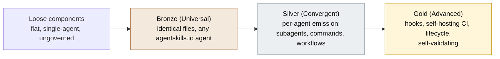

<a id="readme-top"></a>

<div align="center">

# [agent-skills-toolkit](https://github.com/product-on-purpose/agent-skills-toolkit)

**A toolkit and standard for building advanced, cross-agent skill libraries - Claude Code and Codex - to a tiered Bronze / Silver / Gold quality bar.**

Most skill collections are a flat, single-agent, ungoverned pile. This is the Standard that defines what a best-in-class, multi-agent skill library actually is, plus the portable tooling that authors components, grades a plugin against the Standard, and emits each component in the right format for each agent. The repository is built to its own Standard and self-validates at Gold in CI: it is meant to be the proof.

<p>
  <a href="#what-it-is"><strong>What it is</strong></a>
  &nbsp;&middot;&nbsp;
  <a href="#quick-start"><strong>Quick start</strong></a>
  &nbsp;&middot;&nbsp;
  <a href="#the-tiers"><strong>Tiers</strong></a>
  &nbsp;&middot;&nbsp;
  <a href="#the-catalog"><strong>Catalog</strong></a>
  &nbsp;&middot;&nbsp;
  <a href="STANDARD.md"><strong>The Standard</strong></a>
  &nbsp;&middot;&nbsp;
  <a href="https://product-on-purpose.github.io/agent-skills-toolkit/"><strong>Live docs</strong></a>
</p>

<p>
  <a href="https://github.com/product-on-purpose/agent-skills-toolkit/issues/new?labels=bug">Report a Bug</a>
  &nbsp;&middot;&nbsp;
  <a href="https://github.com/product-on-purpose/agent-skills-toolkit/issues/new?labels=enhancement">Request a Feature</a>
  &nbsp;&middot;&nbsp;
  <a href="https://product-on-purpose.github.io/agent-skills-toolkit/">Read the Docs</a>
</p>

<p>
  
  <a href="LICENSE"></a>
  
  
  <a href="#the-catalog"></a>
  
  <a href="https://agentskills.io/specification"></a>
</p>

</div>

---

<details>
<summary><strong>Table of Contents</strong></summary>

- [What it is](#what-it-is)
- [Quick start](#quick-start)
- [The tiers](#the-tiers)
- [What makes it different](#what-makes-it-different)
- [The catalog](#the-catalog)
- [The Standard](#the-standard)
- [Status](#status)
- [Terminology](#terminology)
- [Repository map](#repository-map)

</details>

## What it is

`agent-skills-toolkit` is two things working together:

- **The [Advanced Skill Library Standard](STANDARD.md)** - a normative (RFC-2119) definition of what a best-in-class, multi-agent skill library is: components, conformance tiers, manifest, CI, and lifecycle.
- **The toolkit** - skills, subagents, and portable Node validators that author components, grade a plugin against the Standard, and emit each component in the right format for each target agent. The validators are zero-dependency and run anywhere Node 20+ does.

The path is a flat pile of skills becoming a coherent, versioned **plugin** that conforms to a defined quality bar and works across more than one agent.



## Quick start

The validation spine is live and zero-dependency. From a plugin's root:

```bash
node scripts/check.mjs
```

It prints the highest tier the plugin satisfies and exactly what blocks the next one. `node scripts/tier-report.mjs --json` emits the same result as JSON for tooling. The toolkit is not yet installable as a plugin; install and usage instructions will be documented as it becomes installable, with marketplace registration planned at the first Gold-tagged release (`v1.0.0`).

## The tiers

| Tier | Name | What it means |
|---|---|---|
| Bronze | Universal | Identical files work across all agentskills.io-compliant agents (skills, `AGENTS.md`, MCP definitions). |
| Silver | Convergent | Concepts both agents support but in different formats (subagents, commands, workflows, chain contracts), emitted per agent target. |
| Gold | Advanced | Deep, lifecycle, often agent-specific capability (hooks, output styles, self-hosting CI), self-validating. |

Higher tiers include all lower-tier requirements. The tooling reports the highest tier a plugin actually satisfies and lists exactly what blocks the next one. The validation spine is **25 checks**: Bronze `U1-U11`, Silver `S1-S8`, Gold `G1-G6` (the Gold requirement `G7` is tier inclusion, satisfied structurally rather than by a separate check).

## What makes it different

Two things, working together, that a flat skill collection does not give you:

- **Cross-agent support.** Components are emitted for Claude Code and Codex from one canonical `library.json`, and remain agentskills.io-compatible at the base tier (around 50 agents). One source of truth, the right format per agent.
- **A tiered quality standard you can climb and verify.** Not a style guide and not a per-skill linter: a deterministic gate that grades a whole library at once and tells you precisely what to fix to reach the next tier.

## The catalog

On disk: **23 skills, 7 subagents, 2 commands.** By role:

- **Authoring** - `askit-build-skill`, `askit-build-subagent`, `askit-build-command`, `askit-build-mcp`, `askit-build-hook`, `askit-build-workflow`, `askit-build-chain-contract`, `askit-build-agents-md`, `askit-build-output-style`, `askit-build-statusline`, `askit-build-settings`.
- **Assessment** - `askit-evaluate` (deterministic conformance plus opt-in behavioral and review modes), backed by the `askit-evaluator`, `askit-quality-grader`, and `askit-reviewer` subagents.
- **Docs and samples** - `askit-build-docs`, `askit-build-samples`.
- **Governance and lifecycle** - `askit-backlog`, `askit-decision`, `askit-release`, `askit-deprecate`, `askit-template-manager`.
- **Onboarding and adoption** - `askit-init-plugin`, `askit-init-marketplace`, `askit-migrate`, `askit-capability-advisor`.
- **Judgment subagents (Claude-only)** - `askit-skill-author`, `askit-explorer`, `askit-file-search`, `askit-file-ops`.

See [`INDEX.md`](INDEX.md) for the full, generated map of every component.

## The Standard

[`STANDARD.md`](STANDARD.md) is the normative source of truth that every tool here enforces. It defines the component model (skills, commands, subagents, hooks, workflows, chain contracts, MCP servers), the conformance tiers and exactly what each requires, the `library.json` manifest schema, the CI and release expectations, and the component lifecycle (versioning, history, deprecation). It targets Claude Code and Codex as first-class agents and remains a strict superset of agentskills.io at the Universal tier.

## Status

**Public `0.x` preview, Gold grade.** The repository declares `tier: advanced` and self-validates at Advanced in CI: the full gate is green and `tier-report` prints `advanced` with an empty burndown, so the toolkit is a self-proving example of the Standard it defines. It is **not yet installable**; marketplace registration is planned at the first Gold-tagged release (`v1.0.0`). The Phase 0 Bronze bootstrap is historical context (see [`docs/internal/BOOTSTRAP.md`](docs/internal/BOOTSTRAP.md)).

## Terminology

The vocabulary is strict because two independent axes never mix.

- **Structure (what a thing physically is):** a *component* (the unit of reuse) sits inside a *plugin* (the unit of release, which carries the one version), which sits inside a *workspace*; a *marketplace* catalogs plugins for discovery and install.
- **Quality (how good a plugin is):** a *skill library* is the grade a plugin earns by conforming to this Standard (Bronze / Silver / Gold). It is a grade, not a separate artifact.

The path is **loose components into a plugin into a skill library**.

## Repository map

- [`STANDARD.md`](STANDARD.md) - the normative Standard.
- [`INDEX.md`](INDEX.md) - the generated human map of the repository.
- [`AGENTS.md`](AGENTS.md) - the agent navigation entrypoint.
- [`docs/`](docs/) - tutorials, how-to guides, reference, and explanation (also published to the [live docs site](https://product-on-purpose.github.io/agent-skills-toolkit/)).
- [`docs/internal/DESIGN.md`](docs/internal/DESIGN.md) - the consolidated design and decision record.
- [`CHANGELOG.md`](CHANGELOG.md) - release history.

<div align="right">(<a href="#readme-top">back to top</a>)</div>
