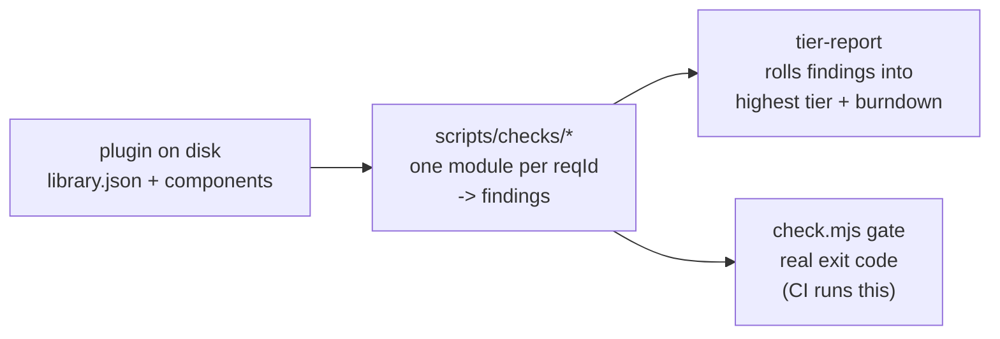
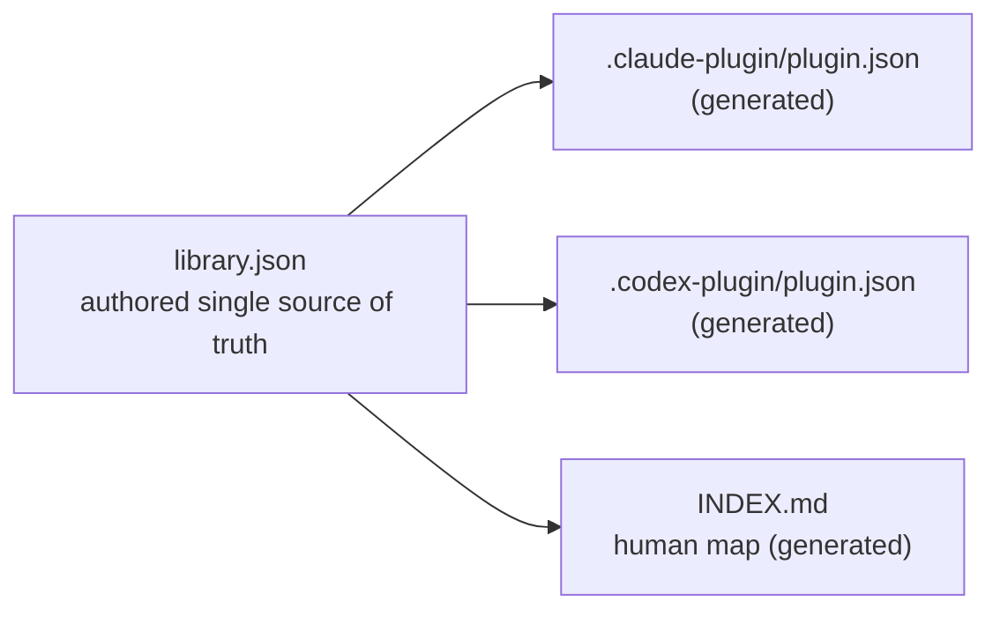

# Architecture overview

This page is a conceptual map of how `agent-skills-toolkit` is put together: the two halves it ships, the deterministic gate that grades a plugin, the judgment layer that sits beside that gate, the single source of truth that feeds every agent, and the monotonic tier model the whole thing climbs. It stays at the level of ideas and relationships. For the file-by-file mechanics - the script entrypoints, the check-module contract, the loader, and the generators - read the detailed companion: [Architecture internals](./architecture-internals.md).

## Two halves: the Standard and the toolkit

The project is two things working together.

- **The Advanced Skill Library Standard** ([`STANDARD.md`](../../STANDARD.md)) is a normative (RFC-2119) definition of what a best-in-class, multi-agent skill library is: its components, its conformance tiers, its manifest, its CI and release expectations, and its lifecycle. It is the bar, written down. It does not run; it specifies.

- **The toolkit** is the implementation that lives up to that specification: skills and subagents that author every component type, plus portable, zero-model Node validators that grade a plugin against the Standard and emit each component in the right format for each target agent (Claude Code and Codex). The validators run anywhere Node 22.12+ runs, with a YAML parser as their only runtime dependency.

The relationship is deliberate: the toolkit is the Standard's reference implementation, and the repository validates itself against its own Standard in CI. A specification whose own reference plugin cannot pass its validators is not trustworthy, so the prover has to be the proof. That self-hosting loop (the Gold check `G2`) is the architectural keystone everything else hangs from.

## The deterministic gate

The grading core is a gate, not an opinion. It is built so that a real exit code - not a model's prose - decides what tier a plugin has earned.

- **`check.mjs` is the gate runner.** It loads the plugin, runs every check, filters the findings by the plugin's declared tier, and exits non-zero if any blocking error remains. This is the thing CI invokes.
- **`scripts/checks/` holds the check modules.** Each module is small and single-purpose: it backs exactly one requirement id from the Standard (for example `U5`, the description-quality rule) and returns a list of findings, each a `error` or `warn` carrying the offending file and a remediation hint. The modules are pure functions over a loaded plugin; they do no I/O of their own beyond reading what the loader already gathered.
- **`tier-report.mjs` rolls the findings up.** It groups errors by the tier their requirement belongs to, accumulates the tiers that have zero errors, and reports the highest tier the plugin fully satisfies plus a `blocked` list naming exactly what stands between it and the next rung. That `blocked` list is the actionable payload: a worklist to the next tier, not just a grade.

The spine is **29 checks** total - `U1-U9`, `U11-U12` (Universal), `S1-S8` (Convergent), and `G1-G10` (Advanced); the `G7` slot is the `docs-frontmatter` check (Standard v0.10), and tier inclusion of Bronze and Silver is a structural property of the monotonic tiers, not a numbered check. Both a machine-readable form (`node scripts/tier-report.mjs --json`) and a one-line human summary come out of the same computation, so tooling and a person read the same verdict.

Why a gate at all, rather than only a skill that presents a grade. A model can describe conformance, but only a deterministic gate with an exit code can run in CI and let a plugin prove itself unattended. The grading **skill** (`askit-evaluate`, also `/askit-evaluate`) is the door; the **script** is the engine. Both run the same checks, and only the script is gate-safe.

## The judgment layer, beside the gate

Some questions a deterministic check cannot answer. Does this skill actually trigger on the queries it should, and stay silent on the ones it should not? Is this component well-named, at the right altitude, and warranted at all? Those are judgment calls, and the toolkit answers them in a separate layer that sits **beside** the gate and never decides pass or fail.

`askit-evaluate` has three modes. The default, **conformance**, is the deterministic core above - it runs the portable scripts and returns the per-rule report and the tier. The other two are opt-in, LLM-judged passes:

- **behavioral** runs a skill against its eval-set and judges whether it fires and behaves correctly, delegating to the `askit-quality-grader` subagent.
- **review** forms a qualitative judgment about correctness, altitude, naming, and whether a component is warranted, delegating to the `askit-reviewer` subagent.

The boundary is load-bearing. Conformance is what CI gates on; behavioral and review produce **evidence**, never a CI result. This is the architectural expression of "deterministic, not vibes": judgment-based evaluation is genuinely useful and the toolkit ships it, but it is opt-in evidence alongside the gate, not a hidden input to the pass/fail decision. The Standard's Gold requirement `G3` asks only for the deterministic baseline - eval cases present and executed in CI - and explicitly defers the richer judging engine to roadmap, which is why the judgment layer is structured as evidence rather than as a second gate.

## One source of truth, emitted per agent

The toolkit is cross-agent by construction, and the mechanism is a single authored manifest.

`library.json` is the **single source of truth** for a plugin's cross-agent metadata: its name, version, declared tier, agent targets, component prefix, and component index. It is authored, not generated. From it, the toolkit generates the agent-native manifests - Claude Code's `.claude-plugin/plugin.json` and Codex's `.codex-plugin/plugin.json` - rather than hand-maintaining the same facts in parallel across schemas the Standard does not own.

Two consequences follow. First, Claude and Codex stay in lockstep: the same intent is emitted in each agent's own format, so a plugin is genuinely cross-agent instead of secretly single-agent. (Some components are agent-specific by nature - subagents, output styles, and the statusline are Claude-only under the current Codex plugin model - and that asymmetry is declared, not hidden.) Second, the generated artifacts are **drift-checked** against their authored source: a hand-edited generated manifest or `INDEX.md` is an error (the Gold check `G4`), because the agent view and the human view must never silently diverge.

## The monotonic tier model

The grading model is a ladder of three rungs - Bronze (Universal), Silver (Convergent), Gold (Advanced) - and they are **monotonic**: each tier includes every requirement of the tiers below it.

- **Bronze / Universal** certifies portable, identical files: valid skill anatomy, a minimal `library.json`, a root `AGENTS.md`, and descriptions that clear the discoverability bar. It is the start line, and it runs unchanged on any agentskills.io-compliant agent.
- **Silver / Convergent** adds the multi-agent machinery - subagents, commands, workflows, chain contracts - emitted per target, with declared `agent-targets` and a component prefix that keeps generic names from colliding.
- **Gold / Advanced** adds the self-proving layer: documented hooks, self-hosting CI, regression coverage for chains and hooks, drift-checked generated docs, and a release and deprecation story.

Monotonicity is what makes the climb safe. A beginner's first Bronze plugin is the exact foundation the advanced track builds on, so nobody starts over - the bar rises and the earlier work still counts. It is also why the burndown is meaningful: because the tiers nest, `tier-report` can cap the satisfied tier at what a plugin declares (so it cannot over-claim) and list everything above that ceiling as the blocked worklist to the next rung. A plugin adding Silver requirements gradually watches its `blocked.convergent` list shrink while CI stays green throughout.

## Self-hosting CI

The pieces close into a loop. The repository declares `tier: advanced`, ships the gate as portable scripts, and runs that gate against itself in CI. When the full check suite is green, `tier-report` prints `advanced` with an empty `blocked` list - the toolkit grading itself at the top of its own ladder.

Local and CI runs are identical by design: the CI configuration contains no validation logic of its own and only shells out to the portable scripts, so any failure a contributor sees in CI reproduces locally with the same command. This is the architecture justifying the README's central claim - a portable gate, not an LLM opinion - and it is why "self-proving" is a structural property of the repository rather than a marketing line.

## Where to go next

- For the concrete file-by-file mechanics - script entrypoints, the check-module contract, the plugin loader, and the generators - read [Architecture internals](./architecture-internals.md).
- For the tier rules in depth, see [Conformance and tiers](./conformance-and-tiers.md) and the normative [`STANDARD.md`](../../STANDARD.md).
