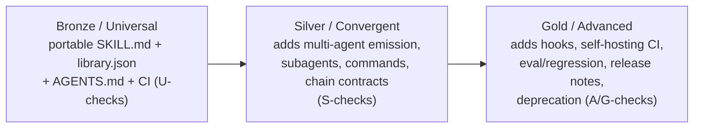

# Explanation: conformance and tiers

The toolkit grades a plugin against the Advanced Skill Library Standard. Checks emit
`error` or `warn` findings keyed to requirement ids (for example `U5` is the
description-quality rule). `evaluate` composes those checks into a report;
`tier-report` rolls them into the highest tier a plugin satisfies, capped at the
tier it declares in `library.json` so it cannot over-claim.

A description scoring below 0.7 is a warning, never an error - quality is judgment,
so the heuristic guides rather than gates. The tiers (Universal / Convergent /
Advanced, or Bronze / Silver / Gold) are cumulative: each includes the last. That is
why a Bronze plugin can grow into Silver and Gold without rework - the bar rises,
the earlier work still counts.

Each tier is cumulative: Silver includes every Universal check, Gold includes every Silver check. `tier-report` reports the highest tier a plugin fully satisfies and lists what blocks the next.

The toolkit is itself built to this Standard and validates itself in CI: it declares
`tier: advanced` and satisfies Gold (G1-G10, on top of Bronze + Silver), so `node scripts/tier-report.mjs --json`
reports `tier: advanced` with an empty `blocked` - a self-proving example of the Standard. See
[`STANDARD.md`](../../STANDARD.md) for the normative rules.

## Silver checks (added in Phase 3A)

Convergent (Silver) reqIds carry the `S` prefix. The current set:

| reqId | What | Standard | Conditional? |
|---|---|---|---|
| S1 | `library.json` `agent-targets` present + valid | sec 5.1, sec 2.2 | no |
| S2 | `library.json` `prefix` present + kebab-dash | sec 8.2 | no |
| S3 | `library.json` `components` index matches disk | sec 5.1, sec 10.3 | no |
| S4 | Chain-contract integrity (phantom; missing-when-chaining) | sec 3.6 | yes |
| S5 | Workflow skill-existence | sec 3.4 | yes |
| S6 | Per-target native-manifest presence | sec 5.1, sec 10.1 | yes |
| S7 | Command-contract (maps-to resolves to one skill/workflow; description present) | sec 3.2 | yes |
| S8 | Components index mirrors what is on disk, in both directions (no orphan or phantom entries) | sec 5.1 | no |

Two Universal checks were added in the v0.2 hardening: **U9** (`version-match`: `package.json` version must equal `library.json` version, the source of truth) and **U10** (`no-dashes`: the house no-em-dash / no-en-dash rule, now CI-enforced for every contributor, not only a local hook).

S6 (per-target native-manifest presence) fires only when `agent-targets` is declared; it checks that each declared target has its generated native manifest on disk. The repository declares `agent-targets: ["claude", "codex"]` and emits both manifests. The `components` index (S3) is now present in `library.json`, so the Silver burndown is empty; the toolkit has since closed the Gold checks (G1-G10) too and declares `tier: advanced`.

## Visible burndown - reading `blocked.convergent` as the climb to Silver

`tier-report` caps `satisfies` at the plugin's declared tier (so a Bronze plugin cannot accidentally claim Silver), and lists everything above the ceiling as `blocked.<next-tier>`. The gate-runner (`check.mjs`) follows the same model: only errors at-or-below the declared tier fail the gate. So a Bronze plugin that adds Silver requirements gradually sees its `blocked.convergent` list shrink, while CI stays green throughout the climb. The repository completed the full climb to Gold: the toolkit now declares `tier: advanced` and `blocked` is empty (Bronze, Silver, and Gold all satisfied). The Gold checks (G1-G10) are documented in [`../reference/gold-checks.md`](../reference/gold-checks.md).
