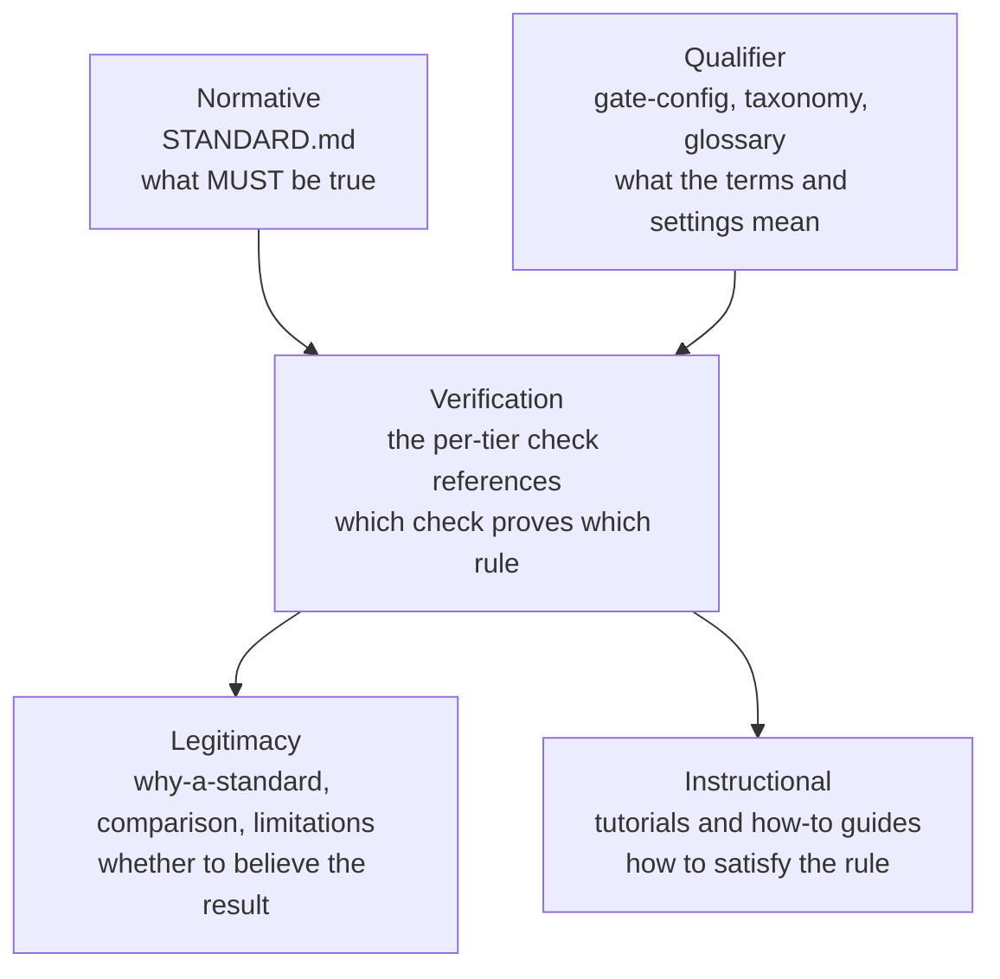

# The document map

There are two ways to find something here. [Reading paths](reading-paths.md) routes you by
**who you are**: pick the reader that sounds like you and follow the sequence. This page
routes you by **what you want to know**: find your question, go to the one document that
answers it.

If you are looking for a *component* rather than a document, the generated
[`INDEX.md`](../../INDEX.md) lists every skill, subagent, hook, and command the plugin
ships, with a one-line description each.

## The five kinds of document

Nearly every page here is doing one of five jobs. Knowing which job a page does tells you
what kind of answer to expect from it, and what it is not going to give you.

| Kind | It answers | It does not |
|---|---|---|
| **Normative** | What MUST be true, in RFC-2119 language | Persuade you, or tell you how |
| **Verification** | Which check proves it, and what a failure means | Argue about whether the rule is right |
| **Legitimacy** | Why the result is worth believing, and where it is weak | Define anything |
| **Qualifier** | What the words and settings around a result mean | Grade anything |
| **Instructional** | How to actually do it | Justify the requirement |

A rule with no check behind it is an aspiration. A check with no honest account of its
limits is a number you cannot act on. That is why all five layers exist rather than just
the first.

---

## 1. What is required

| Your question | Go to | Kind |
|---|---|---|
| What do Bronze, Silver, and Gold actually require? | [`STANDARD.md`](../../STANDARD.md) sec 2 | Normative |
| The same thing, in plain language | [Conformance and tiers](conformance-and-tiers.md) | Normative |
| What must a skill, command, subagent, hook, or MCP server contain? | [`STANDARD.md`](../../STANDARD.md) sec 3 | Normative |
| What fields belong in `library.json`? | [`STANDARD.md`](../../STANDARD.md) sec 5.1 | Normative |
| What does a plugin's directory layout look like? | [`STANDARD.md`](../../STANDARD.md) sec 10 | Normative |
| How do I read the report the tools produce? | [Evaluation reports](../reference/evaluation-reports.md) | Reference |

The tiers are cumulative, so nothing done for Bronze is rework at Silver or Gold. Section
2.6 of the Standard freezes the Gold criteria as ten testable requirements rather than
aspirations, and names what each is satisfied by.

## 2. What backs a claim

A tier is only as good as the checks under it. These pages break the spine down check by
check, so any single finding can be traced to the rule that produced it.

| Your question | Go to | Kind |
|---|---|---|
| What are the Bronze checks? | [Universal checks](../reference/universal-checks.md) | Verification |
| What are the Silver checks? | [Silver checks](../reference/silver-checks.md) | Verification |
| What are the Gold checks? | [Gold checks](../reference/gold-checks.md) | Verification |
| A check failed and I do not understand why | [Troubleshoot the gate](../how-to/troubleshoot-the-gate.md) | Instructional |
| How do I know the grader itself is any good? | [How the toolkit is validated and improved](validation-and-improvement.md) | Legitimacy |
| What does the toolkit score against itself? | [`INDEX.md`](../../INDEX.md) header, and `npx agent-skills-toolkit tier-report --json` | Verification |

The strongest single piece of evidence is that the toolkit is graded by its own gate at the
top tier and would fail its own build if it slipped. [Validation and
improvement](validation-and-improvement.md) explains that argument and its limits, including
how a surprising finding gets verified by hand before any check is "fixed".

## 3. Whether to believe it

| Your question | Go to | Kind |
|---|---|---|
| Why bother with a standard at all? | [Why a standard, and what it delivers](why-a-standard.md) | Legitimacy |
| How does this compare to other tools in the space? | [How agent-skills-toolkit compares](comparison.md) | Legitimacy |
| What does this **not** do, and where is it known to be wrong? | [What this toolkit cannot do](limitations.md) | Legitimacy |
| Quick answers to the obvious objections | [FAQ](faq.md) | Legitimacy |
| How is the toolkit built, and why that way? | [Architecture](architecture.md), then [Architecture internals](architecture-internals.md) | Legitimacy |

Read [limitations](limitations.md) before you rely on a grade for anything that matters. It
is the page that says which limits are deliberate and which are simply not built yet, and
it is deliberately unflattering.

## 4. What the qualifiers mean

A result carries more than a tier. These pages define the words attached to it.

| Your question | Go to | Kind |
|---|---|---|
| What do `error` and `warn` mean, and what actually fails CI? | [Gate configuration](../reference/gate-config.md) | Qualifier |
| What is a profile, a suppression, or a Standard version pin? | [Gate configuration](../reference/gate-config.md) | Qualifier |
| Why did a check not run against my plugin at all? | [`STANDARD.md`](../../STANDARD.md) sec 4.5, and the conditional column in the per-tier check pages | Qualifier |
| Why is a brand new rule only a warning? | [`STANDARD.md`](../../STANDARD.md) sec 7.7 | Qualifier |
| What frontmatter must a docs page carry? | [Docs frontmatter taxonomy](../reference/frontmatter-taxonomy.md) | Qualifier |
| A document used a word I do not know | [Glossary](glossary.md) | Qualifier |
| What will an advisory run cost me in tokens? | [Token usage estimates](../reference/token-usage-estimates.md) | Qualifier |

Three qualifiers do most of the work and are easy to miss. **Conditional** checks fire only
when the plugin has the thing being checked, so absence is not failure. The **declared tier**
is a ceiling: the gate fails only on errors at or below the tier you claim, which is what
lets a plugin climb without ever shipping a red build. And a new requirement ships as a
**warning for one minor version** before it gates, so a check exists before it can break
anyone.

## 5. How to do the work

Learning, in order, from nothing:

| Step | Go to |
|---|---|
| Install it and grade something | [Quick start](../../QUICKSTART.md) |
| Scaffold a plugin and earn Bronze | [Start a plugin and reach Bronze](../tutorials/start-a-plugin-and-reach-bronze.md) |
| Turn an idea into a conformant skill | [Build your first skill](../tutorials/build-your-first-skill.md) |
| Walk all three tiers end to end | [Climb a plugin from Bronze to Gold](../tutorials/climb-to-gold.md) |

Task-shaped recipes, grouped by the job in front of you:

| Job | Guides |
|---|---|
| **Start something** | [Scaffold a plugin](../how-to/scaffold-a-plugin.md), [adopt a foreign repo](../how-to/adopt-a-foreign-repo.md), [stand up a marketplace](../how-to/stand-up-a-marketplace.md), [stand up a docs site](../how-to/stand-up-a-docs-site.md) |
| **Build a component** | [Skill](../how-to/build-and-evaluate-a-skill.md), [AGENTS.md](../how-to/build-agents-md.md), [command](../how-to/build-a-command.md), [subagent](../how-to/build-a-subagent.md), [workflow](../how-to/build-a-workflow.md), [chain contract](../how-to/build-a-chain-contract.md), [hook](../how-to/build-a-hook.md), [MCP server](../how-to/build-an-mcp-server.md), [status line](../how-to/build-a-statusline.md), [output style](../how-to/build-an-output-style.md), [settings](../how-to/build-settings.md), [samples](../how-to/build-samples.md) |
| **Climb a tier** | [Choose agent targets](../how-to/choose-agent-targets.md), [emit for multiple agents](../how-to/emit-for-multiple-agents.md), [Bronze to Silver](../how-to/climb-from-bronze-to-silver.md), [add eval coverage](../how-to/add-eval-coverage.md), [troubleshoot the gate](../how-to/troubleshoot-the-gate.md) |
| **Operate a plugin** | [Cut a release](../how-to/cut-a-release.md), [record a decision](../how-to/record-a-decision.md), [manage the backlog](../how-to/manage-the-backlog.md), [deprecate a component](../how-to/deprecate-a-component.md), [manage templates](../how-to/manage-templates.md), [manage several plugins](../how-to/manage-multiple-plugins.md), [watch the upstream spec](../how-to/watch-the-upstream-spec.md) |

Every skill also has a one-page reference at `docs/reference/askit-*.md` describing its
modes and inputs. Go there when you already know which skill you want. The shared shape all
of them follow is described in [the builder pattern](../reference/builder-pattern.md).

---

## What is not catalogued here

This map covers the published documentation. Two other bodies of writing exist and are
deliberately left out:

**Working documents** live under `docs/internal/`: the competitive research and its
verification methodology, the evaluation-run records that calibrate the checks, the numbered
decision records, the two backlogs, and the release plans. They are in the repository and
you are welcome to read them, but they are working notes, dated and sometimes superseded.
Where their conclusions matter to a reader, a published page carries the conclusion and
links down to the source: [comparison](comparison.md) does this for the research,
[validation and improvement](validation-and-improvement.md) for the evaluation runs, and
[limitations](limitations.md) for the known-weak spots.

**Repository conventions** live at the root: [`README.md`](../../README.md) for positioning,
[`AGENTS.md`](../../AGENTS.md) for agent-facing navigation,
[`CHANGELOG.md`](../../CHANGELOG.md) for the full change history, and
[`RELEASE-NOTES.md`](../../RELEASE-NOTES.md) for the curated user-facing account of each
release.

## How current this page is

The folder inventories and the published site routes are checked mechanically, so a page
cannot exist without being listed somewhere. This page is different: nothing gate-checks
whether the descriptions above still match what each document says. If a row here sends you
somewhere that does not answer the question, that is a bug worth reporting, and the row is
wrong rather than the document.

## See also

- [Reading paths](reading-paths.md) - the same documents, routed by reader instead of question
- [Glossary](glossary.md) - the vocabulary these pages assume
- [`INDEX.md`](../../INDEX.md) - the generated component index, for skills rather than documents
