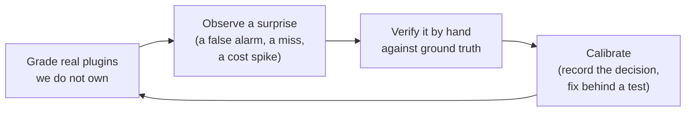

# How the toolkit is validated and improved

A tool that grades quality invites one fair question: how do you know the grader itself is any good? This page answers it. There are two answers, and together they are the toolkit's strongest claim to trust.

1. **It grades itself, at the top of its own scale, on every change.**
2. **It gets better by grading real plugins it does not own, and turning what it learns into recorded, tested improvements.**

Neither is a marketing claim. Both are mechanical, and both leave evidence you can inspect.

## 1. It grades itself (and would fail its own build if it slipped)

The toolkit defines a standard with three tiers (Bronze, Silver, Gold) and a grade for each. It then holds *itself* to the highest tier. Its own configuration declares `tier: advanced` (Gold), and its continuous-integration build runs its own gate against its own files on every commit. If the toolkit ever stopped meeting its own top bar, its build would go red and the change could not merge.

**Why this matters (plainly).** It is the difference between a restaurant critic who eats their own cooking and one who does not. The toolkit cannot quietly hold others to a standard it fails itself, because the same gate that grades your plugin grades the toolkit first, automatically, with no human in the loop to look the other way.

**For engineers.** This is dogfooding enforced as a release gate. `node scripts/check.mjs .` exits non-zero on any error, the build requires it, and the suite of 400-plus tests includes a self-conformance check. The Gold checks (`G1`-`G10`) are non-vacuous: they grade real artifacts (a real hook, generated index, release notes, source docblocks), not empty placeholders. "Self-validating at Gold, 0 errors, 0 warnings" is a build status, not a brochure line.

## 2. It improves by grading the real world

A gate that only ever grades its author's own work will slowly drift into grading *that author's habits* rather than portable quality. The toolkit closes that gap by regularly pointing itself at real third-party skill libraries it did not write, and treating every surprising result as a signal about the grader, not a verdict on the target.

This is the **eval-run loop**, and it follows one disciplined path:

The middle step is the one that protects everything else: **verify before you change anything.** A surprising result is a lead, not a conclusion. We confirm it against an authoritative source (the file on disk, the published spec, how the page actually renders) before touching the grader.

**Why this matters (plainly).** Pointing a quality tool only at your own work is like proofreading only your own writing. You stop seeing your blind spots. Reading other people's writing is what surfaces them. The toolkit does this on purpose, on a schedule, and writes down what it finds.

**For engineers.** Each run is recorded with its target (pinned to a commit), the model and effort used, the measured token cost, and the findings, in a tracked evaluation-run record. Findings that warrant a change become an ADR plus a test-first fix; findings that do not are recorded with the reason. A calibration changes *how* a check fires, never *what* the standard requires, so a plugin graded the default way never moves.

### A real example of why "verify first" is not optional

During one batch, a high-effort AI review confidently declared eleven flagged broken links to be false alarms and recommended weakening the link checker. Verifying by hand against how links actually resolve showed the opposite: the links genuinely broke, and the checker was right. Acting on the AI's confident-but-wrong recommendation would have *removed* a working safeguard. That near-miss is now a written rule: an AI's judgment about the grader is itself only advice, and advice is verified before it becomes a change.

## 3. The line that keeps grades trustworthy

The toolkit has two layers, and the separation between them is deliberate.

- **The deterministic core** produces the grade. It runs no AI model, so it is free, fast, and reproducible: the same plugin at the same commit gets the same verdict every time, on anyone's machine.
- **The optional AI layer** adds advice (a qualitative review, a behavioral read). It can never move the grade or the pass/fail result. Choosing a cheaper or faster model there changes the *quality of the advice*, never the verdict.

**Why this matters (plainly).** The number that decides pass or fail is never at the mercy of a model having a good or bad day. AI is used where judgment genuinely helps (is this description well written? is this skill warranted?) and kept away from the part that must be dependable. You get the best of both without the AI's variability leaking into the grade.

## What this has delivered

The eval-run loop is not theoretical. Recent releases came directly out of it:

- **Grade a plugin you do not own, honestly (v1.5.0).** A single flag grades a third-party plugin on portable correctness only, without imposing the toolkit's house conventions. Pointed at a large public library, the result dropped from a wall of "you are missing our scaffolding" noise to the one finding that was a real defect.
- **Fewer false alarms on well-built plugins (v1.5.1-v1.5.2).** Several checks were recalibrated against real corpora so that good work stops collecting cosmetic warnings. The description-quality check alone went from flagging strong descriptions in bulk to flagging only the genuinely weak ones, measured across five real libraries.
- **Honest, measured costs (v1.5.1-v1.5.2).** A reference page now states what an evaluation costs in plain numbers: the grade and the report are free, and only the optional AI review uses a model, with the tradeoffs measured rather than guessed.

**The value, in one line.** You can trust the grade because the grader passes its own top bar on every build, and you can trust that the grader keeps improving because it learns from real plugins under a discipline that verifies before it changes anything.

## See also

- [Conformance and tiers](conformance-and-tiers.md) - how the grade and the Bronze/Silver/Gold tiers work.
- [How agent-skills-toolkit compares](comparison.md) - where it sits among other skill and plugin tools.
- [Token usage estimates](../reference/token-usage-estimates.md) - the measured cost of the deterministic core versus the optional AI layer.
