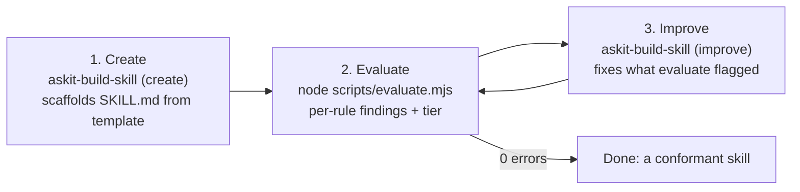

# How to build and evaluate a skill

A walkthrough of the core loop: create a skill, evaluate it, improve it.

## 1. Create

Invoke `askit-build-skill` (create mode). It asks for the name, what the skill
does, when to use it, and trigger keywords, then scaffolds `skills/<name>/SKILL.md`
from the template (`templates/SKILL.md`).

## 2. Evaluate

Run the assessment:

    node scripts/evaluate.mjs skills/<name>

You get per-rule findings, and - for a whole plugin - the tier and what blocks the
next one. A single skill directory is assessed at the component level (the
skill-applicable rules only; no tier, since a lone component has no manifest).

## 3. Improve

Invoke `askit-build-skill` (improve mode). It reads the evaluate report and fixes
what it flags - tightening the description, adding samples, or moving depth into
`references/`.

Repeat evaluate until the report is clean (`0 error(s)`).

## See also

- [`askit-evaluate` reference](../reference/askit-evaluate.md)
- [`askit-build-skill` reference](../reference/askit-build-skill.md)
- [Conformance and tiers](../explanation/conformance-and-tiers.md)
