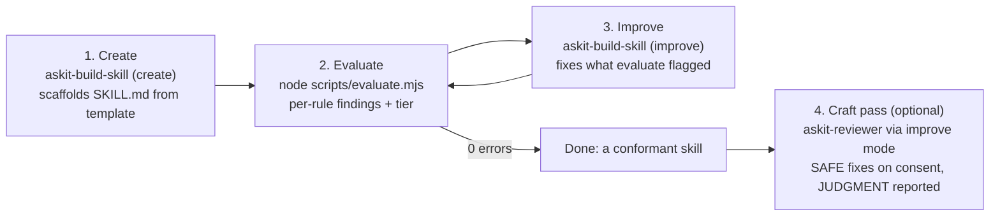

# How to build and evaluate a skill

A walkthrough of the core loop: create a skill, evaluate it, improve it, and optionally
run the craft pass once it is clean.

```mermaid
flowchart LR
  C["1. Create<br/>askit-build-skill (create)<br/>scaffolds SKILL.md from template"] --> E["2. Evaluate<br/>node scripts/evaluate.mjs<br/>per-rule findings + tier"]
  E --> I["3. Improve<br/>askit-build-skill (improve)<br/>fixes what evaluate flagged"]
  I --> E
  E -->|0 errors| D["Done: a conformant skill"]
  D --> P["4. Craft pass (optional)<br/>askit-reviewer via improve mode<br/>SAFE fixes on consent, JUDGMENT reported"]
```

## 1. Create

Invoke `askit-build-skill` (create mode). It asks for the name, what the skill
does, when to use it, and trigger keywords, then scaffolds `skills/<name>/SKILL.md`
from the template (`templates/SKILL.md`).

## 2. Evaluate

Run the assessment:

    node scripts/evaluate.mjs skills/<name>

You get per-rule findings, and - for a whole plugin - the tier and what blocks the
next one. A single skill directory is assessed at the component level (the
skill-applicable rules only; no tier, since a lone component has no manifest).

## 3. Improve

Invoke `askit-build-skill` (improve mode). It reads the evaluate report and fixes
what it flags - tightening the description, adding samples, or moving depth into
`references/`.

Repeat evaluate until the report is clean (`0 error(s)`).

## 4. Optional: the craft pass

Passing the gate means the skill is well-formed. It does not mean the skill is a good
teacher. Once the gate is clean, improve mode can offer a second, optional **craft
review** (v1.7.0, [ADR 0037](../internal/decisions/0037-builder-craft-pass-and-safe-judgment-partition.md)):
it dispatches `askit-reviewer` against a written rubric covering trigger quality,
instruction clarity, example depth, reference structure, and token economy.

Three properties make it safe to accept:

- **It is only ever offered on a clean gate**, so it can never become a way around a
  conformance failure, and it runs only if you opt in.
- **Its findings are split in two.** A closed allowlist of mechanical fixes (a broken
  link, a formatting repair, a missing bookkeeping field) is SAFE; everything else -
  anything touching instructions, procedure, or meaning - is JUDGMENT and is reported
  but never edited. An unrecognized finding defaults to JUDGMENT.
- **It cannot change your grade.** The review renders beside the verdict through the
  advisory path, never into it.

Only the SAFE subset is applied, only with your explicit consent, and the gate re-runs
afterwards to confirm it is still clean.

## See also

- [`askit-evaluate` reference](../reference/askit-evaluate.md)
- [`askit-build-skill` reference](../reference/askit-build-skill.md)
- [Conformance and tiers](../explanation/conformance-and-tiers.md)
