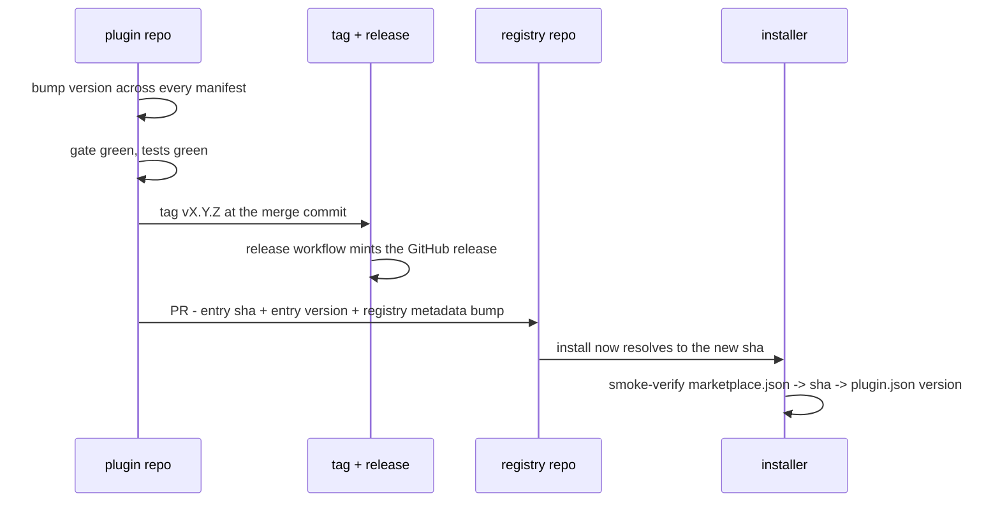

# Manage several plugins and a marketplace

One plugin is a repository. Several plugins are a **portfolio**, and a portfolio has problems a single repo never has: two plugins that ship a colliding skill name, a registry pinning a version that no longer exists, a Standard bump that half your plugins have adopted.

This page is the practice that works today. It is deliberately explicit about which steps are manual, because **the gate has no marketplace scope** and pretending otherwise would send you looking for a flag that does not exist. See [what this toolkit cannot do](../explanation/limitations.md#4-there-is-no-marketplace-scope).

## The shape

```mermaid
flowchart TD
  subgraph portfolio["Your portfolio"]
    P1["plugin-a<br/>own repo, own version"]
    P2["plugin-b<br/>own repo, own version"]
    P3["plugin-c<br/>own repo, own version"]
  end
  R["marketplace registry repo<br/>.claude-plugin/marketplace.json"]
  U["installer<br/>/plugin install name@owner"]

  P1 -- "pinned by sha + version" --> R
  P2 -- "pinned by sha + version" --> R
  P3 -- "pinned by sha + version" --> R
  R --> U

  G["the gate<br/>scripts/check.mjs"]
  G -. "one plugin at a time (today)" .-> P1
  G -. "" .-> P2
  G -. "" .-> P3
```

Three rules follow from that shape, and they are the whole discipline:

1. **A plugin owns its version. The registry only points at it.** The registry never invents a version; it records a sha and the version that sha carries.
2. **The plugin repo is authoritative for conformance.** A plugin is graded in its own tree, against its own declared tier and pinned Standard.
3. **The registry is authoritative for delivery.** If the registry points at an old sha, that is what installs, no matter what the plugin repo says.

Nearly every multi-plugin failure is one of those three getting confused.

## Grade the whole catalogue today

There is no `--scope marketplace`. What works is a loop over members, because the gate takes its target as a positional argument and can be pointed anywhere:

```bash
# from the toolkit checkout, grading a portfolio that lives elsewhere
for p in ../plugin-a ../plugin-b ../plugin-c; do
  echo "=== $p ==="
  node scripts/check.mjs "$p"
done
```

Two things to get right, both of which have burned this project:

- **Forward slashes in paths on Windows.** A backslash path makes the gate silently grade an empty directory and print a clean pass. A false green is worse than an error.
- **Pick the profile deliberately.** Grade your own plugins with the default ladder. Grade a plugin you do not own with `--profile plain-plugin`, which drops the house-provenance checks. The same tree can score 10 errors under one and 1034 under the other.

For a report rather than an exit code, swap in `evaluate.mjs`:

```bash
node scripts/evaluate.mjs "../plugin-a" --report=conformance --format=html --out ../plugin-a/report.html
```

### What the loop cannot tell you

This is the honest gap. A loop grades each member **in isolation**, so it is blind to everything that only exists *between* members:

| Invisible to a per-plugin loop | Why it matters |
|---|---|
| Two members shipping the same skill directory name | Component names enter a shared pool on agents without namespacing |
| Two members with overlapping command names | The same collision, on a surface users type |
| Two skills across members that answer the same request | An installer gets ambiguous routing and cannot tell which fires |
| A registry entry whose source path resolves to nothing | The catalogue is undeliverable and every per-member grade is still green |

Until marketplace scope exists, those are eyes-on checks. The cheapest partial defence is a name-collision sweep:

```bash
# duplicate skill directory names across members
for p in ../plugin-a ../plugin-b ../plugin-c; do
  ls -d "$p"/skills/*/ 2>/dev/null | xargs -n1 basename
done | sort | uniq -d
```

An empty result is not proof of coherence. It rules out one specific collision class.

## The prefix rule exists for exactly this

`S2` requires a `prefix` in `library.json` ending in a hyphen, and every skill, command and subagent name must start with it. It is a Convergent (Silver) requirement, so it is silent at Bronze.

In a portfolio it is the single highest-leverage rule you can adopt early. Claude Code namespaces plugin skills automatically as `plugin-name:skill`; Codex and the wider ecosystem do not. Two plugins that each ship an unprefixed `review` skill will collide on any agent without namespacing, and the fix after publication is a rename that breaks every existing install.

Choose the prefix at scaffold time. Changing it later is a breaking change for your users.

## Re-pin a plugin in the registry

A release is not delivered until the registry points at it. The sequence, and each step is verifiable:



The smoke verification at the end is not ceremony. It is the only step that proves the three artifacts agree: the registry entry, the commit it names, and the version that commit actually carries. Skipping it is how a registry ends up pinning a sha whose `plugin.json` says something else.

**Keep the registry's own version moving too.** The registry has a `metadata.version`; bump it on every entry change so the catalogue itself has a history. A missing entry in the registry changelog is easy to backfill and easy to never notice.

## Rolling a Standard bump across a portfolio

When the Standard gains a check, plugins do not fail immediately. Each plugin declares `"standard": "<version>"` and the gate downgrades to a warning any check introduced after that pin. That is deliberate: it grades a plugin against the ruleset it adopted rather than silently retightening under it.

The practical consequence for a portfolio:

- **A plugin only picks up new requirements when you bump its pin.** Nothing is automatic.
- **Bump the pin deliberately, one plugin at a time**, and read the new warnings before promoting them to errors.
- **A new plugin should be born on the current Standard.** There is no legacy to protect, and starting behind means inheriting warnings you never earned. The seed template used to be four minor versions stale and quietly did exactly that.
- **`--strict` grades against the newest spine regardless of pin.** Use it to see what a bump would cost before committing to it.

```bash
node scripts/check.mjs ../plugin-a --strict   # what a pin bump would surface
```

## One repo or many

Both work. The tradeoffs are real and mostly about release coupling.

| | Separate repos | One repo, several plugins |
|---|---|---|
| Versioning | each plugin versions independently | a change to one plugin moves one plugin's version; the repo still needs a convention for which |
| CI | per repo, simple | one pipeline must grade every plugin and report per-plugin |
| Registry | one entry per repo, one sha each | entries point at paths within one sha, so any commit re-pins everything |
| Cross-plugin checks | hardest: nothing sees across repos | easier: a loop over sibling directories is trivial |
| Blast radius | contained | a bad commit can affect every member at once |

The Standard does not mandate either. It does mandate that a plugin is the **unit of release** and carries exactly one version, which is what makes the registry entry meaningful in both layouts.

If you are choosing today: separate repos for plugins with genuinely independent release cadences, one repo when the plugins ship together and you want cross-plugin checks to be cheap.

## Standing up a registry

Scaffolding a marketplace of your own is a separate, shorter task: see [stand up a marketplace](stand-up-a-marketplace.md) and the `askit-init-marketplace` skill.

## See also

- [What this toolkit cannot do](../explanation/limitations.md) - the marketplace-scope gap in full
- [Cut a release](cut-a-release.md) - the per-plugin release sequence this page assumes
- [Stand up a marketplace](stand-up-a-marketplace.md) - creating the registry
- [Silver checks](../reference/silver-checks.md) - `S2` and the rest of the Convergent tier
