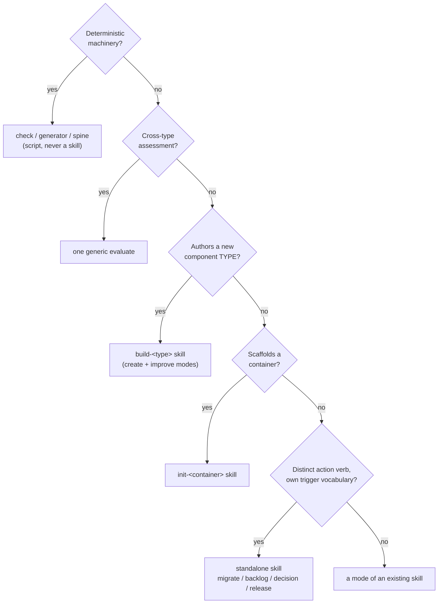

# 0020 - Skill packaging and naming

## TL;DR
- **Decision:** Package builder *families* as modes (`build-<type>` with create/improve) and keep one skill per component *type*, with one generic `evaluate` and a few standalone action-verb skills; prefix **every** component `askit-` (subagents included, for Gemini future-proofing).
- **Why:** A self-hosting product owes per-skill samples + eval sets, so consolidating ~60 catalog entries into ~19-21 skills is the single biggest lever on R6; splitting into per-verb skills also forms verified wrong-skill trigger clusters.
- **Status:** Accepted (2026-05-30).

- **Status:** Accepted (2026-05-30). Execution proceeds aggressively via the per-wave `0.x` release cadence (RELEASE-PLAN v0.2 Section 5).
- **Date:** 2026-05-30
- **Deciders:** maintainer (product-on-purpose); analysis by a 7-agent evidence workflow + adversarial verification
- **Builds on:** DESIGN D17 (naming/verb taxonomy, LOCKED), DESIGN Principle 2 (collapse uniform analysis, keep authoring per-type), DESIGN D19 (Codex subagent constraint). Numbered 0020 to sit after the D1-D19 -> ADR graduation reserved for Phase 4 (decision Q-C).
- **Supersedes the open question:** `builder-skills-catalog.md` open question #2 ("individual skills vs modes").

## Context and problem statement

The maintainer decided v1.0.0 ships the **full builder catalog** (all 27 functional areas of `builder-skills-catalog.md`). That makes one question load-bearing for the entire remaining build: do we package each builder *family* (brainstorm / create / validate / improve) as **individual skills** (~60 skills), or **consolidate** them into `build-<type>` skills with modes plus one generic `evaluate` (~17 skills)? And what is the exact naming scheme (prefix, subagent naming, the per-area component names) so the catalog can be executed without collisions or re-litigation?

This is a self-hosting product: every skill it ships must itself meet the Standard, which means per-skill samples and a triggering eval set. So packaging granularity multiplies maintenance directly.

## Decision drivers

| Driver | Weight |
|---|---|
| R6 / maintenance load on a self-hosting, largely solo product | high |
| Triggering precision; avoid over-triggering / wrong-skill clusters | high |
| Cross-tool portability across ~32 agentskills.io agents | med-high |
| Consistency with what is already shipped and the LOCKED DESIGN taxonomy | med-high |
| agentskills.io compliance (name <=64 lowercase-hyphen == dir) | gate |
| Human discoverability | med |
| Beginner-to-advanced UX | med |

## Considered options

| Option | Summary | Score |
|---|---|---|
| **A. Consolidated** | `build-<type>` create/improve modes + one generic `evaluate`; individual at the component type. | 88 |
| **B. Individual** | A separate skill per family verb (skill-creator, skill-improver, skill-validator, ...), ~60 skills. | 24 |
| **C. Hybrid (chosen)** | Per-family consolidated (create/improve, and brainstorm/validate, as modes), individual per component **type**, one generic `evaluate`, plus a small set of standalone action-verb skills where a distinct verb has its own trigger vocabulary. | **95** |

A and C are the same family; C is A with the over-consolidation boundary and the standalone escape hatch named explicitly. B is rejected.

## Decision outcome

**Chosen: Option C.** Confirm and execute the LOCKED consolidated-by-family / individual-by-type taxonomy. This lands **~17 skills + 7 subagents** for v1, inside both the maintenance envelope and a sane triggering surface.

### Why (primary, verified evidence)

1. **R6 is the decisive driver, and it is verified, not hypothetical.** The Standard asks each skill to ship >=3 golden + >=1 anti sample (present-sample drift is a CI error) and a >=20-case `{query, should_trigger}` eval set (`STANDARD.md:285`, `:327`). ~17 consolidated skills owe ~340-440 eval cases + ~68 samples; ~60 individual skills owe ~1,200 cases + ~240 samples - a **3-4x build/test/maintain multiplier** on a solo product shipping the full catalog. This single fact carries the decision.
2. **Triggering precision favors consolidation.** The 4 shipped consolidated descriptions score 0.90 / 0.90 / 0.90 / 1.00 on `description-score.mjs` (threshold 0.7) and are semantically distinct by artifact-path keywords. Splitting into `skill-creator` / `skill-improver` / `skill-validator` / `skill-eval` creates the canonical "wrong-skill cluster" (shared noun + near-synonym verbs); one such thin description already measured 0.65 (below the bar).
3. **It matches the LOCKED taxonomy and the shipped reality.** DESIGN Principle 2 and D17 already chose this; the 4 on-disk skills already implement create/improve as inline modes and `evaluate` is already the one generic assessor. This is confirm-and-execute, not reopen.
4. **External precedent.** Anthropic's own `skill-creator` is one multi-mode skill, not a split family.

### Why C and not naive A (the over-consolidation boundary)

The same evidence that kills per-family splitting also forbids merging **across component types** into one `build` mega-skill. The seam is the **kind of knowledge**: assessment rules are uniform data, so assessment collapses to **one** generic `evaluate`; but authoring expertise forks hard by type (a skill vs a hook vs an MCP is different knowledge), so there is **one creator per component type**. A single description cannot carry sharp keywords for skill AND hook AND MCP without diluting it below the 0.7 bar, and inlining every type's steps would breach the 500-line SKILL.md budget.

## The naming scheme

### Prefix: affirm `askit-` (all components, including subagents)

`askit-` is LOCKED (DESIGN D17), declared in `library.json`, and short (6 of 64 chars; longest resulting name `askit-build-chain-contract` = 26). Its sole justification is **cross-agent collision avoidance** in the shared `.agents/skills/` pool on agents that do not auto-namespace (Codex, the wider ecosystem); Claude Code auto-namespaces by plugin. The external norm is to namespace by directory/runtime, so `askit-` is a deliberate, defensible divergence. It carries **no triggering value** - triggering must come from the description. Keep it short; never rely on it for triggering.

### Subagents: prefix them too (future-proofing) - maintainer decision

Decision (maintainer, 2026-05-30): **prefix all subagents** (`askit-skill-author`, `askit-evaluator`, ...). The rationale is **future-proofing over uniformity**: subagents are Claude-only for v1, so the cross-agent collision the prefix prevents cannot occur *yet* - but Gemini CLI extensions DO ship subagents, and Gemini is the named v1.x target, so a subagent enters a cross-agent context as soon as Gemini emission lands. Prefixing now avoids renaming an established, chained component later. It also makes the prefix rule uniform ("every component," matching `STANDARD.md` sec 8.2 as written) so **no Standard amendment is needed**. Cost is minor (a short non-discriminating token + slightly longer role names).

Consequence (follow-up task): rename the two shipped subagents (`skill-author` -> `askit-skill-author`, `evaluator` -> `askit-evaluator`) and update `agents/_chain-permitted.yaml`, `library.json`, and the AGENTS.md / INDEX.md references; add a `name`-starts-with-prefix check that covers ALL components (skills + commands + subagents).

### Taxonomy patterns

| Pattern | Purpose | Examples |
|---|---|---|
| `init-<container>` | Scaffold a releasable/cataloging container | `askit-init-plugin` (modes: interview/questionnaire/hybrid), `askit-init-marketplace` |
| `build-<type>` (create + improve modes) | Author one component type | `askit-build-skill`, `askit-build-hook`, `askit-build-mcp`, ... |
| `evaluate` (one generic assessor) | The only cross-type assessment skill | `askit-evaluate` |
| standalone action verb (modes inside) | A distinct verb with its own trigger vocabulary | `askit-migrate`, `askit-backlog`, `askit-decision`, `askit-release`, `askit-capability-advisor` |
| `## <mode> mode` section | A lifecycle/variant of a skill, not its own skill | create/improve; intake/triage/prune; adr/rfc |
| check / generator / spine | Deterministic machinery, never a skill | `scripts/checks/*.mjs`, `gen-manifest.mjs`, `_chain-permitted.yaml` |
| subagent (`askit-` prefixed, Claude-only role) | Bounded internal delegate behind a skill | `askit-skill-author`, `askit-evaluator`, `askit-reviewer`, ... |

### The full v1 component set (~17 skills + 7 subagents)

**Skills (~21, full-catalog per O-1 + ADR 0021; exact count fixed by the wave plan):** the core consolidated set - `askit-init-plugin`, `askit-init-marketplace`, `askit-build-skill` (shipped), `askit-build-command` (shipped), `askit-build-subagent` (shipped), `askit-build-hook`, `askit-build-workflow`, `askit-build-chain-contract`, `askit-build-mcp` (designed), `askit-build-agents-md`, `askit-build-output-style` (Claude-only emit), `askit-capability-advisor`, `askit-evaluate` (shipped), `askit-migrate`, `askit-backlog`, `askit-decision`, `askit-release` - plus the docs/examples skills `askit-build-docs` and `askit-build-samples` (ADR 0021), and the O-1 "everything in v1" additions `askit-build-statusline` and `askit-deprecate` (settings stays a mode of `build-hook`/`build-subagent`).

**Subagents (7, `askit-` prefixed, Claude-only):** `askit-skill-author` (shipped, rename pending), `askit-evaluator` (shipped, rename pending), `askit-reviewer`, `askit-quality-grader`, `askit-explorer`, `askit-file-search`, `askit-file-ops`.

**Folded into modes / checks (not standalone skills):** references/assets, samples, component-history, frontmatter, onboarding, templates, output contracts, settings/permissions, per-type validators, index/manifest/agents-md generators. (Full per-area mapping: 40 components, 0 collisions, 0 agentskills.io violations - see the analysis artifacts.)

**Explicitly deferred by DESIGN (see open item O-1):** `build-statusline` (Area 13), `deprecate` automation (Area 21), the full multi-tier eval engine + benchmark (Area 17), docs-site (Area 15).

## Consequences

**Positive:** ~3-4x lower sample/eval maintenance; clean, distinct triggers; comfortably within agentskills.io limits; matches shipped skills and the locked taxonomy; cheap marginal cost per creator via the shared `builder-pattern.md` contract; human discoverability recovered through commands + `capability-advisor` + `INDEX.md`.

**Negative / cost to manage:** requires discipline at the margins (resist both per-verb splitting and cross-type merging); the standalone action-verb skills still each owe an eval set (bounded); the multi-mode description is a real authoring tax (must keep create-and-improve keywords sharp).

## Implementation requirements (from the adversarial verification)

1. **Do not rest the case on the "Claude Code drops least-used descriptions after ~15-25 skills" claim.** It is an unverified hypothesis (not citable from the repo or a source); label it as such. The R6 sample/eval multiplier is the load-bearing, verified argument.
2. **Enforce the prefix on every component.** Add a `name`-starts-with-prefix check covering skills + commands + subagents (closing the S2 gap, which today validates only the manifest `prefix` string, not per-component names). No `STANDARD.md` sec 8.2 amendment is needed - prefixing subagents matches the literal "every component" SHOULD. Includes renaming the two shipped subagents (`skill-author`/`evaluator` -> `askit-`) and updating the chain contract, manifest, and AGENTS/INDEX references.
3. **Add a per-skill triggering-eval gate** specifically covering the create-vs-improve multi-mode boundary and the `build-skill`-vs-`evaluate` boundary (the 0.65 thin-description case shows mode-blended descriptions can dip below 0.7).
4. **Drop literal angle brackets** from `build-<type>` descriptions (the shipped `build-subagent` / `build-command` descriptions embed `agents/<name>.md`; `description-score.mjs` penalizes `< >` and sec 8.1 discourages them). Use prose such as "a subagent file under `agents/`".
5. **Codify the command policy** as a check before scaling: a command per **user-invocable headline skill**, not per skill, so the command surface (which reuses skill names verbatim) does not silently double the prefixed/triggering footprint.

## Open items (need a maintainer call)

- **O-1 (full-catalog interpretation).** RESOLVED 2026-05-30: the maintainer chose **truly everything in v1** - `build-statusline` (Area 13), `deprecate` automation (Area 21), the **full multi-tier eval engine + benchmark** (Area 17), and a **docs-site** (Area 15) are all in v1, not v1.x. This adds ~3-4 skills + the eval engine to the ~17-skill set and is the maximal-scope reading; it compounds R6 (tracked as the dominant risk in RELEASE-PLAN v0.2). The wave plan absorbs it by sequencing these into the later waves (D/E), each still shippable at its declared tier.
- **O-2 (subagent prefix).** RESOLVED 2026-05-30: **prefix all subagents** for future-proofing (Gemini v1.x ships subagents, so they enter a cross-agent context). Requires renaming the two shipped subagents + updating the chain contract/manifest/AGENTS references + a per-component prefix check. No Standard amendment needed (this matches sec 8.2 as written).

## Provenance

Decided from a 7-agent evidence workflow (repo ground truth + 2026 ecosystem practice + triggering/discoverability analysis + a full naming map), a scored option comparison (A 88 / B 24 / C 95), and an adversarial verification pass (verdict: holds-with-revisions; the five revisions are folded in above as implementation requirements). All component names were checked: longest 26 chars, all lowercase-hyphen, all `name == dir`; zero collisions, zero agentskills.io violations.
