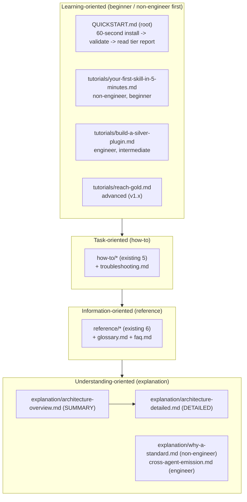

# 0021 - Documentation, examples, and docs-site strategy

## TL;DR
- **Decision:** Ship a complete dual-audience, multi-level documentation set (Diataxis incl. the missing tutorials quadrant + QUICKSTART), a summary+detailed convention for architecture and decision docs, an Astro Starlight docs site deployed to GitHub Pages (copied from the proven pm-skills stack), and exactly **two new consolidated skills** - `askit-build-docs` and `askit-build-samples` - so users can author best-in-class docs and examples for the plugins they build. Adopt a bounded "example threads" pattern (2-3 recurring example plugins).
- **Why:** The toolkit currently *grades* docs and samples it never helps a user *create* (a self-hosting credibility gap), and the maintainer's bar is beginner-to-advanced empowerment. The additions are admissible under R6 because they are either already-locked-but-unbuilt or pure reuse, and they collapse 6-7 catalog micro-skills into 2.
- **Status:** Accepted (2026-05-30, with ADR 0020).

- **Date:** 2026-05-30
- **Deciders:** maintainer (product-on-purpose); analysis by a 5-agent evidence workflow (docs strategy + Starlight, catalog coverage, utility survey, pm-skills threads study, synthesis)
- **Builds on:** ADR 0020 (packaging+naming), DESIGN D7 (Diataxis docs) and the "truly everything in v1" scope decision (2026-05-30) that pulls the docs-site into v1.

## Context

The maintainer set five requirements: (1) copious, adequate documentation for **both non-engineers and engineers**, in **different modalities and experience levels**, to empower people to get started, continue, and grow - not docs for the sake of docs; architecture and decision docs in **summary and detailed** versions. (2) Does the plugin include the skills a **user** needs to create best-in-class docs and examples for the plugins **they** build? (3) Is an **Astro Starlight** docs site + **deploy** in the plan? (4) Should any **utility skills** be added? (5) Should the repo use a **pm-skills "threads"** pattern for multiple examples/samples?

Verified gap: the STANDARD requires the artifacts (README/CHANGELOG/RELEASE-NOTES, the `docs/{tutorials,how-to,reference,explanation}` tree, per-skill `examples/{golden,anti}` with >=3 golden + >=1 anti, drift = error), but the shipped surface produces none of them for a user's own plugin - `build-skill` leaves samples as an optional "add it yourself" note, and there is no docs-authoring skill. The tutorials quadrant is empty and there is no root QUICKSTART, although DESIGN D7 already mandates both.

## Decision drivers

R6 (scope/burnout) is dominant and already maxed by the full-catalog choice, so additions must be consolidated and justified; beginner-to-advanced empowerment is the explicit bar; the toolkit must dogfood everything it ships (self-hosting); reuse over re-derivation; the "CI only shells out to portable scripts" principle must hold for the docs-site deploy too.

## Decision outcome

### D1 - Documentation information architecture (dual-audience, multi-level)

Every doc is tagged by audience (non-engineer / engineer / both) and level (beginner / intermediate / advanced). v1 fills the **tutorials** quadrant (the single biggest gap and the first thing a non-engineer needs), adds **QUICKSTART**, **glossary**, **faq**, **troubleshooting**, and the **architecture overview+detailed** pair. The "grow" path is explicit: QUICKSTART -> first-skill tutorial -> build-a-silver-plugin -> climb-from-bronze-to-silver (existing how-to) -> reach-gold (v1.x).

### D2 - Summary + detailed convention (architecture and decisions)

A writing convention (near-zero infra cost), two parts:
1. **Architecture:** `docs/explanation/architecture-overview.md` is a one-screen SUMMARY (the Standard-as-spine, the two axes, the Bronze/Silver/Gold ladder, one mermaid context diagram) for the non-engineer; it links `docs/explanation/architecture-detailed.md` (the engineer body, distilled from DESIGN.md), which opens with a backlink.
2. **Decisions (ADRs):** every ADR carries a mandatory 3-line `## TL;DR` (Decision / Why / Status) immediately under the title, with the full MADR body below. This ADR and ADR 0020 are backfilled to the convention. The `askit-decision` skill ships a **summary mode** that emits and lints the TL;DR companion from a long ADR/RFC (covers the summary+detailed requirement at zero new-skill cost). A v1.x docs-presence check can assert the TL;DR block and the overview->detailed link exist.

### D3 - Astro Starlight docs site + GitHub Pages deploy (in v1)

The docs-site is **in v1** (the 2026-05-30 "truly everything" decision; the still-stale "defer docs site" wording in DESIGN/RELEASE-PLAN is corrected in this re-baseline). Reuse the proven pm-skills stack near-verbatim (the single biggest R6 collapse here):
- `astro ^6`, `@astrojs/starlight ~0.39`, `astro-mermaid` (a maintainer requirement; one integration line, ordered **before** starlight).
- An **in-place glob loader** (`content.config.ts`, base `.`) mounting `docs/**/*.{md,mdx}` so the site is a **generated view** of the Diataxis markdown - never a second content store; `generateId` strips the `docs/` prefix; exclude `docs/internal/**`, `templates/**`, `**/README.md`.
- Sidebar via `autogenerate: { directory: 'docs/tutorials' | 'how-to' | 'reference' | 'explanation' }` - the folder tree IS the published IA. Pagefind search, dark mode, mobile, edit-on-GitHub come free.
- A **separate** `.github/workflows/deploy-pages.yml` using composable steps (`setup-node` + `npm ci` + `npm run build` + `actions/upload-pages-artifact` + `actions/deploy-pages`; permissions `pages:write` + `id-token:write`; trigger push:main + workflow_dispatch). `ci.yml` stays the validation gate; the deploy is additive and keeps portable post-build scripts in the npm chain.
- Caveats: set the Pages base path `/agent-skills-toolkit` (project-page links 404 otherwise - pm-skills hit this); Starlight 0.39 needs `autogenerate` wrapped in `items: []`.
- **v1.x:** `starlight-versions` (ship a single current version for v1, as pm-skills does) and asciinema/video casts (recurring maintenance; written + mermaid tutorials cover the launch).

### D4 - Two new consolidated skills (the net add)

| Skill | Modes | Purpose |
|---|---|---|
| `askit-build-docs` | create / improve, with a doc-**type** parameter: readme, quickstart, tutorial, how-to, reference, explanation, glossary, faq, troubleshooting, architecture (summary+detailed pair), capability-matrix, **site** | The single user-facing home for the human docs the Standard grades. Authors FROM the plugin's `library.json` + component index + frontmatter (single source of truth, non-duplicative). `improve` is where `askit-evaluate`'s doc findings point (closes build -> evaluate -> improve for docs). `type=site` is the Starlight scaffold+deploy mode (not a tenth micro-skill). |
| `askit-build-samples` | create / improve(validate), threads-aware | Generates per-component `examples/{golden,anti}` meeting the Standard's >=3 golden + >=1 anti, drawn from the bounded thread set; `improve/validate` re-checks and detects drift (drift = error, CI-gated). Closes the verified dead end where nothing generates samples. |

These **two** skills subsume catalog Areas 11/15/19 (readme-creator, changelog-curator, docs-site-builder, samples-creator, samples-validator, reference-builder, asset-manager). Collapsing 6-7 implied micro-skills to 2 is a **net reduction** and holds the ADR 0020 consolidation line. `changelog`/`release-notes` stay modes of `askit-release` (not a separate curator).

### D5 - Example "threads" (bounded adoption of the pm-skills pattern)

Adopt the pm-skills "narrative threads" idea (a fixed scenario profile with a distinct prompt style, run end-to-end so a learner follows one story), with two deliberate adaptations:
1. **Keep examples co-located** in `skills/<skill>/examples/{golden,anti}` per the toolkit's own Standard. Do NOT centralize in a `library/` as pm-skills does - that would contradict the published Standard (the biggest divergence between the repos). Layer the thread naming/scenario convention *inside* the co-located examples.
2. **Bound harder:** 2-3 recurring example plugins chosen for this domain - a Bronze beginner single-skill plugin, a Silver cross-agent plugin, and **the toolkit itself as the Gold thread**. The prompt-style axis (casual / organized / structured) delivers the maintainer's "different experience levels" through one structural convention. Single-thread for meta/builder skills.

**Companion plugins = the validation triad (answers "should a complementary plugin be built alongside?").** Yes - but it is folded into the threads rather than run as a separate workstream, because a self-hosting tool that validates only itself is a closed loop; the threads are the *external* proof that the toolkit works on plugins other than itself. The three threads map to three validation roles: (1) a small **greenfield Bronze plugin** scaffolded by `init-plugin` proves the scaffold path on a normal, non-meta domain; (2) **pm-skills, adopted and graded** via `evaluate` + `migrate`, is the real-world Silver companion - a substantial existing repo in the same workspace, so it is near-zero build cost and the strongest external test of the grade-and-adopt path; (3) the **toolkit itself** is the Gold self-hosting thread. This is why no separate companion-plugin project is needed: the companion validation rides on the examples the plan already requires. (A fresh thinking-domain plugin such as `thinking-framework-tools` is a fine optional fourth, but the greenfield + pm-skills pair already cover the scaffold and adopt paths; add it only if a non-meta showcase is wanted for marketing.)

Delivery: `STANDARD.md` sec 7.2 gains a SHOULD/MAY (never MUST) "scenario threads" convention so trivial skills are not penalized; `askit-build-samples` reads the threads and scaffolds one sample per thread per skill; `askit-build-docs` `type=site` renders a per-thread showcase page generated from the existing examples (never hand-maintained). **v1.x:** a `threads.yaml` machine contract + a samples-validator consistency check (the check pm-skills itself deferred - ship it as a differentiator).

### D6 - Utility decisions (what is NOT a new skill)

- **Mermaid:** a CHECK (`scripts/checks/mermaid-valid.mjs`, parses fenced blocks, fails CI on invalid syntax) + an authoring convention - NOT a diagram-generator skill. In v1.
- **Docs link + dash hygiene:** extend `reference-links.mjs` to cover `docs/`; the dash rule is the portable no-dashes check. In v1. A "docs-linter skill" is rejected (would fork enforcement off the deterministic gate).
- **Docs-presence** (Diataxis dirs non-empty + ADR TL;DR + overview->detailed link): a CHECK, v1.x (additive; defer behind the content).
- **Capability-matrix:** a render MODE of `build-docs` (from `capability-advisor` data); a standalone interactive matrix is v1.x.
- **reference-builder / asset-manager / changelog-curator / quickstart-glossary-faq-troubleshooting generators:** SKIP as standalone; all are `build-docs` modes or `askit-release` modes.

## Consequences

**Positive:** users can produce best-in-class dual-audience docs, a deployed docs site, and calibrated examples for their own plugins; the toolkit becomes a true validated example (it dogfoods all of it); net scope *shrinks* versus a naive full-catalog reading (+2 skills, -4-5 would-be micro-skills); docs-site risk collapses via pm-skills reuse.

**Negative / real cost:** self-hosting obligation - the toolkit must deploy its OWN Starlight site, write its OWN summary+detailed DESIGN/ADR docs, ship its OWN mermaid diagrams, QUICKSTART, and 2-3 threads (budget this in Wave E, not free); the `build-docs` multi-type description must stay sharp to clear the 0.7 description-score bar; mermaid + docs-presence checks add to the gate.

## Scope and R6

- **Net new v1 skills = +2** (`askit-build-docs`, `askit-build-samples`); v1 skill set ~17 -> ~19. Everything else is a mode (docs-site, decision-summary, capability-matrix) or a check (mermaid-valid, docs-link/dash in v1; docs-presence in v1.x) - no new prefix entries.
- **v1.x (do not pull forward):** starlight-versions, video casts, the showcase gallery, the threads machine-contract + consistency check, the interactive capability matrix, the docs-presence check.
- **Stale-wording fix:** DESIGN.md (:210/:276/:291) and RELEASE-PLAN.md (:124) still say "defer the docs site"; corrected to "docs-site in v1" in the re-baseline.

## Implementation notes

Copy `astro.config.mjs`, `content.config.ts`, and `deploy-pages.yml` from `E:/Projects/product-on-purpose/pm-skills` (change base, title, sidebar); fetch the current Starlight setup via Context7 at build time per the repo's context7 rule rather than pinning stale config; add the sec 7.2 "scenario threads" SHOULD/MAY to `STANDARD.md`; add `mermaid-valid.mjs` to the check registry.

## Provenance

A 5-agent evidence workflow: docs-strategy + Starlight (confirmed Starlight 0.39 capabilities + the pm-skills deploy), catalog doc/example coverage (the verified gap), a utility survey (bounded to checks/modes), the pm-skills threads study (THREAD_PROFILES.md / README_SAMPLES.md, three fictional companies), and a synthesis that bounded the net add to +2 skills against R6.
