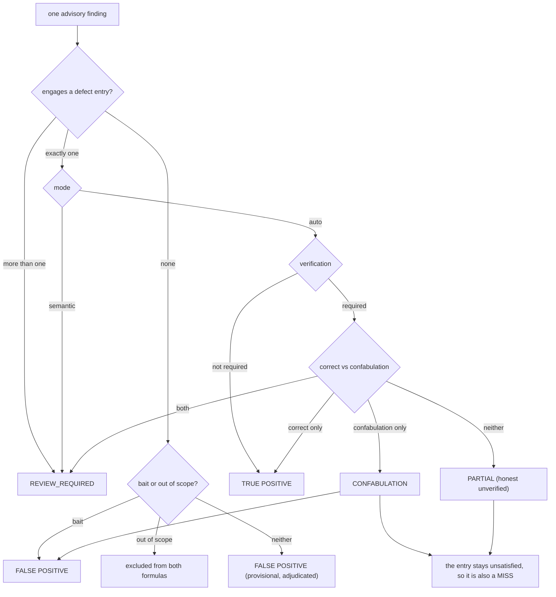

# The seeded-defect fixture and its scoring key

How advisory quality is measured (F3 requirement R-AQ-1). A fixture plugin carries defects planted on
purpose; a tracked key says what each one is and what a finding has to assert to count as having
caught it. With those two artifacts a run stops being an anecdote and becomes a precision/recall pair
per model and effort cell.

- **Fixture:** [`tests/fixtures/anti/seeded-defects/privacy-notice-toolkit`](../../../tests/fixtures/anti/seeded-defects/privacy-notice-toolkit)
- **Key:** [`tests/fixtures/anti/seeded-defects/privacy-notice-toolkit.key.json`](../../../tests/fixtures/anti/seeded-defects/privacy-notice-toolkit.key.json)
- **Invariant test:** [`tests/integration/seeded-defect-fixture.test.mjs`](../../../tests/integration/seeded-defect-fixture.test.mjs)
- **Harness:** [`scripts/lib/advisory-score.mjs`](../../../scripts/lib/advisory-score.mjs), with [`tests/unit/advisory-score.test.mjs`](../../../tests/unit/advisory-score.test.mjs). Nothing here dispatches a model.

The key lives one directory ABOVE the plugin root on purpose. An advisory run dispatched at the
fixture path reads the fixture and never the answers.

## The two invariants

**1. The fixture passes the deterministic gate.** `node scripts/check.mjs <fixture> --profile plain-plugin`
reports 0 errors and 0 warnings. Every planted defect is qualitative, the kind only a reading
reviewer can catch. If the gate could see one, a run's recall would be measuring the gate rather than
the advisory layer, which is the one thing this measurement must not do.

The fixture is shaped as a vanilla third-party plugin (a `.claude-plugin/plugin.json`, `skills/`,
`commands/`, `agents/`, a `README.md`) with no askit scaffolding, so `plain-plugin` is the rubric that
applies to it, exactly as for every corpus target. Under the default askit-library ladder it reports
house-scaffolding findings only (a missing `library.json`, a missing `AGENTS.md`, missing folder
READMEs, S7 `maps-to`), and none of them names a planted defect. This is the same picture the corpus
recorded for `lenny-skills`: 0/0 under `plain-plugin`, house noise under the full ladder.

**2. The key still describes the fixture.** Every planted defect names the file it lives in and quotes
an anchor from it. The invariant test asserts each anchor is still present, so an edit that silently
removes a defect fails CI instead of quietly deflating a recorded recall number.

## What is planted

Nine defects, one per class the eval runs surfaced. Each row's ground truth, correction, match rule
and worked examples are in the key.

| Id | Class | Lives in | Mode | The defect in one line |
| --- | --- | --- | --- | --- |
| SD-01 | trigger-surface-collision | `skills/dsar-intake-triage`, `skills/data-request-router` | auto | Two skills answer the same inbound request; both descriptions score 1.00 on U5 in isolation. |
| SD-02 | manifest-vs-disk-drift | `.claude-plugin/plugin.json` | auto | The manifest declares `./agents/notice-reviewer.md`; the file on disk is `agents/privacy-reviewer.md`. |
| SD-03 | stale-doc-claim | `.../references/output-contract.md` | auto | The reference documents a `--write` mode the skill's own changelog says was removed at 0.3.0. |
| SD-04 | wrong-procedure | `skills/consent-log-audit` | auto | The retention deadline is computed from `granted_at`, contradicting the schema's rule that a renewal restarts the clock. |
| SD-05 | fake-statute | `.../references/us-state-laws.md` | auto | A "Colorado Consumer Data Protection Act (CCDPA)" that does not exist; Colorado's law is the Colorado Privacy Act (CPA). |
| SD-06 | inverted-rule | `.../references/us-state-laws.md` | semantic | The GDPR and US state consent directions are stated backwards, in the paragraph warning about that exact error. |
| SD-07 | command-vs-skill-contradiction | `commands/review-privacy-notice.md` | auto | Two canonical seven-point checklists, only two items shared. |
| SD-08 | capability-overclaim | `README.md` | auto | A signed PDF certificate emailed to the DPO, which no component implements. |
| SD-09 | broken-cross-reference | `commands/review-privacy-notice.md` | auto | A link to `state-law-matrix.md`; the file is `us-state-laws.md`. U6 does not scan `commands/`. |

Two classes deserve a note on why they are still qualitative:

- **SD-02.** U13 (skill-registration, Standard 0.12) made the SKILLS half of reading 12 deterministic.
  The planted instance is therefore in a component type U13 does not cover, and on a plugin that
  enumerates no skills at all, so U13 correctly returns nothing.
- **SD-09.** U6 (reference-links) resolves relative links in `SKILL.md` and `references/` only. A
  dangling link in `commands/` is outside its scan set, which is what leaves it to a reader. The
  same gap is the one the v1.7.0 craft fixture demonstrates for `examples/`.

Three **bait** entries (`nonDefects`) are planted for the opposite purpose: a finding that claims one
of them is a defect is an unambiguous false positive.

| Id | The bait | Why it is bait |
| --- | --- | --- |
| NB-01 | Colorado's universal opt-out mechanism requirement from July 1, 2024 | True, and three paragraphs from a fabricated statute name. Flagging the file rather than the line is not verifying. |
| NB-02 | The 45-day response clock with one 45-day extension | True for all four statutes. "Correcting" it to 30 days imports the GDPR's clock, the same generator as a confabulated statute. |
| NB-03 | `commands/audit-consent-log.md` is not named in `plugin.json` | Commands are discovered from `commands/`; the manifest's arrays name additional paths. Claiming it will not install is a false claim, and the discriminator against pattern-matching on SD-02. |

Three `outOfScope` rules exclude findings that are neither catches nor false claims: remarks about the
fixture's own disclosure block, recommendations to adopt askit house scaffolding (outside the
`plain-plugin` rubric rather than false), and pure style preferences.

## How a run is scored

Every pattern in the key is a JavaScript regular expression compiled case-insensitively and tested
against one string per finding: `matchText`, the finding's `area`, `file`, `message`,
`recommendation`, `evidence` and `title` joined by newlines. Nothing else is consulted, so a scorer
cannot reach into a run's prose summary for credit.



`precision = TP / (TP + FP)` and `recall = TP / (number of planted defects)`. Duplicates collapse, so
the count of true positives equals the count of satisfied entries and `TP / (TP + misses)` is the same
number; a scorer computes both and a disagreement means the duplicate rule was applied wrongly.
Partials, review-required items and out-of-scope items are reported separately, never hidden.

One extra rate is reported because it is the direct measurement of reading 17: **falseVerifiedRate**,
the share of findings marked `provenance: "verified"` whose outcome is a false positive or a
confabulation. A model that certifies its own inventions scores badly on it however good its recall
looks.

## The rule the whole measurement rests on

**A confabulated correction counts as BOTH a false positive AND a miss. It is never a true positive.**

Sensor reading 17 is the existence proof. Haiku at high effort smelled a real statute error, named a
correction that is also not a real statute, graded it minor, and elsewhere asserted a consistency that
is false. A key that credited that as a catch would score a hallucination as recall, and the dossier
would then recommend the model that hallucinated.

Making it mechanical takes three pattern sets per verified entry and one precedence rule:

1. **locate** decides whether the finding is pointing at this defect at all. It cannot require the
   defective token: a good finding often names the correct statute and never repeats the fabricated
   one. SD-05 therefore engages on `CCDPA` OR on a reference to the Colorado row, with a `none` clause
   excluding the universal-opt-out paragraph so bait NB-01 stays in its own lane.
2. **correct** is the assertion that would be right. For SD-05 it is `Colorado Privacy Act`, `\bCPA\b`
   or `SB 21-190`, and nothing else.
3. **confabulation** is the set of asserted corrections that are wrong. Two shapes: names that exist
   nowhere (`Colorado Consumer Privacy Act`), which are wrong in any position, and a correction verb
   bound to a real-but-wrong neighbour within one clause
   (`should be ... VCDPA`). The verb binding is what keeps a correct finding that merely mentions the
   neighbour as context ("not to be confused with Virginia's VCDPA") from tripping the rule.

Precedence: confabulation without correct is a CONFABULATION; correct without confabulation is a true
positive; **both** is REVIEW_REQUIRED; neither is PARTIAL. The both-match case is deliberately not
auto-resolved, because guessing between a careful finding and a confabulated one is exactly the
judgment a key must not fake.

The second penalty needs no extra bookkeeping: a confabulation is appended to the false positives and
its entry is NOT added to the satisfied set, so the defect is still counted as a miss. A run made
entirely of confabulations scores precision 0.00 and recall 0.00, which the invariant test asserts.

The asymmetry this produces is the point. Saying "something here is wrong, I could not verify what"
is a PARTIAL: it costs recall and costs no precision, because it makes no false claim. Inventing a
correction costs both. Silence is cheaper than confabulation, which is the incentive the recorded
failures say the measurement should encode.

## What a machine can decide, and what it cannot

| Entry | Automatable | Why |
| --- | --- | --- |
| SD-01 | Yes | Requires both skill names plus collision vocabulary. A wrong framing fails locate rather than passing it. |
| SD-02 | Yes | `notice-reviewer` and "agents array" are distinctive; the correction is a filename, not a judgment. |
| SD-03 | Yes | The stale claim is bounded by two literals (`--write`, `0.3.0`). |
| SD-04 | Mostly | Auto-scored, but the correct set leans on `renewed_at` plus restart vocabulary. Spot-check a true positive here before publishing a cell. |
| SD-05 | Yes | Statute names are exact tokens; this is the cleanest auto entry in the key. |
| SD-06 | **No** | Marked `semantic`. "Opt-in" and "opt-out" both appear on both sides of the truth, so a pattern cannot separate a finding that states the direction correctly from one that restates the error in other words. Every locate hit is emitted as a worklist item for a human. |
| SD-07 | Yes | The contradiction and the false-consistency assertion have distinct shapes. |
| SD-08 | Mostly | Auto, but the confabulation patterns need an affirmative construction; a negated mechanism sentence can push a finding to REVIEW_REQUIRED, which is the safe direction. |
| SD-09 | Yes | One distinctive filename token. Locate is deliberately narrow: a finding that reports the broken link without naming the target will read as unmatched and go to adjudication. |
| NB-01, NB-02, NB-03 | Mostly | The bait patterns require a claim, not a mention. NB-03's borderline case (an observation about declaration style with no delivery claim) is out of scope, and a human confirms it. |

So: seven of nine defects auto-score, two want a spot-check, one is human-only by construction, and
every ambiguity resolves to REVIEW_REQUIRED rather than to a guess.

## Adjudication (verify before calibrate, as a step)

METHODOLOGY rigor item 3 stops being narrative here. No cell is published until:

1. The run is auto-scored, producing a provisional partition and a worklist.
2. Every REVIEW_REQUIRED item and every semantic worklist item is hand-resolved against the fixture
   file the entry names, with the resolution recorded against the run id.
3. Every false positive that is not a bait hit is hand-checked. A false positive that turns out to be
   a REAL defect nobody planted is a key defect, not a model defect.
4. A verified unplanted defect is either promoted to a key entry (bump `keyVersion`, and earlier
   scores are no longer comparable) or recorded out of scope with the reason. It is never left
   silently scored as a false positive.
5. A finding that claims no defect at all (praise, or a neutral restatement) is out of scope rather
   than a false positive: it asserts nothing that could be wrong.
6. Only then is the precision/recall pair published, with the `keyVersion` beside it.

## Running it

The fixture is an in-repo path, not a pinned third-party clone, so it is deliberately NOT in
[`corpus.json`](corpus.json): the runner's pin check exists to prove a third-party tree is at the sha
a reading cited, and an in-repo fixture is pinned by the repo's own commit. Dispatch it as an ad hoc
path target with an explicit sha, and use [`dispatch-reviewer.md`](dispatch-reviewer.md) unchanged so
the prompt matches every other recorded cell. The reviewer must not be told that defects were planted,
how many there are, or where.

The fixture is also the natural target for R-AQ-3, the defect-rich replication of the R9/R10/R11 model
triple: the parity claim ("Sonnet/high matched Opus/high") was measured on a clean plugin, and this is
a target where triage depth has something to bite on.

## Scoring a run with the harness

```text
node scripts/lib/advisory-score.mjs <advisory-result.json> [key.json] [--json] [--run-id <id>]
```

The key argument defaults to the tracked one. The harness reads the advisory result and the key and
nothing else: it dispatches no model, runs no check, and never opens the fixture tree, so scoring is a
pure synchronous function of two JSON documents. Exit 0 means the run was scored (a bad score is still
a score); exit 2 is a refusal. It prints the outcome partition, the pair, the miss list and the
adjudication worklist, with the `keyVersion` on the first line so a recorded number always names the
key that produced it.

Two SIMULATED runs are tracked beside the fixture so the harness has fixed inputs whose partition is
known by construction. They are hand-authored, are labelled `"simulated": true`, and must never be
transcribed into [eval-runs.md](eval-runs.md) as measured cells:

| Simulated run | Shape | Scores |
| --- | --- | --- |
| [`simulated-runs/strong-frontier.advisory.json`](../../../tests/fixtures/anti/seeded-defects/simulated-runs/strong-frontier.advisory.json) | catches all eight auto-scorable defects, states the semantic one correctly, makes no false claim, adds one house-scaffolding recommendation | precision **1.00**, recall **0.89** PROVISIONAL, noise 0.10, false-verified 0.00 |
| [`simulated-runs/reading-17-cheap.advisory.json`](../../../tests/fixtures/anti/seeded-defects/simulated-runs/reading-17-cheap.advisory.json) | four confabulations plus one bait claim, every one marked `verified` | precision **0.00**, recall **0.00**, nine misses, false-verified **1.00** |

0.89 is the **auto ceiling**, not a shortfall: SD-06 is `semantic`, so eight of nine is the highest an
auto score can report against this key. The harness prints the ceiling next to the recall so the two
are never confused, and it marks any run carrying an unadjudicated item PROVISIONAL.

Two rulings the key does not state, made in the harness and recorded here:

- **Precision over zero scored claims is `null`, not 0.00 and not 1.00.** A run of nothing but honest
  hedges asserts no claim that could be wrong, so it has no precision to report; scoring it 0.00 would
  punish the hedge and 1.00 would flatter it. It still scores recall 0.00. This is what makes silence
  cheaper than invention rather than merely equal to it.
- **`matchText.join` is read as an escape sequence.** The key's value is the JSON string `"\\n"`, which
  decodes to a backslash and an n rather than to a newline; every declared example separates the file
  from the message with a real newline and the gap-class note is written in terms of lines, so the
  harness resolves it. The difference is currently invisible (no pattern straddles a field boundary
  through a one-line gap class), which is exactly why it is written down before it bites.

## Versioning and known limits

`keyVersion` is semantic over the SCORING SURFACE. Adding or removing a defect, a bait entry, or a
scoring rule is a change that invalidates comparison with earlier runs; widening a pattern so a
correct finding is no longer missed is a fix, and it too bumps the version, because the same advisory
file can score differently before and after it.

Stated limits, so nobody reads more into a number than it carries:

- **One fixture, one domain.** Nine defects in a privacy-compliance plugin. A cell measured here says
  what a model does on THIS defect mix, not on all libraries. Widening the fixture set is the obvious
  next move once the harness exists.
- **Recall has a floor of interpretation.** A model that finds a defect but words it in a way no
  pattern anticipates lands in adjudication, not in the recall numerator, until a human moves it.
  That is a deliberate bias toward under-crediting rather than over-crediting.
- **The fixture path discloses itself.** A reviewer reading the path knows it is a fixture. That
  raises measured recall relative to a blind run, and it does not suppress confabulation, which is the
  behaviour the key is sharpest about.
- **The disclosure block in the fixture README** exists so the deliberately wrong legal content is
  never mistaken for guidance. It is out of scope for scoring.
