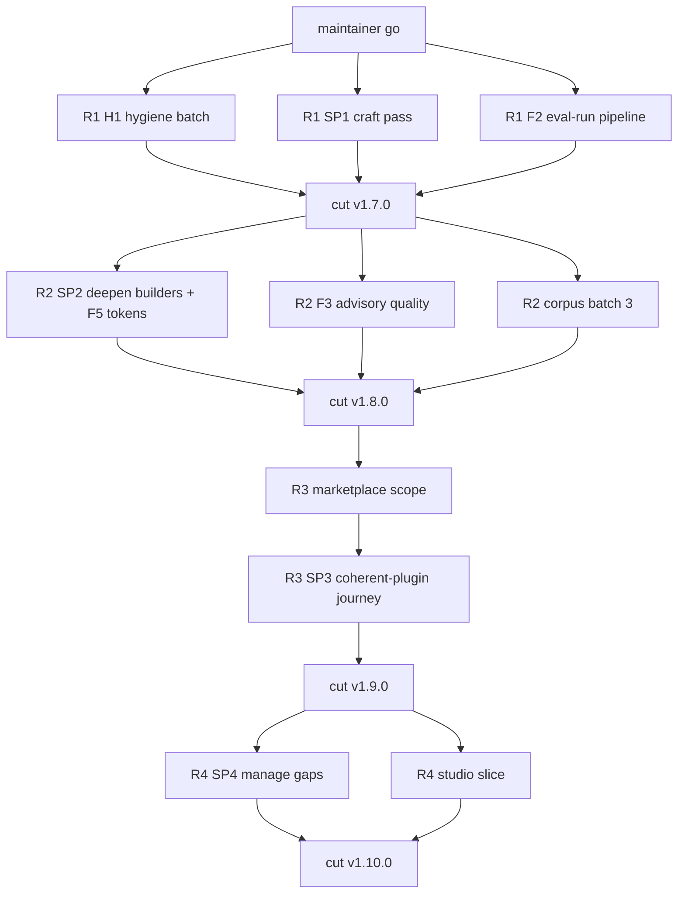

# Execution plan: four releases, one repo, one orchestrator

This is the master execution plan for the askit uplift program. It decides HOW the planned work runs: in what order, behind which gates, with which discipline. WHAT the program achieves is [02-prd.md](02-prd.md); WHO does what is [10-agent-operations.md](10-agent-operations.md); the cut mechanics are [06-release-choreography.md](06-release-choreography.md).

**What this delivers and why it matters (plain language).** The program ships as four small releases instead of one big one. Each release leaves the product complete and better than before, so the maintainer can stop, pause, or reprioritize after any of them without stranded work. All work happens inside this repository under one orchestrator, which is what makes full autonomy safe: there is no cross-repo action to get wrong.

## 1. The model: one lane, four releases

Unlike the maintainer's standards program (two lanes because it crosses repos), this program needs only ONE lane: every write lands in agent-skills-toolkit, so the entire program is autonomous after the single maintainer "go". The only recurring maintainer touchpoint is applying each release's staged re-pin instructions, which is optional and can lag arbitrarily (an unpinned registry simply keeps serving the previous version).

Work is grouped into four releases, ordered by dependency and by trust value:

1. **R1 v1.7.0 "trust and craft"** - H1 (hygiene batch) restores every stale trust surface; SP1 (builder craft pass) resumes the maintainer's 2026-06-25 thread; F2 (eval-run pipeline) is the multiplier everything later uses.
2. **R2 v1.8.0 "deep builders, measured advisory"** - SP2 (deepen builders) plus F3 (advisory quality) plus F5 (authoring tokens, riding SP2's authoring runs) plus corpus batch 3 (on the F2 runner) plus real evals/ fixtures.
3. **R3 v1.9.0 "marketplace scope"** - the headline: marketplace-scope evaluation, plus SP3 (coherent-plugin journey).
4. **R4 v1.10.0 "manage and studio"** - SP4 (Manage gaps) plus the GUI read-only studio slice; stretch riders E4 (SARIF output) and E9 (provenance contract).

## 2. The dependency spine

- **H1 (hygiene batch) first within R1.** It is independent, high-visibility, and several later docs build on corrected surfaces (README, STATUS cross-repo note).
- **F2 (eval-run pipeline) before corpus batch 3 and F3 (advisory quality).** The pipeline is built in R1 precisely so R2 exercises it immediately; F3's dispatch contract and record automation are F2 deliverables.
- **SP2 (deepen builders) and F5 (authoring tokens) are one motion.** The golden/anti examples are authored via the builder skills with token metering on; those runs are the F5 measurements. Sequencing them separately would pay for the authoring twice.
- **Corpus batch 3 feeds R3.** Batch 3's target list includes at least one marketplace-shaped library, providing fresh ground truth for marketplace-scope acceptance beyond the pinned phuryn clone.
- **Marketplace scope before SP3 (coherent-plugin journey) within R3.** The journey's final step (evaluate what you composed) reads better once collection-level evaluation exists, and both share composition thinking.
- **R4 last.** SP4 (Manage gaps) is ADR-gated and independent; the studio slice renders evaluate/tier-report JSON, which R3's renderer factoring leaves in its final shape.

Within each release, independent bundles run in parallel via worktree-isolated subagents; the diagram shows release-level ordering only.

## 3. Gates

1. **The one maintainer go.** The maintainer approves [EXEC-SUMMARY.md](EXEC-SUMMARY.md); everything after is autonomous inside this repo. There are no per-release approval gates (maintainer ruling AU-3, full ship autonomy) - but every stop-and-flag condition (section 5) suspends autonomy immediately.
2. **Per-PR gate.** TDD evidence (RED first), full `npm test` green, `node scripts/check.mjs .` Advanced 0/0, the 4-lens adversarial panel run with findings resolved or declined with recorded rationale, docs wiring (G7 docs-frontmatter, G8 folder-readme, route-manifest) when public docs change. Merge is `gh pr merge --squash --admin` on green (main is branch-protected; admin squash is the repo's established flow).
3. **Per-cut gate.** Everything in [06-release-choreography.md](06-release-choreography.md): CHANGELOG and RELEASE-NOTES complete, version consistency across the four CI-guarded manifests (package.json, library.json, .claude-plugin/plugin.json, .codex-plugin/plugin.json) plus the regenerated INDEX and manifest.generated, implementing ADRs ratified, the release packet folder written, tag only at the squashed merge commit, release.yml green behind its version-consistency guard.
4. **The gate never goes red.** No merge and no cut on a red gate or failing suite. A red gate is a stop-and-flag event, not a retry loop.
5. **Standard growth is ADR-gated.** If any work proposes a new spine check (candidates: the step-orphan check in SP4, any marketplace-scope check), the ADR decides spine-vs-validator explicitly, and a spine route ships warn-first per ADR 0027 (standard-aware gate) section 7.7 burndown. Whichever ADR first takes the Standard to 0.13 also owns the U13 (skill-registration) warn-to-error flip in the same sweep; if the program never reaches 0.13, that flip carries to [09-backlog.md](09-backlog.md) as an obligation on the next Standard bump.

## 4. The living-docs protocol

Every landing updates the affected packet docs in the same session: release-plan statuses, [07-decision-register.md](07-decision-register.md) for any new ruling, [08-risk-register.md](08-risk-register.md) for retired or new risks, [09-backlog.md](09-backlog.md) for discovered follow-ons, and this file's status column. `docs/internal/STATUS.md` remains the repo's single live tracker and gets its normal per-release update. Every session closes with a wrap-session log carrying a verbose continuation prompt (the 2026-06-25 unlogged-session failure mode is the named reason this is mandatory).

## 5. Stop-and-flag rules

Autonomy suspends and the maintainer is flagged the moment any of these appears:

- **The relocation fires.** Any sign of the agent-plugins standards program's PR-C (askit re-adopt) touching this repo: stop, reconcile against [relocation-addendum.md](relocation-addendum.md), re-plan.
- **A red gate** that a fix-forward within the current PR cannot immediately restore.
- **An out-of-boundary write** would be required to proceed (anything outside this repo): hard stop, stage instructions instead.
- **A hook-denial pattern** (for example the no-dash hook denying repeatedly), signaling pasted legacy content needing a human call.
- **A plan assumption fails against the live tree** (file moved, count changed, upstream drift): re-derive; if the shape of the plan changes, stop and flag.
- **A judgment reversal without principle.** If a review finding demands reversing a maintainer-ruled decision, the finding is declined with rationale and surfaced, not silently obeyed.

## 6. Done definitions

- **A release is done when** its release plan's exit gate is met, the cut checklist in [06-release-choreography.md](06-release-choreography.md) is complete through "GitHub release live and Latest", the staged repin-instructions.md exists in its release-plans folder, and STATUS plus RELEASE-HISTORY tell the story.
- **The program is done when** all four releases are cut, the PRD metrics M1-M10 hold, [09-backlog.md](09-backlog.md) has been re-triaged into the canonical backlog, the memory index is updated, and a close-out wrap-session log exists.
- **An early stop is clean when** the current release's in-flight PRs are either merged green or closed with their branches deleted, the packet statuses say exactly where things stand, and a wrap-session log carries the continuation prompt.

## Renumbered 2026-07-27

**R3 is now v1.10.0 and R4 is now v1.11.0.** Maintainer-approved work outside this program (`askit-standards-watch` plus the ADR implementation-sites convention) shipped as **v1.9.0**, because adding a skill is a MINOR under semver and the version is a promise to anyone installing from the marketplace. Renumbering an internal plan is cheaper than misnumbering a public release.

Release CONTENT is unchanged. Only the version labels move. Where this packet's prose says "v1.9.0 marketplace scope" or "v1.10.0 manage and studio", read v1.10.0 and v1.11.0 respectively.
