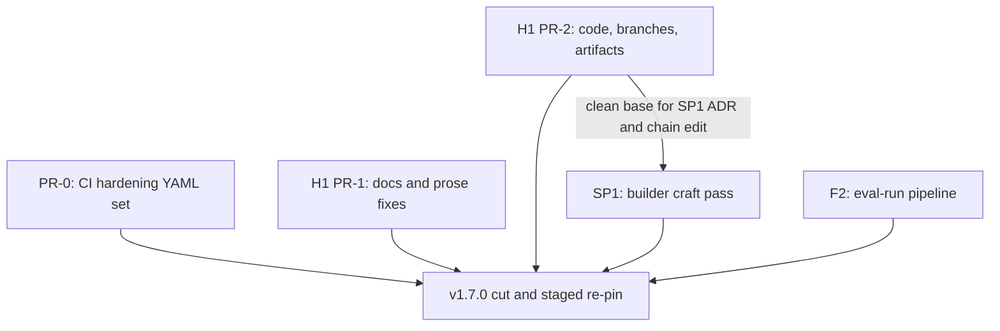

# Release 1: v1.7.0 "trust and craft"

This is the plan for the first of the four releases in the askit uplift program (see the packet map at [../README.md](../README.md) and the release model at [../03-execution-plan.md](../03-execution-plan.md)). It bundles three workstreams: H1 (hygiene batch: restore every stale trust surface), SP1 (builder craft pass: give the skill builder a real craft-review phase), and F2 (eval-run pipeline: make the improve loop a command, not a procedure). It restates no decision rationale (that lives in [../07-decision-register.md](../07-decision-register.md)) and allocates no ADR number, version tag, or check id (those are allocated at land per the execution plan).

## What this delivers and why it matters (plain language)

Right now three things quietly undermine trust in the toolkit. Its public README advertises the wrong version and check count (it says an older release with fewer checks than actually ship). Its comparison page carries a caveat about a scorer that was already fixed a month ago. And the loop the maintainer uses to improve the toolkit by grading real third-party plugins is run entirely by hand, which is slow and easy to get subtly wrong.

Release 1 fixes all three at once. It corrects every stale surface and adds a small guard so the README can never drift out of sync again. It teaches the skill builder to do a second, optional "craft" pass: after a skill mechanically passes the gate, an AI reviewer reads it for teaching quality (are the examples real, is the trigger clear, is it the right length) and offers to apply only the safe, mechanical fixes with your consent, never touching meaning. And it turns the hand-run grading loop into a repeatable script so the next batch of grading takes minutes to set up instead of an afternoon.

The payoff: a product that no longer contradicts itself, a builder that makes genuinely better skills, and an improvement loop anyone can reproduce. Nothing here changes what the gate requires or how it grades; the check spine stays 30 checks and the repo stays self-grading at Advanced.

## Release at a glance

| Bundle | What it is | Pillar | Shape | PRs (suggested) |
|---|---|---|---|---|
| H1 (hygiene batch) | 11 itemized trust-surface fixes | cross-cutting | mechanical volume | 1-2 |
| SP1 (builder craft pass) | `askit-build-skill` improve mode gains an optional craft-review phase 2 | Create | judgment-heavy | 1 |
| F2 (eval-run pipeline) | pinned corpus + deterministic runner + dispatch contract + aggregation | Improve | judgment-heavy | 1 |
| CI hardening (the [../05-ci-plan.md](../05-ci-plan.md) set) | Dependabot, Node {22.12.0, 24} matrix, npm audit step, concurrency group, npm cache, SHA-pin, c8 report-only, CodeQL | cross-cutting | mechanical YAML | 1 |

Model routing (per [../10-agent-operations.md](../10-agent-operations.md)): H1 is Sonnet mechanical volume with Opus spot-checks on the two judgment items (H1.2 comparison re-verification, H1.8 CONDITIONAL semantics); SP1 and F2 are Opus builds. Every substantive merge passes the 4-lens Claude adversarial panel (false-PASS, false-FAIL, determinism, contract-fidelity); Codex review is opportunistic, never blocked on.

## Sequencing within the release

H1 lands first because it is low-risk and clears the working tree (stale branches pruned, artifacts committed) that SP1 and F2 build on top of. SP1 and F2 are independent and parallelize via git worktrees. The cut waits on all four gate-green PRs.

---

## Bundle H1: hygiene batch

Eleven itemized fixes, each with its own acceptance criterion. All writes are in this repo. Items are grouped into two suggested PRs (see PR slicing below): the docs and prose fixes, and the code plus repo-state fixes.

### H1.1 - README version and check-count truth, with a drift guard

The README badges and the Status prose still name a pre-v1.6.0 release and an old check count. Correct both to the v1.6.0-current values (version and 30 checks). Then add the guard so this cannot drift again: a small script `scripts/check-readme-version.mjs` that asserts the README version string equals `library.json` version, wired into `npm test` (and therefore the `validate` gate) so a stale README fails CI. Decision recorded in this doc: ship the script plus CI assertion rather than a release-flow reminder, because a checked-in assertion is enforced mechanically while a runbook step relies on discipline (the same reasoning the standards program applies to its re-pin conformance check).

- **Acceptance:** the README badges and Status prose read the live version and 30 checks; `node scripts/check-readme-version.mjs` exits non-zero when the README version and `library.json` version diverge, and is invoked by `npm test`.
- **TDD:** RED first - a unit test that points the asserter at a fixture README whose version disagrees with a fixture `library.json` and expects a non-zero exit; then the passing case.

### H1.2 - comparison.md re-verification pass

`docs/explanation/comparison.md` line 56 still carries the "description-quality scorer is currently being recalibrated" caveat, but ADR 0033 (U5 recalibration) shipped 2026-06-11. Remove the stale caveat. Re-check the competitor claims against live state (a read-only pass; `gh api` calls to other repos are permitted, no writes). Add a not-yet-live qualifier to the `/evaluation-reports/` showcase promise at line 62 (the showcase route is not yet published).

- **Acceptance:** the U5 caveat paragraph is gone; every competitor claim carries a re-verification date; the showcase sentence states the route is not yet live.
- **Note (judgment item):** Opus does the competitor re-verification; if a claim can no longer be verified from primary sources, it is softened or dropped, not left asserted (the METHODOLOGY verify-before-assert rule).

### H1.3 - new docs/reference/subagents.md

The 7 subagents (`askit-evaluator`, `askit-explorer`, `askit-file-ops`, `askit-file-search`, `askit-quality-grader`, `askit-reviewer`, `askit-skill-author`) have no reference page. Add `docs/reference/subagents.md` with one section per subagent: purpose, parent skill, and chain permissions (sourced from `agents/_chain-permitted.yaml`). Wire it fully: G7 frontmatter (no colon-space in the description), a G8 inventory line in the folder README, and a `site/scripts/route-manifest.txt` entry for route parity.

- **Acceptance:** the page documents all 7 subagents; both site guards (G7 frontmatter, G8 folder-README) pass; the route-manifest carries the new route; `node scripts/check.mjs .` stays Advanced 0/0.

### H1.4 - QUICKSTART report-render example

`QUICKSTART.md` shows terminal and `--json` output but not the HTML report. Add a one-line report-render example: `node scripts/evaluate.mjs <target> --format=html`.

- **Acceptance:** QUICKSTART shows the `--format=html` invocation with a sentence on where the file lands.

### H1.5 - backlog E12 status sync

E12 (report UX: responsive pass plus per-check glossary), `docs/internal/backlog/enhancements.md`, still reads "the (a) minimal scroll fix is SHIPPED, the rest is open." v1.6.0 shipped the per-check glossary, the universal-checks reference page, and the sub-600px responsive pass (commit `5ecdd89`). Update the E12 status line to reflect what actually shipped and what, if anything, remains.

- **Acceptance:** the E12 status line names the v1.6.0 deliverables as shipped; any genuine residual is stated, otherwise E12 is marked done.

### H1.6 - prune stale merged remote branches

Prune the stale merged remote branches (PR #138 precedent: each verified as net-deletions against main before deletion). The live remote set at authoring (16 branches, not the 11 the audit snapshot named - flagged to the orchestrator as a count discrepancy to reconcile at execution): `f1-skill-registration`, `f2-phase-b-migration-release`, `f4-report-ux`, `feat-profile-flag`, `feat-u2-u5-house`, `fix/evaluator-calibration`, `release-v1.5.0`, `release-v1.6.0`, `research/competitive-comparison`, `status-finalize-v1.4.0`, `status-finalize-v1.4.1`, `status-finalize-v1.5.0`, `status-finalize-v1.6.0`, `v1.4.0-bump`, `v1.4.1-hardening`, `worktree-f2-phase-c-advisory`. Re-enumerate live at execution (`git branch -r`) and tree-diff-verify each (`git diff origin/main...origin/<branch>` shows net-deletions or already-merged) BEFORE deleting; any branch carrying unmerged work is left and flagged, not deleted.

- **Acceptance:** every pruned branch was verified merged/net-deletions first; the surviving remote set is `main` plus any branch with genuine unmerged work; the reconciled count is recorded in the PR body.

### H1.7 - commit the template design references

The 4 untracked design references in `docs/internal/template/` (`evaluation-report--plugin--{dark,dashboard,editorial}.html` plus `editorial.md`) are the E1 renderer's original design variants. Commit them as labeled historical references and add a note to the template folder README stating they are frozen design references (the maintainer's favorite was the dashboard variant), not live templates.

- **Acceptance:** the 4 files are tracked; the folder README note labels them historical design references and names dashboard as the maintainer favorite.

### H1.8 - evaluate.mjs CONDITIONAL set includes U12 and U13

U12 (mermaid-valid) and U13 (skill-registration) currently render PASS on plugins that have no diagrams / no enumerating manifest, when they should render N/A (a vacuous pass reported as PASS overstates conformance). Add U12 and U13 to the CONDITIONAL set in `evaluate.mjs` so a subject lacking the precondition renders N/A, not PASS.

- **Acceptance:** a plugin with no mermaid diagrams renders U12 as N/A; a plugin with no enumerating manifest renders U13 as N/A; both still PASS/FAIL correctly when the precondition is present.
- **TDD:** RED first - a fixture plugin with no diagrams and no enumerating manifest; assert the report shows N/A for U12 and U13, not PASS. This is a judgment item (report-semantics contract); Opus spot-check on the panel's contract-fidelity lens.

### H1.9 - remove the orphaned catalog build artifact

`site/src/content/docs/catalog.md` is a gitignored build artifact left on disk. Remove it (site-content cleanup); confirm the site build regenerates cleanly without it.

- **Acceptance:** the orphaned file is gone; `npm run` site build (or the site guard) passes; no route regression.

### H1.10 - STATUS.md cross-repo dependency note

Add a note to `docs/internal/STATUS.md`: the agent-plugins standards program exists and may relocate STANDARD.md and the checker (`scripts/check.mjs`, `scripts/lib/`, `scripts/checks/`, `scripts/generators/`, `tier-report.mjs`) into `agent-plugins/standards/`; this repo plans around that move (new engine-adjacent code is built cleanly separable), and if that program's PR-C (askit re-adopt) fires mid-program, this program stops and reconciles.

- **Acceptance:** STATUS.md carries the cross-repo dependency note naming the relocation and the stop-and-reconcile trigger.

### H1.11 - U6 finding message wording (message-only)

U6 (reference-links) findings do not say what a relative link resolves against, which confused a reader in eval-run sensor reading 8 (relative-link base). Add "resolves relative to the containing file" to the U6 finding message. Message-only, no logic change.

- **Acceptance:** the U6 finding message includes the "resolves relative to the containing file" wording; the golden snapshot for a U6 finding is regenerated (`UPDATE_SNAPSHOTS=1`) and the change is the message text only.

---

## Bundle SP1: builder craft pass

Resumes the maintainer's stalled 2026-06-25 design and makes it a real spec. `askit-build-skill` improve mode gains an optional **phase 2** that runs only after the deterministic gate is already clean: a craft review that reads the skill for teaching quality and offers to apply only the safe, mechanical subset of its findings with consent.

### What SP1 delivers (plain language)

The skill builder can already tell you whether a skill passes the rules. It cannot yet tell you whether the skill is any good as a teacher: whether its examples are real, whether its trigger is clear, whether it is the right length. SP1 adds that second opinion. After a skill mechanically passes, the builder can dispatch an AI reviewer against a written craft rubric, show you the findings in a durable report, and offer to apply only the safe fixes (broken links, formatting, missing frontmatter fields) with your say-so. It never edits meaning, never edits without consent, and the advisory result can never change the pass/fail verdict.

### Design

Phase 2 is offered (not forced) after `improve` mode confirms the gate is clean:

1. **Dispatch the reviewer.** Dispatch the `askit-reviewer` subagent, guided by a NEW reference `skills/askit-build-skill/references/skill-craft-rubric.md`. Rubric dimensions: description/trigger quality, instruction clarity, example depth (including golden and anti-example presence), reference structure, token economy.
2. **Render the findings.** Findings render through the existing `evaluate.mjs --report=review` advisory path to a durable MD plus HTML artifact, so the craft review is a shareable report, not ephemeral chat output.
3. **Partition the findings.** A NEW helper `scripts/lib/craft-review.mjs` partitions findings into SAFE (a mechanical allowlist: broken-link fixes, formatting, missing frontmatter fields) versus JUDGMENT (anything touching instructions, procedures, or meaning).
4. **Consent-gated apply.** The skill offers to apply only the SAFE subset, with explicit consent, then re-runs the gate to confirm it is still clean.

### Invariants (load-bearing)

- Never edits without consent.
- The advisory layer can never move the gate verdict (the `applyAdvisory` allowlist invariant; the craft review is rendered beside the verdict, never into it).
- SAFE is a closed allowlist; anything not on it is JUDGMENT by default (fail closed toward "do not touch").

### Artifacts SP1 creates or edits

- NEW `skills/askit-build-skill/references/skill-craft-rubric.md` (the rubric).
- NEW `scripts/lib/craft-review.mjs` (the partitioner). Must be listed in `scripts/lib/README.md` (G8) or the dogfood fails.
- EDIT `skills/askit-build-skill/SKILL.md` (the improve-mode phase-2 procedure).
- EDIT `agents/_chain-permitted.yaml`: permit `askit-reviewer` under `askit-build-skill`. Today `askit-build-skill` chains only `askit-skill-author`; `askit-reviewer` is currently reachable only under `askit-evaluate`. This edit adds the new chain edge.
- NEW ADR (craft pass; number allocated at land) recording the phase-2 design and the SAFE/JUDGMENT partition contract.
- A token-dossier row in `docs/reference/token-usage-estimates.md` for the craft-review dispatch (model plus effort).
- A line in [../relocation-addendum.md](../relocation-addendum.md) recording `scripts/lib/craft-review.mjs` as **evaluate-side** (retained by askit if the checker relocates, since it rides the `evaluate.mjs` advisory path, not the deterministic check spine).

### Acceptance criteria

- [ ] Phase 2 is offered only after the gate is clean, and only runs on explicit opt-in.
- [ ] The rubric reference exists and covers all five dimensions.
- [ ] `craft-review.mjs` partitions a mixed finding set correctly: planted SAFE findings land in SAFE, planted JUDGMENT findings land in JUDGMENT, unknown categories default to JUDGMENT.
- [ ] The consent-gated apply touches only SAFE findings, and re-runs the gate afterward.
- [ ] The advisory result is rendered beside the verdict and cannot change it (invariant test).
- [ ] The chain edit permits `askit-reviewer` under `askit-build-skill`; `node scripts/check.mjs .` stays Advanced 0/0.
- [ ] The ADR, the token-dossier row, and the relocation-addendum line are present.

### TDD notes

- **Unit (partition):** RED first - a `craft-review.mjs` partition test seeded with real-shaped findings: known-SAFE (broken link, missing frontmatter field, formatting) and known-JUDGMENT (an instruction rewrite, a procedure change), plus one unknown-category finding that must default to JUDGMENT. Assert the split before writing the partitioner.
- **End to end:** a fixture skill carrying both a safe defect (a broken relative link) and a judgment defect (a weak trigger). Assert: phase 2 offers, the SAFE apply fixes only the link, the judgment finding is reported but untouched, and the gate is re-run clean.

---

## Bundle F2: eval-run pipeline

F2 is built to the existing SPEC and implementation plan; this section states only deltas and sequencing, it does not duplicate them.

- SPEC: [../../release-plans/plan_v1.6.0/F2-eval-run-pipeline/SPEC.md](../../release-plans/plan_v1.6.0/F2-eval-run-pipeline/SPEC.md) (R-PIPE-1 through R-PIPE-5).
- IMPL-PLAN: [../../release-plans/plan_v1.6.0/F2-eval-run-pipeline/IMPL-PLAN.md](../../release-plans/plan_v1.6.0/F2-eval-run-pipeline/IMPL-PLAN.md) (branch, manifest, runner, dispatch templates, aggregator, verify).

### Deltas from the on-disk plan

These are the only changes this release makes to the F2 plan as written; everything else is built as specified.

1. **Gate invoked only through the `npm run check` seam (relocation-friendly).** The runner MUST invoke the gate through the `npm run check` script seam, never a hardcoded `scripts/check.mjs` path in new code. This is the maintainer's relocation ruling made concrete: if the standards program relocates the checker (STATUS note H1.10), the seam is the one place that repoints, and F2's runner does not need to change. The IMPL-PLAN's Step 3 wording ("run the free gate") is satisfied via the seam, not a direct script path.
2. **Record automation appends to `docs/internal/eval-runs/eval-runs.md`.** R-PIPE-4 (record and aggregate) targets the existing tracked record `docs/internal/eval-runs/eval-runs.md`; the aggregator appends correctly-shaped rows there (schema including the `scope` column) and updates the measured ranges in `docs/reference/token-usage-estimates.md`. Raw artifacts stay gitignored under `_local/audit/eval-runs/`.
3. **Exercised immediately by one smoke target.** Per the SPEC's "build it right before the batch that exercises it," run the pipeline once against the pinned `deanpeters-pm` clone at `E:/tmp/eval-deanpeters-pm` @ `70fb6c4` as the smoke exercise, confirming: the pin verifies, the conformance report renders, a record skeleton is written, and a drifted or empty tree fails loudly. Corpus batch 3 (the larger exercise) is Release 2 work, not Release 1.

### Relocation-separability note

The F2 runner and aggregator are new engine-adjacent code. They are built cleanly separable per the maintainer's relocation ruling: because the runner reaches the gate only through the `npm run check` seam and reads/writes only askit-side records (`eval-runs.md`, the dossier, `_local/audit/`), F2 is recorded in [../relocation-addendum.md](../relocation-addendum.md) as **evaluate-side / askit-retained** - it orchestrates around the checker but is not part of the check spine. New `scripts/lib/*` files must be listed in `scripts/lib/README.md` (G8).

### Acceptance criteria

F2's feature-level acceptance is the SPEC checklist (R-PIPE-1 through R-PIPE-5). The release-level additions:

- [ ] No new code contains a hardcoded `scripts/check.mjs` path; the runner reaches the gate through `npm run check`.
- [ ] The aggregator appends to `docs/internal/eval-runs/eval-runs.md` with the `scope` column and updates the dossier ranges.
- [ ] The `deanpeters-pm` @ `70fb6c4` smoke run produces the conformance report plus a record skeleton, and a not-at-pin tree fails loudly.
- [ ] `node scripts/check.mjs .` Advanced 0/0; `npm test` green; new `scripts/lib/*` listed in `scripts/lib/README.md`.

### TDD notes

- RED first: a runner test that points at a clone NOT at the pinned sha and asserts a loud failure (the silent-empty-dir trap closed); then the at-pin happy path asserting the report plus skeleton are written. A path-normalization test that a Windows backslash target is normalized to forward slashes before the gate sees it (the recorded Windows trap).
- Aggregator test: feed two record skeletons, assert two correctly-shaped rows append to a fixture `eval-runs.md` and the dossier ranges update.

---

## Release exit gate

v1.7.0 does not cut until all of the following hold:

- **Gate:** `node scripts/check.mjs .` is Advanced 0/0 on `main` after every H1, SP1, and F2 PR is merged. The check spine stays 30 checks; no check is added or changed in Release 1.
- **Tests:** `npm test` is green, including every new test (the README-drift asserter, the CONDITIONAL N/A cases, the craft-review partition and end-to-end tests, the F2 runner and aggregator tests).
- **Adversarial panel:** each substantive PR passed the 4-lens Claude panel (false-PASS, false-FAIL, determinism, contract-fidelity); the SP1 invariant (advisory cannot move the verdict) and the H1.8 report-semantics contract were specifically exercised on the contract-fidelity lens.
- **Docs wired:** the new `subagents.md` reference and any new page carry G7 frontmatter, a G8 folder-README inventory line, and a `site/scripts/route-manifest.txt` entry; both site guards pass.
- **Trust surfaces clean:** README version and check count are live and guarded by CI; comparison.md carries no stale caveat; STATUS.md carries the cross-repo dependency note.
- **CI hardening live:** the [../05-ci-plan.md](../05-ci-plan.md) changes are merged and green (Dependabot config present, the Node {22.12.0, 24} matrix passing, audit step, concurrency group, cache, SHA-pin, c8 summary printing, CodeQL first run complete).
- **Relocation addendum updated:** `craft-review.mjs` and the F2 runner/aggregator are recorded as evaluate-side / askit-retained.

## PR slicing (suggested)

| PR | Contents | Model | Notes |
|---|---|---|---|
| PR-0 (CI hardening) | the YAML-only set from [../05-ci-plan.md](../05-ci-plan.md) (Dependabot, Node matrix, audit step, concurrency, cache, SHA-pin, c8 report-only, CodeQL) | Sonnet, Opus spot-check on the matrix change | YAML-only; no validation logic in YAML; per-change rollback recorded in the CI plan |
| PR-1 (H1 docs) | H1.2, H1.3, H1.4, H1.5, H1.7, H1.10, H1.11 - prose, new reference page, backlog/status sync, template commit, message-only U6 | Sonnet, Opus spot-check on H1.2 | docs and message-only; low risk |
| PR-2 (H1 code and repo state) | H1.1 (README asserter), H1.6 (branch prune), H1.8 (CONDITIONAL N/A), H1.9 (artifact removal) | Sonnet, Opus on H1.8 | carries the two code changes and the branch prune; TDD on H1.1 and H1.8 |
| PR-3 (SP1) | the full builder craft pass, its ADR, chain edit, rubric, `craft-review.mjs`, dossier row, addendum line | Opus | judgment-heavy; TDD partition then end-to-end |
| PR-4 (F2) | the eval-run pipeline built to the plan_v1.6.0 SPEC/IMPL-PLAN with the three deltas | Opus | judgment-heavy; smoke-exercised on deanpeters-pm |

H1 may collapse to a single PR if the two-PR split adds no review value; SP1 and F2 stay one PR each and parallelize via git worktrees. Each PR is individually gate-green against protected `main`.

## Release-1 risks and dependencies

These are the Release-1-specific entries; the program-wide register is [../08-risk-register.md](../08-risk-register.md).

| Risk | Likelihood | Impact | Mitigation | Reopen trigger |
|---|---|---|---|---|
| The standards program's PR-C (askit re-adopt) fires mid-release, moving the checker out from under F2 and SP1 | Low | High | The `npm run check` seam (F2 delta 1) and the evaluate-side classification of `craft-review.mjs` keep both bundles separable; H1.10 records the stop-and-reconcile trigger. If PR-C fires, stop and reconcile per the packet boundary rule before cutting. | Any commit in agent-plugins that lands the relocation, or a re-adopt PR opened against this repo. |
| The stale-branch count is wrong (audit said 11, live shows 16) | High | Low | H1.6 re-enumerates live and tree-diff-verifies each branch before deletion; no branch is deleted on the audit snapshot alone. | `git branch -r` at execution differs again from the recorded set. |
| H1.8 CONDITIONAL change turns a real PASS into a spurious N/A (false-FAIL of the report semantics) | Low-Medium | Medium | TDD fixture asserts U12/U13 still PASS/FAIL when the precondition is present, N/A only when absent; the adversarial panel's false-FAIL lens exercises it. | A graded subject that HAS diagrams or an enumerating manifest renders N/A. |
| SP1's advisory layer leaks into the verdict | Low | High | The `applyAdvisory` allowlist invariant plus a dedicated invariant test; SAFE is a closed allowlist failing toward "do not touch." | Any craft-review finding changes the gate exit code in a test or a real run. |
| README drift guard (H1.1) is itself brittle across manifest format changes | Low | Low | The asserter reads the version field by key, not by line position; a fixture test covers a format-shifted README. | The asserter false-fires on a valid README after a manifest edit. |

The load-bearing cross-release dependency is the relocation ruling: Release 1 is the first release to add engine-adjacent code (F2's runner, SP1's `craft-review.mjs`), so it is the first to write real content into [../relocation-addendum.md](../relocation-addendum.md). Getting the evaluate-side classification right here sets the pattern the later releases follow.

## Cut checklist

When all four PRs are merged and the exit gate holds, cut v1.7.0 following the per-release runbook at [../06-release-choreography.md](../06-release-choreography.md): bump the five manifests, update CHANGELOG, tag, GitHub release, then STAGE (do not execute) the agent-plugins marketplace re-pin instructions per the packet boundary rule. The cut itself is autonomous within this repo; the re-pin is staged for the maintainer.

## Change log

| Date | Change |
|---|---|
| 2026-07-06 | Created. |
