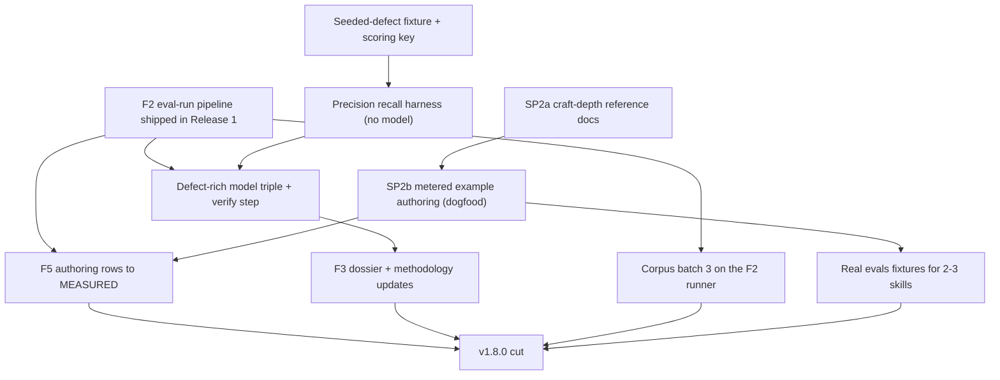

# Release 2 - v1.8.0 "deep builders, measured advisory"

This is the plan for the second release of the askit uplift program. It operationalizes the release model, gates, and stop-and-flag rules in [../03-execution-plan.md](../03-execution-plan.md); it restates no rationale those documents own and allocates no version, ADR, or check number here (numbers are fetched against the protected head at land, per the execution plan's allocation-at-land gate). Where an on-disk SPEC or IMPL-PLAN already exists for a workstream, this document links to it and states only the deltas and the sequencing; it does not duplicate the spec.

Release 1 (v1.7.0 "trust and craft") is the hard predecessor: it ships the [F2 (eval-run pipeline)](../../release-plans/plan_v1.6.0/F2-eval-run-pipeline/SPEC.md) runner that three of this release's four workstreams record into. **F2 must be shipped and merged to `main` before this release's measurement work can finalize.** The one-way dependency is spelled out in section 3.

## What this delivers and why it matters

**For anyone (non-engineer).** The toolkit has thirteen "builder" skills that draft components for you (a skill, a workflow, an MCP wiring, a hook). They are broad but shallow: the four hardest builders ship a reference note of roughly twenty to forty lines and, critically, **zero working examples** - one MCP template even points at a server file that does not exist. This release turns the four complex builders into genuine teachers: each gets real craft guidance (patterns, the mistakes to avoid, worked reasoning) and at least three working golden examples plus one deliberately-wrong "anti" example, so a person learns by seeing a good one, not by guessing from a stub. We author those examples using the builders themselves, with a token meter running, which simultaneously answers a question the cost page has always left blank: **how much does it actually cost to author a component?** In the same release we build a scored test for the optional AI "advisory" opinion, so "the cheaper model seemed just as good" becomes a measured precision-and-recall number rather than a hopeful impression, and we run the next batch of real third-party libraries through the new pipeline to keep the grader honest against the wild.

**For an engineer.** Release 2 lands five coupled workstreams: (1) **SP2 (deepen the builders)** replaces the four highest-complexity builder reference stubs with craft-depth docs and ships >= 3 golden + >= 1 anti example per builder under the samples convention, plus >= 1 golden per remaining builder; (2) **F5 (authoring token measurements)** meters those authoring runs and moves the dossier's authoring rows from "not yet measured" to MEASURED; (3) **F3 (advisory quality measurement)** ships a seeded-defect fixture with a scoring key and a precision/recall harness, and replicates the same-target model triple on a structurally defective target; (4) **corpus batch 3** exercises the F2 runner at scale for the first time; (5) **evals fixtures** ship real `evals/` eval-set instances for 2-3 shipped skills so [G3 (library-regression)](../../../../scripts/checks/library-regression.mjs) finally grades on-disk evidence. The deterministic spine stays 30 checks / Standard 0.12; no check, severity, or verdict changes in this release. The gate stays Advanced 0/0 throughout.

## 1. Scope and non-goals

**In scope.**

- SP2 (deepen the builders): deep reference docs and real examples for `askit-build-skill`, `askit-build-workflow`, `askit-build-mcp`, `askit-build-hook`, plus >= 1 golden example for every remaining builder.
- F5 (authoring token measurements) per its [SPEC](../../release-plans/plan_v1.6.0/F5-authoring-token-measurements/SPEC.md) / [IMPL-PLAN](../../release-plans/plan_v1.6.0/F5-authoring-token-measurements/IMPL-PLAN.md).
- F3 (advisory quality measurement) per its [SPEC](../../release-plans/plan_v1.6.0/F3-advisory-quality/SPEC.md) / [IMPL-PLAN](../../release-plans/plan_v1.6.0/F3-advisory-quality/IMPL-PLAN.md).
- Corpus batch 3: the next outward-grading batch, run on the F2 runner.
- Evals fixtures: real `evals/` instances for 2-3 shipped skills (the reading-2 residual).
- The U6 (reference-links) advisory message-wording fix (sensor reading 8).

**Non-goals (deferred, tracked in [../09-backlog.md](../09-backlog.md)).**

- Modifying any builder's runtime behavior beyond its reference doc, examples, and the one MCP template server-file fix - SP2 deepens the teaching surface, it does not re-architect the builders.
- Authoring-output QUALITY measurement (an eval harness over what the builders produce - the [E7 (borrow skill-creator's rigor)](../../backlog/enhancements.md) idea). F5 measures authoring COST only; F3 measures ADVISORY quality only.
- Any new check, severity change, or Standard version bump. This release is teaching-surface, measurement, and fixtures. A new check would move to its own ADR-gated release (Release 3 is where the next headline check lands).
- Marketplace-scope evaluation itself (Release 3). Corpus batch 3 only supplies the marketplace-shaped ground truth Release 3 will need.

## 2. The five workstreams

Two pillars run in this release. SP2 and the evals fixtures deepen the **Create** pillar (the builders and the evidence a skill carries). F5, F3, and corpus batch 3 industrialize the **Improve** pillar (measured cost, measured advisory quality, and the outward-grading loop). They are coupled at exactly one seam: the SP2 example-authoring runs are also the F5 measurements. Everything else is independently reviewable and independently revertable, so a slip in one pillar does not strand the other.

### SP2 - deepen the four complex builders

The four highest-complexity builders ship reference stubs today: `askit-build-skill`'s flagship reference is 22 lines, `askit-build-workflow` 36, `askit-build-hook` 32, `askit-build-mcp` 41, and none of the thirteen builders ships a single working example - only shape stubs. SP2 closes both gaps.

**(a) Craft-depth reference docs.** Each of the four gets its `references/` stub replaced by a real craft doc: the patterns that work, the anti-patterns to avoid, worked reasoning for the judgment calls, and cross-references to the specific Standard sections the builder's output must satisfy (the existing stubs already cite section numbers; the deep doc explains the *why* behind each). The bar is "a builder new to this component type could produce a Silver-grade artifact from this doc alone."

**(b) Working golden + anti examples.** Each of the four ships **>= 3 golden examples plus >= 1 anti-example** under the samples convention that [askit-build-samples](../../../../skills/askit-build-samples/SKILL.md) authors and validates (`examples/`, Standard sec 7.2). Every remaining builder ships **>= 1 golden example**. The known-broken MCP template that points at a nonexistent server file is fixed as part of `askit-build-mcp`'s example set (a golden example must actually run).

Per-builder, the craft doc and example set target the component type's hardest judgment call:

| Builder | Reference stub today | Craft-doc focus | Example spread (>= 3 golden + 1 anti) |
|---|---|---|---|
| `askit-build-skill` | 22 lines | the description bar (sec 8.1 scoring), progressive-disclosure budget, when to split into `references/` | a bounded single-purpose skill, a multi-section skill, a skill that delegates; anti = a vague-description skill that scores below 0.7 |
| `askit-build-workflow` | 36 lines | chain-contract shape (S4), step-to-skill wiring, the orphan-step trap | a linear chain, a branching chain, a chain with a hook; anti = a chain edge with no permitting contract entry |
| `askit-build-mcp` | 41 lines | server wiring, `${CLAUDE_PLUGIN_ROOT}` paths, the manifest-vs-disk contract (S6/U8) | a stdio server, an HTTP server, a server with resources; anti = a template pointing at a nonexistent server file (the exact bug being fixed, kept as the teaching anti-case) |
| `askit-build-hook` | 32 lines | event selection, exit-code semantics, the deny-vs-warn decision | a PreToolUse guard, a PostToolUse formatter, a Stop notifier; anti = a hook that blocks with the wrong exit code |

The MCP nonexistent-server-file defect is fixed in the golden set AND deliberately preserved as the anti-example, so the mistake that shipped becomes the lesson.

**The critical synergy.** The examples are authored **via the builder skills themselves** (dogfooding), with token metering on. Those authoring runs ARE the F5 measurements - one activity produces both the teaching artifact and the cost datum. This is why SP2 examples must be authored before F5's dossier rows finalize (section 3).

Delta over a naive "just write examples" pass: the examples are not hand-crafted prose, they are the recorded OUTPUT of a metered `askit-build-*` run, so each carries an eval-run record row with `scope: authoring` and a pointer to the raw artifact under the gitignored `_local/audit/eval-runs/<date>/`.

### F5 - authoring token measurements

Operationalized by the existing [F5 SPEC](../../release-plans/plan_v1.6.0/F5-authoring-token-measurements/SPEC.md) and [IMPL-PLAN](../../release-plans/plan_v1.6.0/F5-authoring-token-measurements/IMPL-PLAN.md). Read those for the requirements (R-AUTH-1..3) and the step list; only the deltas for this release follow.

- **Delta 1 - the runs are the SP2 authoring runs.** The F5 IMPL-PLAN's Step 2 ("run and measure") is satisfied by SP2's example-authoring, not by throwaway builds. A representative spread is guaranteed by SP2's own coverage: a bounded component (a hook golden), a mid component (a skill golden), and a larger one (an MCP wiring golden), across >= 2 model x effort cells (e.g. Sonnet/medium and Opus/high). Revision rounds are noted per run (the dominant cost driver).
- **Delta 2 - record via the F2 record path.** F5's IMPL-PLAN says "reuse the F2 aggregator if it has landed; otherwise hand-add." In this release F2 HAS landed (the section-3 dependency), so the runs are recorded through the F2 record path with `scope: authoring`, not hand-added. This is F2's first authoring-scope exercise.
- **Delta 3 - move the dossier rows.** [docs/reference/token-usage-estimates.md](../../../../docs/reference/token-usage-estimates.md)'s "authoring ranges are not yet measured" note becomes a MEASURED range with a per-component budget (small/mid/large) and a ceiling, citing the SP2 runs. Deterministic rows stay at 0.

The target measurement matrix (a run fills a cell; SP2's coverage guarantees the spread):

| Component size | Example authored | Cells to measure | Records as |
|---|---|---|---|
| Bounded | a hook golden | Sonnet/medium, and one of Opus/high or Haiku/medium | `scope: authoring` |
| Mid | a skill golden | Sonnet/medium and Opus/high | `scope: authoring` |
| Larger | an MCP wiring golden | Opus/high (the ceiling anchor) | `scope: authoring` |

Each row records tokens (harness-reported subagent total), wall-clock, and revision rounds - revisions dominate authoring cost, so a single-pass number would understate the real budget.

### F3 - advisory quality measurement

Operationalized by the existing [F3 SPEC](../../release-plans/plan_v1.6.0/F3-advisory-quality/SPEC.md) and [IMPL-PLAN](../../release-plans/plan_v1.6.0/F3-advisory-quality/IMPL-PLAN.md) (requirements R-AQ-1..4). Deltas and the sequencing-critical points:

- **The seeded-defect fixture + scoring key (R-AQ-1).** 1-2 fixture plugins carry KNOWN planted qualitative defects spanning the surfaced classes: a trigger-surface collision, a manifest-vs-disk drift, a stale doc claim, a subtly wrong procedure, plus the recorded content-error classes (a fake statute, an inverted domain rule, a command-vs-skill enumerated-content contradiction, a capability overclaim, a broken cross-reference). The scoring key maps each planted defect to a ground-truth label precise enough to auto- or hand-match a finding.
- **The scoring key's hardest rule (the reading-17 lesson).** A confabulated correction MUST count as **both a false positive AND a miss** - never a true positive. Sensor reading 17 is the existence proof: Haiku at high effort "smelled" a real error, invented a statute that also does not exist, and asserted a false consistency. The harness must score that as FP + miss, or it credits a hallucination as a catch. This is an explicit soundness lens item at review (F3 IMPL-PLAN adversarial-review section).
- **The precision/recall harness (R-AQ-2).** `scripts/lib/advisory-score.mjs` + a thin CLI classifies each finding TP/FP/miss against the key and computes precision/recall per model x effort cell. It scores an existing advisory result; **it dispatches no model** (determinism lens) and touches no check (contract lens). New `scripts/lib/*` files are listed in `scripts/lib/README.md` (G8), or dogfood fails.

  The scoring key entry per planted defect carries: an id, the defect class, the file/anchor it lives at, and a match rule (a substring, a regex, or a labelled "semantic" match a reviewer applies by hand). Classification: a finding matching exactly one unmatched key entry is a true positive (TP); a finding matching no key entry is a false positive (FP); a key entry no finding matched is a miss. Then precision = TP / (TP + FP) and recall = TP / (TP + misses). The reproducibility acceptance is that scoring the same advisory result file against the same key twice yields the identical TP/FP/miss partition and the identical pair.
- **The defect-rich triple (R-AQ-3).** Replicate the R9/R10/R11 same-target model triple (Opus/Sonnet/Haiku at high effort, identical prompt) on a **structurally defective** target, to test the reading-16 parity claim ("Sonnet/high matched Opus/high") where triage DEPTH matters - the R9/R10/R11 triple ran on a clean pm-toolkit, which is the open single-target caveat in [METHODOLOGY.md](../../eval-runs/METHODOLOGY.md). The verified-finding union is computed and the dossier's parity guidance updated to "holds / does not hold on a defect-rich target," resolving or explicitly carrying forward the caveat.
- **Verify-before-calibrate becomes a codified step.** METHODOLOGY rigor item 3 (the 4-lens verification pass before a finding drives a change) stops being narrative and becomes a named pipeline step in the F3 harness flow: no advisory finding feeds the parity verdict until it is hand-verified against ground truth. Reading 8 (the Sonnet/high advisory that mis-triaged 11 real U6 link defects as checker false positives) is why.

### Corpus batch 3

The next outward-grading batch, and **the F2 runner's first real exercise at scale**. Target selection criteria, recorded in-doc at run time:

- 2-4 new third-party skill libraries not previously graded, chosen to widen coverage (a new domain, a new authoring style, a new scale point).
- **At least one marketplace-shaped target** (a repo that bundles multiple plugins), to build the ground-truth corpus Release 3 (marketplace-scope evaluation) will need. This is the load-bearing selection constraint: Release 3's headline check needs real marketplace inputs to grade against, and batch 3 is where they are sourced.
- Raw artifacts gitignored under `_local/audit/eval-runs/<date>/`; sensor readings filed in [eval-runs.md](../../eval-runs/eval-runs.md) with dispositions, following the observe -> verify -> calibrate promotion path in METHODOLOGY.

Batch 3 doubles as a stress test of the F2 runner itself: it is the first time F2's dispatch, capture, and record path handles a multi-target batch it did not author by hand, so any friction (a broken record row, a mis-scoped `--profile`, a capture that drops an artifact) surfaces here as an F2 defect to be filed rather than after Release 3 depends on the runner at marketplace scale. A verified reading that warrants an ENGINE change is filed as an ADR + TDD candidate for a later release, not smuggled into this one - batch 3 is a sensor pass on the targets and a shakedown of the runner, not a calibration pass on the checks.

### Evals fixtures (the reading-2 residual)

The behavioral `evals/` convention has zero on-disk instances today, so [G3 (library-regression)](../../../../scripts/checks/library-regression.mjs) grades an empty set for this repo. This release ships real `evals/` eval-set instances for **2-3 shipped skills** (recommended: `askit-evaluate` and `askit-build-skill`), authored via [askit-build-samples](../../../../skills/askit-build-samples/SKILL.md), so the convention finally has real instances and G3 grades on-disk evidence. Each eval set declares its `covers` object (`chain` / `hook` / `skill`) per the G3 format; a `skill` triggering set carries >= 20 `{query, should_trigger}` cases (Standard sec 8.3).

### The U6 message-wording fix

A small rider from sensor reading 8: the U6 (reference-links) advisory message wording is tightened so a relative-link finding reads unambiguously (the reading recorded that a strong advisory misread genuine 404s as checker false positives partly on message ambiguity). This is a wording change to advisory/message text, not a check-behavior change - the gate result is byte-identical. It lands with the F3 work since F3 is where the U6 verify-before-calibrate lesson is codified.

## 3. Dependencies and sequencing

The one hard cross-release edge: **F2 must ship in Release 1 before this release's measurement work finalizes.** F5 records authoring runs through the F2 record path; F3 records the triple and the harness scores through the same record; batch 3 runs on the F2 runner. If F2 slips, this release stops and reconciles (a stop-and-flag event per [../03-execution-plan.md](../03-execution-plan.md)).

The one hard intra-release edge: **SP2 examples must be authored before F5's dossier rows finalize** - the examples ARE the measurements, so the metered authoring runs must exist before the dossier can cite them.

**Parallelism.** SP2 (reference docs then examples) and the F3 fixture-plus-harness build are independent until F5 needs the SP2 runs, so they run on parallel git worktrees. Batch 3 is independent of everything except a shipped F2 and runs whenever a corpus-run slot opens. Evals fixtures depend only on `askit-build-samples` being current (it is) and can start any time.

**Engine-adjacent separability note (relocation clause).** F3's `scripts/lib/advisory-score.mjs` is new engine-adjacent code. Per the program's relocation clause, it is built cleanly separable: it imports only from `scripts/lib/` shared utilities and the findings shape, dispatches no model, and touches no check module, so if the maintainer's agent-plugins standards program relocates the checker it moves as a self-contained unit. Its packing-list delta is recorded in [../relocation-addendum.md](../relocation-addendum.md) at land. If that program's "PR-C askit re-adopt" fires mid-release, this release stops and reconciles.

## 4. PR slicing

Each PR is individually green against protected `main`, passes the 4-lens Claude adversarial panel (false-PASS, false-FAIL, determinism, contract-fidelity), and is TDD where it ships code (RED test first from a real fixture). Model routing: Opus subagents for the judgment-heavy craft docs and the F3 scoring-key design; Sonnet for the mechanical example volume and the remaining-builder goldens; Haiku is never used for the veracity-critical fixture or scoring work.

| PR | Workstream | Contents | Model | Depends on |
|---|---|---|---|---|
| PR-1 | SP2a | Four craft-depth reference docs (skill, workflow, mcp, hook) | Opus | F2 shipped |
| PR-2 | SP2b | >= 3 golden + >= 1 anti per complex builder, metered; MCP server-file fix | Opus author / Sonnet volume | PR-1 |
| PR-3 | SP2b | >= 1 golden per remaining builder, metered | Sonnet | PR-1 |
| PR-4 | F5 | Dossier authoring rows to MEASURED, citing PR-2/PR-3 runs | Opus | PR-2, PR-3 |
| PR-5 | F3 | Seeded-defect fixture(s) + scoring key (RED-first) | Opus | F2 shipped |
| PR-6 | F3 | `advisory-score.mjs` harness + CLI + G8 README entry | Opus | PR-5 |
| PR-7 | F3 | Defect-rich model triple, verify step, dossier + methodology, U6 wording | Opus | PR-6 |
| PR-8 | Batch 3 | Corpus batch 3 run record + sensor readings + dispositions | Opus judge | F2 shipped |
| PR-9 | Evals | Real `evals/` fixtures for 2-3 shipped skills | Sonnet | none |

PR-2 and PR-3 may split further if the example volume warrants; the slicing rule is "one reviewable adversarial-panel unit per PR." A single protected-branch PR is in flight at a time (allocation-at-land discipline).

## 5. Exit gate

Release 2 is done and cuttable when all hold:

- [ ] SP2: the four complex builders each ship a craft-depth reference doc (stub replaced) and >= 3 golden + >= 1 anti example; every remaining builder ships >= 1 golden; the MCP nonexistent-server-file template is fixed and its golden runs.
- [ ] F5: >= 3 authoring runs across component sizes and >= 2 model x effort cells are recorded via the F2 path with `scope: authoring`; the dossier authoring rows read MEASURED with a per-component budget + ceiling; deterministic rows stay 0.
- [ ] F3: the seeded-defect fixture(s) + scoring key are tracked; the precision/recall harness scores a run per model x effort reproducibly and dispatches no model; the defect-rich model triple is recorded with its verified-finding union and a parity verdict; the confabulation-as-FP-and-miss rule is enforced and tested; the dossier and METHODOLOGY carry the measured numbers.
- [ ] Batch 3: 2-4 new third-party targets (>= 1 marketplace-shaped) graded on the F2 runner; artifacts gitignored; sensor readings filed with dispositions.
- [ ] Evals: real `evals/` instances for 2-3 shipped skills land and G3 grades them.
- [ ] U6 wording: the U6 (reference-links) advisory message states that a relative link resolves against its containing file (distinct from R1's gate-finding-message fix; byte-identical gate verdicts before and after).
- [ ] `node scripts/check.mjs .` is Advanced 0/0 and unchanged (no check, severity, or verdict touched); `npm test` green; spine 30 / Standard 0.12 unchanged; no em/en dashes anywhere; every landing recorded in [../08-risk-register.md](../08-risk-register.md), [../09-backlog.md](../09-backlog.md), and STATUS per the living-docs protocol.

Gate-check commands run before the cut:

| Command | Expected |
|---|---|
| `node scripts/check.mjs .` | Advanced 0/0, unchanged (no check touched) |
| `npm test` | green (includes the new F3 harness RED-first tests and the confabulation-as-FP-and-miss assertion) |
| `node scripts/lib/advisory-score.mjs <result> <key>` | a reproducible TP/FP/miss partition and a precision/recall pair; dispatches no model |
| `node scripts/check.mjs skills/askit-evaluate` (and the other fixtured skills) | G3 grades the new `evals/` instances rather than an empty set |
| `git grep -n "not yet measured" docs/reference/token-usage-estimates.md` | no longer matches the authoring note (now MEASURED) |
| dossier + METHODOLOGY diff | carry the measured precision/recall numbers and the parity verdict; deterministic rows still 0 |

## 6. Risks and open questions (release-local)

The program-wide register is [../08-risk-register.md](../08-risk-register.md); these are the risks this release introduces or carries, for the orchestrator to track.

| ID | Risk | Likelihood | Impact | Mitigation |
|---|---|---|---|---|
| R2-1 | F2 slips in Release 1, so F5/F3/batch-3 have no record path | Medium | High | Section 3 stop-and-flag: this release does not start measurement finalization until F2 is merged; SP2a (reference docs) and the F3 fixture build can proceed meanwhile since they do not record |
| R2-2 | Metering noise: harness-reported subagent totals vary run to run, muddying the F5 ranges | Medium | Medium | Report ranges with a ceiling (never point estimates), note revision rounds, and cite the specific run ids; the dossier already frames authoring as budgetary not exact |
| R2-3 | The seeded-defect scoring key is ambiguous, so TP/FP/miss classification is contestable | Medium | High | The R-AQ-1 acceptance requires a match rule precise enough to auto- or hand-match; the soundness lens at review specifically probes the confabulation-as-FP-and-miss rule |
| R2-4 | The defect-rich triple is a single target, so a parity verdict still generalizes weakly | Low-Medium | Medium | State the verdict as "on THIS defect-rich target" and carry the single-target caveat forward explicitly rather than hardening it into guidance (METHODOLOGY rigor) |
| R2-5 | Batch 3 finds a genuine engine defect that tempts an in-release calibration | Medium | Medium | Batch 3 is a sensor pass; a verified reading files as an ADR + TDD candidate for a later release, never a mid-release check change |
| R2-6 | agent-plugins "PR-C askit re-adopt" fires mid-release, moving the checker under F3's feet | Low | High | The relocation clause: `advisory-score.mjs` is built separable and its delta is in the relocation addendum; if PR-C fires, stop and reconcile |

**Open questions for the orchestrator.** (1) Which 2-3 shipped skills get the real `evals/` fixtures - the recommendation is `askit-evaluate` + `askit-build-skill`, but a chain-participating skill would exercise G3's `covers.chain` path more fully and may be the better third pick. (2) Whether the defect-rich triple's target is a curated fixture or a real corpus plugin - a real plugin is more honest but its defects are not pre-labelled, so the scoring key must be authored against it first. (3) Whether F5's third cell should be Haiku/medium (cheap-authoring datum) or a second Opus/high (tighter ceiling) - the matrix above defaults to breadth.

## 7. The cut

The version bump, tag, GitHub release, and the STAGED (never executed) marketplace re-pin instructions follow the per-release runbook in [../06-release-choreography.md](../06-release-choreography.md). Per the program's hard boundary, the agent-plugins re-pin is written as ready-to-apply maintainer instructions in the release packet, never applied by this program. Ship autonomy after "go" covers the in-repo bump, tag, and GitHub release; it does not cross the repo boundary.

## See also

- [../03-execution-plan.md](../03-execution-plan.md) - the release model, gates, stop-and-flag rules, and living-docs protocol this release runs under.
- [../06-release-choreography.md](../06-release-choreography.md) - the per-release cut runbook and the staged re-pin instructions template.
- [../08-risk-register.md](../08-risk-register.md) - the program-wide risk register that section 6's release-local risks feed into.
- [F2 (eval-run pipeline)](../../release-plans/plan_v1.6.0/F2-eval-run-pipeline/SPEC.md) - the Release 1 prerequisite this release records into.
- [F3 (advisory quality)](../../release-plans/plan_v1.6.0/F3-advisory-quality/SPEC.md) and [F5 (authoring token measurements)](../../release-plans/plan_v1.6.0/F5-authoring-token-measurements/SPEC.md) - the two on-disk SPECs this document operationalizes.
- [METHODOLOGY.md](../../eval-runs/METHODOLOGY.md) - the observe / verify / calibrate discipline F3 codifies as a pipeline step.

## Change log

| Date | Change |
|---|---|
| 2026-07-06 | Created. |
