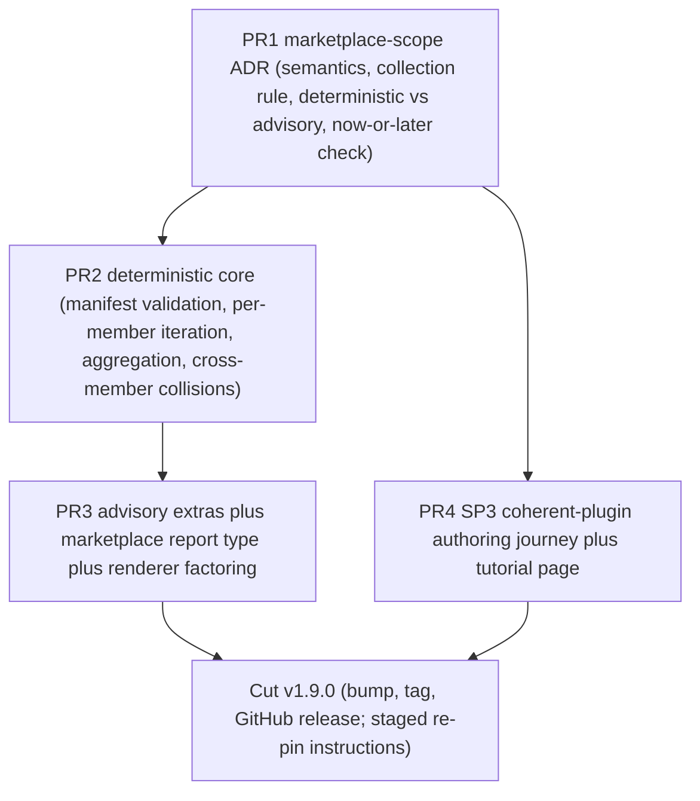

# Release 3: v1.9.0 "marketplace scope"

This is the headline release of the askit uplift program. It teaches the grader a third scope. Today askit grades one component or one plugin at a time; a marketplace (a `.claude-plugin/marketplace.json` that catalogues many member plugins) can only be graded by running the gate by hand, once per member, and reading nine reports side by side. Release 3 makes a whole marketplace one command with one verdict, and it does so ADR-first so the scope's semantics are settled before a line of grading code is written.

Release 3 has two workstreams: **marketplace-scope evaluation** (the deterministic core, its advisory extras, and a new marketplace report type) and **SP3 (coherent-plugin authoring journey)**, a guided flow that walks a builder from an empty directory to a working, green, multi-component plugin.

Release 3 also carries the program's single largest relocation obligation. Marketplace grading is engine-adjacent code, and the maintainer's separate standards program may later relocate the checker out of askit into `agent-plugins/standards/` (decision-register ruling 4). Every new module in this release is built to travel cleanly, and this release is where the [relocation-addendum.md](../relocation-addendum.md) stub becomes a real packing-list delta.

## What this delivers and why it matters (plain language)

**For anyone.** A "marketplace" is a shop window that lists many plugins in one place. Right now, to check that every plugin in a shop window is sound, someone has to open each one and inspect it separately, then remember which ones passed. That is slow, and it misses problems that only appear when you look at the whole window at once, for example two different plugins that both claim the same name, or two skills that would both answer the same request and confuse the assistant about which to use. This release teaches the toolkit to inspect the whole shop window in a single pass: it checks the window's own listing is valid, grades every plugin in it, produces one summary table plus a single overall verdict, and points out the collisions that only a whole-window view can catch. The second half of the release, SP3, gives first-time builders a guided path from a blank folder to a finished, passing plugin, because today the toolkit can build each individual part but nothing walks a person through assembling a coherent whole.

**For an engineer.** A new `marketplace` scope value joins `component` and `plugin`. The deterministic core validates the marketplace manifest, iterates member plugins through the existing per-plugin gate (honoring the ADR 0034 (component-scope profiles) config-resolution pipeline per member), aggregates a per-member verdict table plus a collection verdict, and detects cross-member structural collisions. Two advisory extras (trigger-surface collision from sensor reading 11, command-vs-skill enumerated-content divergence from sensor reading 15) run opt-in and never move the verdict. A `marketplace` report type joins the renderer, which is factored into per-report-type modules while it is open. SP3 adds a guided mode to `askit-init-plugin` that orchestrates the existing builders end to end and ships a tutorial page.

## 1. Scope of this release

| Item | Kind | Deterministic or advisory | New spine check | ADR-gated |
|---|---|---|---|---|
| Marketplace scope semantics | design | n/a | decided by the ADR | yes (headline) |
| Marketplace manifest validation | build | deterministic | the ADR decides now-or-later | via the ADR |
| Per-member gate iteration + aggregation | build | deterministic | reuses existing spine | via the ADR |
| Cross-member structural collision detection | build | deterministic | the ADR decides now-or-later | via the ADR |
| Trigger-surface collision analysis (reading 11) | build | advisory (never gates) | no | no |
| Command-vs-skill divergence lint (reading 15) | build | advisory (never gates) | no | no |
| Marketplace report type + renderer factoring | build | deterministic | no | no |
| SP3 (coherent-plugin authoring journey) | build | n/a (authoring) | no | small design decision, in-doc |

**Explicit non-goals for this release.** No change to any of the 30 existing checks or to any per-plugin verdict (a marketplace verdict is an aggregate of unchanged per-plugin verdicts). No marketplace re-pin executed (staged only, per the program boundary rule). No GUI work (that is Release 4). No hosting or showcasing of rendered marketplace reports (a later pass, consistent with F2's own out-of-scope note).

## 2. The marketplace-scope ADR (write this first)

The release opens with a single ADR, referenced here as **the marketplace-scope ADR (marketplace-scope evaluation)**; its number is allocated at land against the protected head (the latest Accepted is ADR 0035 (manifest-vs-disk skill-registration), so do not pre-bake a number in a draft branch). No grading code merges before the ADR is Accepted. The ADR settles three questions that shape every downstream PR:

1. **Scope semantics.** What counts as a marketplace target (a directory whose `.claude-plugin/marketplace.json` catalogues member plugins), how members are resolved (local source paths for a local marketplace; the ADR decides whether remote-source marketplaces are in scope for v1.9.0 or deferred), and how the `marketplace` scope is detected in `evaluate.mjs` alongside the existing `hasSkillMd`/`looksLikePlugin` branch.
2. **The collection verdict rule.** How per-member verdicts aggregate into one collection verdict: worst-member (any red member reds the collection) versus an explicit policy (for example, a member allowlist or a "collection passes at tier T if N of M members reach T"). The ADR picks one and states why; the deterministic core implements exactly that rule.
3. **Deterministic versus advisory, and now-or-later on a numbered check.** Which findings are deterministic (manifest shape, per-member aggregation, structural collisions) and which are advisory (the two reading-driven analyses). And whether any cross-member collision graduates to a numbered spine check in v1.9.0 or ships as a scope-local deterministic finding first. The default recommendation, following the U13 (skill-registration) burndown precedent (warn at introduction, graduate a minor later), is to ship cross-member collisions as scope-local deterministic findings in v1.9.0 and defer any spine-number graduation to a later ADR, so v1.9.0 changes what the grader can grade without changing the 30-check spine every existing plugin is held to. The ADR confirms or overrides this.

The ADR also records the relocation posture: marketplace grading is engine-adjacent, its module home is `scripts/lib/marketplace/` plus at most one `scripts/checks/` entry point, and the [relocation-addendum.md](../relocation-addendum.md) packing-list delta is updated in the same release (section 8).

## 3. The deterministic core (model-free, exit code equals verdict)

The deterministic core is the product. It runs with no model in the loop and its exit code is the verdict, exactly like `check.mjs` today.

**Manifest validation.** Validate `.claude-plugin/marketplace.json` shape: every entry resolvable, no duplicate plugin names within the catalogue, and for a local marketplace every member `source` path exists on disk. A malformed manifest is a finding, never a crash, matching the house rule already followed by `resolveRegistrationSource` in the U13 (skill-registration) check (which reads the same `marketplace.json` `plugins[]` shape and falls through on malformed input rather than throwing).

**Per-member iteration.** For each member plugin, run the existing per-plugin gate. Crucially, resolve each member's grading config through the same pipeline plugin scope uses (`loadConfig` then CLI-override then `resolveFindings`), so `--profile plain-plugin` and `--mode` apply per member. This is the ADR 0034 (component-scope profiles) invariant extended to a third scope: a flag that is validated must be honored, never silently dropped. The member's own root is the one root for both its findings and its config, mirroring how `evaluateComponent` roots a skill at its own directory.

**Aggregation.** Produce a per-member verdict table (member name, declared tier, grade earned, error/warn counts, gate exit) and a single collection verdict computed by the rule the ADR fixed. The collection verdict is a pure function of the unchanged per-member verdicts.

**Cross-member structural collisions.** Detect duplicate skill directory names across members (two members shipping `skills/review/`) and overlapping command names across members. These are deterministic and objective: they are string comparisons over the resolved member inventories, the same class of judgment-free comparison that made U13 (skill-registration) and the manifest-drift check objective-provenance.

| Layer | What it decides | Provenance class | Moves the verdict |
|---|---|---|---|
| Manifest validation | is the catalogue well-formed | objective | yes |
| Per-member gate | is each member conformant | unchanged per-check provenance | yes (aggregated) |
| Collection verdict | is the marketplace conformant as a whole | derived | yes |
| Cross-member collisions | do members structurally clash | objective | the ADR decides (scope-local finding vs deferred spine check) |
| Trigger-surface / divergence advisory | do members route or contradict each other | advisory | never |

## 4. The advisory extras (opt-in, never move the verdict)

Two analyses that the eval-run readings identified as the advisory layer's most distinctive value, both structurally invisible to any per-plugin gate because they only exist across members:

- **Cross-skill trigger-surface collision analysis (sensor reading 11).** Across all member plugins, surface skill descriptions that route ambiguously (two skills that answer the same query about equally, the lenny `ai-evals`/`building-with-llms` overlap and the deanpeters workshop-pair pattern the readings recorded). This compares trigger surfaces across skills, which U5 (description scorer) never does because it scores each description in isolation.
- **Command-vs-skill enumerated-content divergence lint (sensor reading 15).** When a command declares a mapping (`maps-to`/`uses:`) to a skill and both files enumerate a same-cardinality named list, flag divergence (the phuryn `review-resume` command's 10-point scorecard contradicting the skill's own 10-point list, only one item overlapping). This is a lint in its strong form; the reading flagged the "when are two lists the same list" design care needed, which the build must respect to avoid false positives.

Both extras are allowlist-merged onto the deterministic marketplace object exactly as `applyAdvisory()` merges the review/behavioral blocks onto a conformance object today: base first, then one namespaced key, so a stray top-level key can never overwrite the gate verdict. They run only when explicitly requested and are labeled advisory in every render. They never change the collection verdict or the exit code.

## 5. The marketplace report type

A `marketplace` report type joins the five existing types in the renderer. It carries an aggregate summary (the collection verdict, member count, tier distribution), one per-member section (each member's masthead-level result linking to its own detail), the cross-member collision findings, the advisory extras when present, and the per-check glossary the F4/E12 work already established.

**Renderer factoring (do this while it is open).** `report-render.mjs` is 933 lines and holds all report types in one file. While Release 3 is already touching it to add the marketplace type, factor it into per-report-type modules (conformance, migration, release, review, behavioral, marketplace) over the shared `deriveModel` view-model and the shared style block. This is a refactor with a hard safety rail: the existing golden snapshots for all five current types must regenerate byte-identical (or the diff must be verified purely additive), so the factoring provably changes structure only, not output. Regenerate snapshots with `UPDATE_SNAPSHOTS=1` only after confirming the pre-refactor diff is empty. The factoring is also what makes the renderer's relocation posture legible (section 8): a self-contained marketplace renderer module is far easier to reason about as "travels with the checker" or "stays in askit" than a 200-line block inside a 1100-line file.

## 6. SP3 - the coherent-plugin authoring journey

Today the 13 Create builders are each single-component: each builds one skill, one command, one agent. Nothing walks a user from a blank directory to a working multi-component plugin, so a first-time builder assembles the whole by hand and by guesswork. SP3 (coherent-plugin authoring journey) closes that gap.

**Recommended shape (a design decision recorded in-doc, escalated to a short ADR only if the panel argues for a new skill).** Add a guided mode to the existing `askit-init-plugin` skill rather than shipping a new top-level skill. The guided mode orchestrates the existing pieces in sequence: `init` (scaffold the plugin root and `library.json`), then the relevant `askit-build-*` component loops (at least one skill, and enough components to make a coherent whole), then chain-contract wiring between the components, then the `askit-evaluate` gate, then a rendered report. It composes what exists; it does not duplicate any builder's logic. Preferring a mode over a new skill keeps the Create surface from growing a fourteenth top-level entry for what is fundamentally an orchestration of the thirteen that exist. If the adversarial panel makes the case that a distinct skill reads better to users, that becomes the ADR's decision.

**Acceptance.** A scripted walkthrough, recorded as a tracked example thread, takes a blank directory to an installable plugin with at least three components, a green gate (`node scripts/check.mjs .` clean at the declared tier), and a rendered report. The journey ships as a tutorial page under the docs site, wired the way every new public doc must be: G7 (docs frontmatter, no colon-space in the description), G8 (added to the folder README), and the site route manifest for route parity (the standing gotcha from the program memory: a new public doc that skips any of these fails the dogfood gate).

## 7. PR slicing

Four PRs, sequenced so the ADR gates everything and each PR is independently reviewable behind a 4-lens Claude adversarial panel (false-PASS, false-FAIL, determinism, contract-fidelity). Parallel work uses git worktrees. Every PR is TDD, RED test first from real fixtures.

| PR | Contents | Gated by | Notes |
|---|---|---|---|
| PR1 (ADR) | The marketplace-scope ADR (marketplace-scope evaluation), Accepted at land | none (writes only the ADR + relocation-addendum stub delta) | number allocated at land; no grading code |
| PR2 (deterministic core) | `scripts/lib/marketplace/` module, one `scripts/checks/` entry point if a check ships, the `marketplace` scope branch in `evaluate.mjs`/`check.mjs`, exit-code semantics | PR1 Accepted | TDD: golden + anti fixture marketplaces, exit-code tests, per-member config-resolution test (ADR 0034 invariant) |
| PR3 (advisory + renderer) | The two advisory extras (allowlist-merged), the `marketplace` report type, the renderer factored into per-report-type modules | PR2 | golden snapshots for all five existing types regenerate additive-only; advisory-never-moves-verdict test |
| PR4 (SP3) | The `askit-init-plugin` guided mode, the tracked walkthrough example thread, the tutorial page (G7/G8/route-manifest) | PR1 (only for the mode-vs-skill decision) | can build in parallel with PR2/PR3 in a worktree; depends on the ADR only for the shape decision |

SP3 (PR4) is deliberately decoupled from the marketplace grading PRs: it depends on the ADR only for the mode-versus-skill shape ruling, not on any marketplace code, so it can proceed in a parallel worktree the moment PR1 lands.

## 8. Relocation-friendly construction and the addendum stub

Decision-register ruling 4 keeps this program from writing to `agent-plugins`, but requires new engine-adjacent code to be built cleanly separable, because the maintainer's separate standards program may relocate the checker (STANDARD.md plus `scripts/check.mjs`, `scripts/lib/`, `scripts/checks/`, `scripts/generators/`, `tier-report.mjs`) into `agent-plugins/standards/`. Marketplace grading is squarely in that engine surface. Release 3 therefore observes three construction rules:

1. **A delimited module home.** All new deterministic marketplace code lives under `scripts/lib/marketplace/`, with at most one `scripts/checks/` entry point if the ADR ships a check. No marketplace logic is smeared into existing lib internals.
2. **Minimal inward imports.** The marketplace module imports the existing gate through its public entry points (`runGate`/`evaluate`, `loadConfig`, `resolveFindings`, `PROFILES`), not by reaching into check internals. The fewer the load-bearing imports into existing lib files, the smaller the relocation packing-list delta.
3. **The addendum is updated in the same release.** [relocation-addendum.md](../relocation-addendum.md) is a stub until Release 3; this release turns it into a real packing-list delta.

**What the relocation addendum must record (this section is the stub spec; the addendum itself is the deliverable).** The addendum must state, as a packing list the standards program can act on without re-deriving it:

- The exact new files this release adds to the engine surface (`scripts/lib/marketplace/*`, any `scripts/checks/marketplace-*.mjs`, and any new `scripts/lib/` shared helper), so a relocation moves them with the rest of the checker rather than orphaning them in askit.
- The one genuinely ambiguous case, flagged as an open question for the standards program to rule: whether `report-render.mjs` and its new per-report-type modules travel with the checker or stay in askit as product. The renderer lives under `scripts/lib/` (which the ruling lists as checker) but renders a product-facing report; the relocation packing list must make an explicit call, and this release does not presume it.
- The public entry points the marketplace module depends on, so the standards program can verify those entry points survive the move intact.
- The stop-and-reconcile trigger: if the standards program's "PR-C askit re-adopt" fires mid-program (askit repoints at the relocated runner), this program halts and reconciles rather than merging marketplace code against a checker path that is about to move. This is a hard stop, recorded in [../08-risk-register.md](../08-risk-register.md).

## 9. Ground truth and TDD

**Reproduction target.** `E:/tmp/eval-phuryn-pm` @ `d384f0c` is the 9-plugin marketplace already graded by hand across nine separate runs (sensor readings 6-17 reference it repeatedly; all nine members graded 0E/0W under `--profile plain-plugin`). The headline acceptance test: one marketplace-scope run over this target reproduces the nine manual per-plugin verdicts exactly and adds the collection-level findings the hand runs never computed (the collection verdict, and any cross-member collision or trigger-surface finding across the nine). Reproducing the nine known verdicts is the determinism proof; the added collection findings are the new value.

**Planted anti fixture.** A tracked anti fixture marketplace with the failure modes designed in: duplicate plugin/skill names across members, one deliberately red member (so the collection verdict must go red under the worst-member rule the ADR fixes), and one cross-member trigger collision (so the advisory extra has a known positive to catch). This is the RED-first fixture the deterministic core and the advisory extras are both written against.

**TDD surface.**
- Fixture marketplaces: a golden (well-formed, all members pass) and the anti (the planted failures), both tracked.
- Exit-code semantics tests: a clean marketplace exits 0, a marketplace with a red member exits 1 under the collection rule, a malformed manifest is a finding not a crash.
- Per-member config-resolution test: `--profile plain-plugin` applied to a marketplace run reaches every member (the ADR 0034 (component-scope profiles) invariant, now at marketplace scope).
- Renderer snapshot tests: a golden marketplace-report snapshot, plus the additive-only regeneration proof for the five existing report types after the renderer factoring.

## 10. Dependencies

- **Release 2 corpus batch 3 should include a marketplace-shaped target.** R2 (v1.8.0) runs corpus batch 3 on the F2 (eval-run pipeline) runner. If that batch includes a marketplace-shaped target beyond the hand-graded phuryn one, Release 3 inherits a second, freshly-pinned ground-truth marketplace, so the reproduction acceptance is not resting on a single target class (the single-target caveat sensor reading 16 raised for the model-triple applies equally to a new scope). This is a benefit, not a hard blocker: phuryn @ `d384f0c` alone is sufficient to build against.
- **F2 (eval-run pipeline) manifest carries a marketplace scope value.** F2's corpus manifest already records a `scope` per target including "marketplace-by-hand" (SPEC R-PIPE-1). Once marketplace scope is a real gate scope, the manifest's marketplace targets become runnable by the F2 runner rather than by hand, closing a loop F2 opened.
- **ADR 0034 (component-scope profiles) is a hard precedent.** The per-member config-resolution requirement is that ADR's invariant extended to a third scope; the build reuses `loadConfig`/`resolveFindings`, not a new config path.
- **U13 (skill-registration) is the per-plugin analog.** Cross-member collision detection is the marketplace-scope sibling of U13's on-disk-vs-manifest comparison; its objective-provenance framing and malformed-read discipline are the template.
- **The F4/E12 renderer work is the factoring baseline.** The per-check glossary and responsive-table work already in the renderer are what the marketplace report type reuses; the factoring must preserve them.

## 11. Exit gate

Release 3 is done and cuttable when all of the following hold:

- [ ] The marketplace-scope ADR (marketplace-scope evaluation) is Accepted, with its number allocated at land, settling scope semantics, the collection verdict rule, the deterministic-vs-advisory split, and the now-or-later decision on any numbered check.
- [ ] `marketplace` is a real scope in `evaluate.mjs` and `check.mjs`: manifest validation, per-member iteration with per-member config resolution, aggregation to a collection verdict, and cross-member structural collision detection, all deterministic with the exit code equal to the verdict.
- [ ] One marketplace-scope run over `eval-phuryn-pm` @ `d384f0c` reproduces the nine manual per-plugin verdicts and adds the collection-level findings.
- [ ] The planted anti fixture marketplace fails as designed (red collection verdict, detected duplicate names, detected trigger collision).
- [ ] The two advisory extras run opt-in, are allowlist-merged, and provably never move the collection verdict or the exit code.
- [ ] The `marketplace` report type renders (aggregate summary, per-member sections, collisions, glossary); the renderer is factored into per-report-type modules; all five existing report-type snapshots regenerate additive-only.
- [ ] SP3 (coherent-plugin authoring journey): the `askit-init-plugin` guided mode takes a blank directory to an installable 3-plus-component plugin with a green gate and a rendered report, recorded as a tracked walkthrough; the tutorial page ships wired (G7, G8, route manifest).
- [ ] All new engine-adjacent code lives under `scripts/lib/marketplace/` plus at most one `scripts/checks/` entry point; [relocation-addendum.md](../relocation-addendum.md) is updated with the packing-list delta and the renderer open question.
- [ ] `node scripts/check.mjs .` self-grades Advanced 0/0; `npm test` green; no em-dash or en-dash characters anywhere; every substantive merge passed a 4-lens adversarial panel; the work is recorded in [../../STATUS.md](../../STATUS.md) and the session log.

## 12. Cut

The v1.9.0 cut follows the standing per-release runbook in [../06-release-choreography.md](../06-release-choreography.md): bump the manifests, tag, GitHub release, all autonomously within this repo per decision-register ruling 3 (full ship autonomy after "go"). The `agent-plugins` marketplace re-pin is staged as ready-to-apply instructions in the release packet and is never executed by this program (decision-register ruling 2, the hard boundary). Read-only `gh api` calls to confirm the current registry pin are fine; a write to `agent-plugins` is a hard stop.

## See also

- [README.md](../README.md) - the packet map.
- [03-execution-plan.md](../03-execution-plan.md) - the release model, gates, and stop-and-flag rules this release inherits.
- [04-releases/README.md](README.md) - the four-release index.
- [relocation-addendum.md](../relocation-addendum.md) - the packing-list delta this release makes real.
- [08-risk-register.md](../08-risk-register.md) - the mid-program PR-C stop-and-reconcile trigger.
- [../../eval-runs/eval-runs.md](../../eval-runs/eval-runs.md) - sensor readings 11 and 15, the advisory extras' evidence base.
- [../../decisions/0034-resolve-profiles-in-component-scope.md](../../decisions/0034-resolve-profiles-in-component-scope.md) - the per-scope config-resolution invariant marketplace scope extends.
- [../../decisions/0035-manifest-vs-disk-skill-registration-completeness.md](../../decisions/0035-manifest-vs-disk-skill-registration-completeness.md) - U13, the per-plugin analog of cross-member collision detection.

## Change log

| Date | Change |
|---|---|
| 2026-07-06 | Created. |
