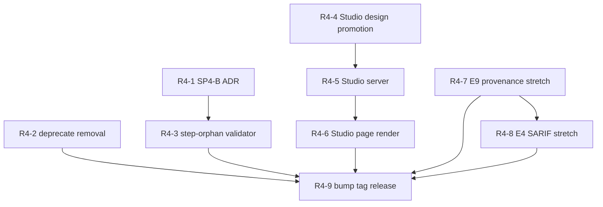

# Release 4: v1.10.0 "manage and studio"

This is the fourth and final release of the askit uplift program. It closes the two remaining Manage-lifecycle gaps the toolkit admits in its own skills (SP4), ships the first user-facing slice of the long-designed GUI as a read-only local dashboard (the Studio slice), and, if room remains, rides two small backlog serializers (E4 SARIF output and E9 provenance contract). Because it is last, this document also carries the program-close sweep.

It operationalizes, and does not restate, the program plan at [../README.md](../README.md), the packet decision register (the four maintainer rulings of 2026-07-06), and the relocation addendum that tracks Ruling 4 (the possible engine move to agent-plugins). Where an existing on-disk skill, ADR, or backlog item defines the contract, this doc links it and states only the delta and sequencing.

## What this delivers and why it matters

Plain language, for a non-engineer reader:

- **Retiring a skill cleanly, not by hand.** Today the toolkit can *mark* a skill as going away and check that the promise is well-formed, but the actual removal - taking it out of the catalog, regenerating the index files, sweeping the docs - is manual and easy to get wrong. SP4 (Manage gaps) adds a guided, verified removal so a maintainer can retire a component and trust that nothing dangling is left behind.
- **Catching a broken workflow before a user hits it.** A "workflow" is a recipe that names the skills it runs in order. If the recipe names a skill that was renamed or deleted, the recipe is quietly broken. SP4 adds an automatic check that every step in a workflow points at a skill that actually exists on disk.
- **Seeing the grade instead of reading a terminal.** The toolkit grades a plugin Bronze, Silver, or Gold. Until now you read that in a terminal or an HTML file. The Studio slice is a small local web page you launch with one command that shows the grade, the per-check table, and a link to the full report - read-only, on your own machine, nothing uploaded anywhere. It is the "look at my results" view and nothing more.

Engineering summary: R4 adds one guided removal-execution path to `askit-deprecate`, one ADR-gated validator for workflow step orphans (spine check or non-spine validator, decided ADR-first per the ADR 0035 (U13 skill-registration) precedent), and a `127.0.0.1`-bound, token-gated, zero-runtime-dependency Node server that runs the existing `tier-report` / `evaluate` JSON against a chosen target and renders it as a dashboard page. The stretch riders serialize data the gate already computes. Everything is built cleanly separable from the checker per Ruling 4.

## 0. Rulings that shape this release

Four maintainer rulings from the 2026-07-06 packet decision register bear directly on R4:

- **Ruling 1 (scope).** The GUI thin slice is in scope for the program; R4 is where it lands.
- **Ruling 2 (hard cross-repo boundary).** R4 writes to no other repo. The agent-plugins marketplace re-pin at the v1.10.0 cut is STAGED as ready-to-apply instructions in this packet, never executed. Read-only `gh api` calls to other repos (for example, confirming a corpus target's pinned sha) are fine.
- **Ruling 3 (full ship autonomy).** After the program "go," Fable merges green adversarially-reviewed R4 PRs, and cuts the v1.10.0 bump/tag/release, autonomously within this repo.
- **Ruling 4 (engine relocation).** R4 builds new engine-adjacent code cleanly separable and keeps the relocation addendum current (Section 2); if the agent-plugins "PR-C askit re-adopt" fires mid-program, R4 stops and reconciles.

## 1. Scope, the two workstreams, and the stretch riders

| Workstream | What it is | Model | Kind |
|---|---|---|---|
| SP4-A (deprecate removal automation) | Guided, verifiable removal execution in `askit-deprecate` | Opus (judgment on safety rails) | Skill + fixtures |
| SP4-B (workflow step-orphan check) | ADR-gated validator that workflow steps reference on-disk skills/subagents | Opus (ADR), Sonnet (impl) | ADR + check/validator |
| Studio slice (visualize verb) | Read-only local dashboard over the existing gate/report JSON | Opus (server + token gate), Sonnet (page render) | New `scripts/ui.mjs` + tracked design |
| E4 (SARIF output) - stretch | SARIF 2.1.0 + GitHub Actions annotations as output formats | Sonnet | Serializer |
| E9 (provenance output contract) - stretch | Stable machine-readable provenance tag on every finding | Sonnet | Schema + docs |

The two stretch riders are independently droppable. If R4 fills up on SP4 plus the Studio slice, E4 (SARIF output) and E9 (provenance output contract) fall back to the backlog untouched; neither is a release gate.

## 2. Engine-separability posture (Ruling 4)

Ruling 4 says a separate maintainer program in agent-plugins may later relocate `STANDARD.md` and the checker (`scripts/check.mjs`, `scripts/lib/`, `scripts/checks/`, `scripts/generators/`, `tier-report.mjs`) out of askit into `agent-plugins/standards/`. R4 plans around it:

- **SP4-B's validator** is the one R4 item that touches engine-adjacent code. It is built as a self-contained module under `scripts/checks/` (spine route) or a `reqId: null` validator (non-spine route), importing only from `scripts/lib/` exactly as the existing 30 checks do, so it relocates with the pack as a unit. The ADR records its packing-list line.
- **The Studio server** imports the deterministic core through its public entry points (`runGate`, `computeTierReport`, `evaluate`), never by reaching into check internals. If the checker relocates, the Studio repoints one import path, not its logic. The Studio itself is a **consumer** of the engine and stays in askit regardless.
- **The relocation addendum** in this packet gains one line per R4 artifact that would move (SP4-B's module and its fixtures) or that newly consumes the engine across the seam (the Studio's import surface).
- **Stop-and-reconcile:** if that program's "PR-C askit re-adopt" fires mid-R4, we stop and reconcile against the relocated runner before merging any SP4-B or Studio PR that imports the core, per the program's stop-and-flag rule.

## 3. SP4-A: askit-deprecate removal automation

**Gap (self-admitted).** [skills/askit-deprecate/SKILL.md](../../../../skills/askit-deprecate/SKILL.md) Scope says: "Actual removal at the `remove-in` version is a release-time action ... a dedicated removal-automation skill is roadmap." Today the skill defines policy and the G6 (deprecation) check enforces the contract (`deprecated-by` + `remove-in` present, deprecated components keep validating), but the removal steps at the `remove-in` version are prose a human follows.

**Delta.** Add a `remove` mode (or a removal-execution section) that turns the manual steps into a guided, verified sequence:

1. **Precondition gate:** the component is `status: deprecated`, its `remove-in` matches the version being cut, and G6 (deprecation) is currently clean. Refuse to remove a component that is not properly deprecated first (deprecate-before-delete, mirroring the Studio design's safety rails).
2. **Referential sweep:** grep the tree for references to the component (commands pointing at it, INDEX entries, `_workflows` steps, chain-contract permissions) and list what will break before touching anything.
3. **Delisting:** remove the component from `library.json.components.*` and, where present, from `.claude-plugin/marketplace.json`.
4. **Regeneration:** run the generators (`gen-index`, `gen-manifest`, `sync-agents-md`) and present the diff before writing.
5. **Docs sweep:** remove or redirect the component's doc pages and folder-README entries so G8/G9/G10 do not go red on a dangling reference.
6. **Verification:** re-run the gate and confirm Advanced 0/0 (for the toolkit) or the target's declared tier, plus a CHANGELOG removal entry, before the mode reports done. "Done" is a gate state, not a checklist tick.

The removal policy and the lifecycle it enforces already live in [skills/askit-deprecate/references/deprecation-policy.md](../../../../skills/askit-deprecate/references/deprecation-policy.md); the `remove` mode operationalizes that policy rather than re-deriving it, and any wording the mode adds is swept back into the reference so the two stay in one voice. Removal remains release-time and stays coordinated with `askit-release` (which owns the tag guard and the CHANGELOG), so the mode is a guided pre-flight the release skill calls into, not a parallel release path.

**Edge cases the fixtures pin:** removing a component that is *not* the last of its kind (a plugin with three skills, one removed, U13 (skill-registration) still clean afterward); removing the *only* skill (the zero-skill edge where U13 is vacuously clean); a component still referenced by a chain contract (must surface and require the contract edit before delisting); and a component whose `remove-in` does not match the version being cut (must refuse, not silently remove early or late).

**TDD.** RED fixtures first: a `golden/` plugin with a correctly deprecated-then-removed component (gate clean after removal) and an `anti/` plugin where removal was done by hand and left an orphan (a stale INDEX entry, a workflow step pointing at the removed skill, a dangling doc link) that the removal mode must detect and refuse to leave behind. The anti fixture doubles as an SP4-B input.

**Model.** Opus builds the safety-rail judgment (what counts as a blocking reference, deprecate-before-delete enforcement); the mechanical generator/diff plumbing reuses existing modules.

## 4. SP4-B: build-workflow step-orphan check (ADR-first)

**Gap (self-admitted).** [skills/askit-build-workflow/SKILL.md](../../../../skills/askit-build-workflow/SKILL.md) Scope says: "The deterministic workflow-step chain-permission check (step orphans) is a planned enhancement; today S5 enforces step skill-existence and the chain contract governs component-to-component invocation." The skill body also claims "Every referenced skill MUST exist (S5)," so the ADR must first establish precisely what S5 (workflow step skill-existence) already covers versus the orphan gap that remains, to avoid building a duplicate of an existing check.

**ADR-first (the ADR 0035 precedent).** The first SP4-B deliverable is an ADR (number allocated at land) that decides **spine check vs non-spine validator**, exactly as ADR 0035 (U13 skill-registration) reasoned the manifest-completeness case. The ADR must resolve:

- **The S5 overlap.** Determine empirically what S5 (workflow step skill-existence) verifies today. If S5 already fails a workflow whose step names a non-existent skill, SP4-B is not a second existence check; it is the broader orphan case: steps naming a *subagent* that does not exist, steps whose chaining is not chain-permitted (sec 3.6), and reverse orphans (a declared step with no reachable target). The ADR states the exact residual defect class, or, if S5 is found to be weaker than the skill body claims, records that the skill's own text is aspirational and SP4-B closes it.
- **Spine vs non-spine.** Spine route: the property is objective, portable, and plugin-intrinsic (a workflow that names a missing target is genuinely broken for any agent), which by the ADR 0035 test earns a spine slot. Non-spine route: if the property is better modeled as a refinement of S5 rather than a new requirement, ship it as a `reqId: null` validator surfacing a finding without a new Standard requirement. The ADR picks one with the same four drivers ADR 0035 used (objectivity, portability, non-vacuity, tier-ladder integrity).
- **Provenance and profile survival.** If spine, it is `objective` provenance (a set comparison, no judgment), so it survives `--profile plain-plugin`, per ADR 0029 (provenance reclassification).

**Warn-first burndown (spine route only).** If SP4-B goes the spine route it becomes a new Universal requirement at the next MINOR. Per STANDARD.md sec 7.7 and ADR 0027 (Standard versioning policy), a new spine requirement ships as `warn` for one minor before it gate-fails. This sequences cleanly: Standard would move 0.12 -> 0.13, which is also the release where U13 (skill-registration) graduates from `warn` to `error`. The ADR records the spine count move (30 -> 31) and the warn-for-0.13 / error-at-0.14 schedule, and the documentation sweep (STANDARD spine line, tier-report count, `docs/reference/universal-checks.md`, README, AGENTS, tests) mirrors the ADR 0035 sweep list. The dogfood invariant holds: the toolkit's own workflows reference only on-disk targets, so the toolkit stays clean (not even a warn).

**Standard 0.13 ownership rule (program-wide).** The U13 (skill-registration) warn-to-error flip recorded by ADR 0027 (Standard versioning policy) is owned by whichever ADR FIRST takes the Standard to 0.13: R3's marketplace-scope ADR if it graduates a spine check, otherwise SP4-B's ADR on the spine route. The two never collide because the second 0.13 candidate rebases onto whatever the first landed (allocation at land). And if the program ends with the Standard still at 0.12 (both ADRs choose non-spine routes), the flip does not silently lapse: it carries to [../09-backlog.md](../09-backlog.md) as a standing obligation attached to the next Standard bump, whenever that occurs.

**TDD.** RED fixtures: a `golden/` plugin whose every workflow step resolves to an on-disk, chain-permitted target; an `anti/` plugin with a step naming a deleted skill, a step naming a missing subagent, and a step whose chaining is not permitted. Reuse the SP4-A anti fixture's orphaned workflow as one case so the two workstreams cross-validate.

**Model.** Opus writes the ADR (the spine-vs-validator judgment and the S5-overlap determination); Sonnet implements the chosen module against the RED fixtures.

## 5. Studio slice (read-only visualize verb)

The GUI has a full design in gitignored `_local/gui/` (five lifecycle surfaces, four prototypes, a phased desktop-wrapper path). R4 ships a **bounded subset**: the visualize verb only, read-only, local.

### 5.1 Promote the design into tracked docs

Move the design from `_local/gui/` into a tracked `docs/internal/studio/`:

- `APPROACHES.md` and `LOCALHOST-DEPLOYMENT.md`, edited so they describe the *slice actually shipped* (Approach A local-web, Phase 0 dashboard) as built, with the Create/Build/Grow/Package surfaces and the agent-runtime adapter clearly marked as future design, not R4 scope. Sweep the dash rule across both (the source docs predate the retroactive sweep).
- The four `prototype-0*.html` files committed as design references under `docs/internal/studio/prototypes/`; prototype 01 (studio dashboard) is the direct reference for the slice.
- A short `docs/internal/studio/README.md` (folder-README for G8) stating what is shipped versus designed, and the non-goals below.

### 5.2 The minimal slice

A new `scripts/ui.mjs` launched locally as `npm run ui -- --target <dir>` (a `bin` entry is also added so a FUTURE npm publish would enable true `npx`; publishing itself is out of scope under AU-2 (hard repo boundary) and the repo is currently `private: true`):

- **Server:** plain `node:http` router, no new runtime dependency (the toolkit's single `yaml` dependency constraint holds; SSE and static serving need nothing more). Binds `127.0.0.1` only, on a free random port, with a per-launch session token embedded in the opened URL and required on every route. Origin and Host header checks on every request. Path-jailed to the chosen target after normalizing Windows backslashes (the known "backslash path silently grades an empty dir" gotcha makes normalization load-bearing).
- **Data:** runs the existing `computeTierReport` / `evaluate` in-process against `--target <dir>` and shapes the JSON for the page. No re-implementation of any check (the single-source-of-truth rule from the design's Section 3). The route surface is the read-only subset of the design's full API (`_local/gui/LOCALHOST-DEPLOYMENT.md` Section 5): `GET /api/overview` (tier report plus last gate plus counts) and `GET /api/report` (the rendered HTML report id or inline blob). Every write route in that design (`POST /gate` mutating nothing is read-only and allowed as a re-run; `POST /components`, `PUT`, `DELETE`, `/jobs`, `/scaffold`, `/config`) is explicitly absent from the slice.
- **Page:** renders the grade (achieved vs declared tier), the per-check table carrying the existing per-check glossary content (the E12 (per-check glossary) text sourced from check metadata, zero model tokens), and a link to the full self-contained HTML report the renderer already emits. Reuses the dashboard report template's design tokens for visual continuity.

### 5.3 Explicit non-goals (in-doc, load-bearing)

The slice is the **visualize verb only**. It does NOT:

- create, edit, scaffold, or package anything (no Create/Build/Package verbs);
- mutate any file in the target - zero writes, ever;
- run agent jobs or the model-assisted layer (no `claude -p` adapter);
- offer a PWA install, service worker, or desktop wrapper;
- manage a multi-project workspace or registry;
- bind anything but `127.0.0.1`, or expose any remote access.

These are the honest line in the sand for R4; the rest of the `_local/gui/` design remains future work behind its own ADR.

### 5.4 Acceptance

- `npm run ui -- --target E:/tmp/eval-phuryn-pm` (the pinned 9-plugin corpus clone @ d384f0c, exercised in R3) opens a working local dashboard showing that target's grade, check table, and report link.
- `npm run ui -- --target .` (askit itself) shows Advanced 0/0.
- Zero writes to the target directory across a full session (verified by a before/after tree hash in the test).
- Works on Windows paths (backslash input normalized).

### 5.5 TDD and smoke

TDD the testable seams: the route handlers, the token gate (a request without the token is rejected; Origin/Host mismatch is rejected), and the JSON shaping (given a known evaluate object, the page payload is exact). The rendered page itself is manual smoke against the two acceptance targets. Opus builds the server and token gate (security-critical); Sonnet builds the page renderer over the shaped JSON.

## 6. Stretch riders (only if room; each independently droppable)

**E4 (SARIF output).** Per [../../backlog/enhancements.md](../../backlog/enhancements.md) E4 (effort S): add a SARIF 2.1.0 emitter and GitHub Actions `::error` / `::warning` annotations as additional output formats of `scripts/evaluate.mjs` / `scripts/lib/report-render.mjs`. Pure serialization of data the gate already computes - deterministic, no verdict change. TDD: a known evaluate object emits schema-valid SARIF (validate the shape against the 2.1.0 structure in-test).

**E9 (provenance output contract).** Per backlog E9 (effort S): expose the `objective` / `vendor-cited` / `house` provenance tag (ADR 0029) as first-class, documented, stable machine-readable output on every finding (JSON now, a SARIF rule property if E4 also lands). TDD: every finding in a golden run carries a provenance tag from the fixed vocabulary; a documented contract page states the guarantee.

E9 pairs naturally with E4 (the SARIF rule property is the same tag), so if both ride, sequence E9 first so E4 can carry it. If only one rides, either stands alone.

## 7. PR slicing and sequencing

Small, independently reviewable PRs; each passes the 4-lens Claude adversarial panel (false-PASS, false-FAIL, determinism, contract-fidelity); each merges green and autonomously per the program's full-ship-autonomy ruling. TDD RED test lands with or before each implementation PR.

| PR | Scope | Depends on | Model |
|---|---|---|---|
| R4-1 | SP4-B ADR (spine vs validator, S5-overlap determination) | none | Opus |
| R4-2 | SP4-A deprecate removal automation + fixtures | none | Opus |
| R4-3 | SP4-B validator/check implementation + fixtures | R4-1 (ADR) | Sonnet |
| R4-4 | Studio design promotion into `docs/internal/studio/` + prototypes | none | Sonnet |
| R4-5 | Studio server (`ui.mjs`): router, token gate, path jail | R4-4 | Opus |
| R4-6 | Studio page render + glossary + report link | R4-5 | Sonnet |
| R4-7 | E9 provenance contract (stretch) | none | Sonnet |
| R4-8 | E4 SARIF + annotations (stretch) | R4-7 if both ride | Sonnet |
| R4-9 | Version bump, CHANGELOG, docs sweep, tag/release | all above merged | Opus |

**Sequencing notes.**

- **ADR before implementation.** R4-1 (the SP4-B ADR) lands before R4-3 so the spine-vs-validator decision, and any Standard bump it triggers, is ratified before code assumes an id or a severity. This mirrors the ADR 0035 (U13 skill-registration) order, where the ADR fixed the check id and burndown schedule before the module shipped.
- **Studio is a strict chain.** R4-4 (design promotion) grounds R4-5 (server) and R4-6 (page); the server's security seams land and are tested before any page render consumes them, so a review never sees an untested token gate behind a working-looking page.
- **Bump last.** R4-9 runs only after every functional PR is merged green, so the single version/CHANGELOG/tag reflects the whole release and the count sweep runs against the final spine.

Every session opens with the staleness/collision check (`git fetch origin`, compare `main` vs `origin/main`); parallel builds (SP4-A and the Studio design promotion have no shared files) use git worktrees. Codex review is used opportunistically, never blocked on.

## 8. Exit gate

R4 is done when all hold:

1. **SP4-A:** `askit-deprecate` removal mode ships with golden/anti fixtures green; a hand-orphaned removal is detected and refused.
2. **SP4-B:** the ADR is Accepted and landed; the chosen module (spine check or validator) ships against its fixtures; if spine, the Standard bumps 0.12 -> 0.13 with the warn-first schedule recorded, U13 (skill-registration) flips to `error` in the same bump, and the full count sweep is green (`registry-sync` passes).
3. **Studio slice:** both acceptance targets render; the token gate and path jail are tested; zero-writes verified; non-goals documented; design promoted to `docs/internal/studio/`.
4. **Stretch riders:** either shipped with tests or cleanly deferred to backlog (no half-built state).
5. **Self-grade:** `node scripts/check.mjs .` stays Advanced 0/0; the test count rises with the new fixtures and route tests.
6. **Separability (Ruling 4):** the relocation addendum reflects SP4-B's module and the Studio's engine-import surface.
7. **Release cut:** version bumped across the manifests, CHANGELOG updated, tag and GitHub release created autonomously in this repo. The agent-plugins marketplace re-pin is STAGED as ready-to-apply instructions in this packet, never executed (the hard cross-repo boundary).

**Shippable-at-any-point invariant.** Stopping after R4 leaves a complete, coherent product: the Manage lifecycle is now executable end to end (deprecate through verified removal), workflows are integrity-checked, and users have a read-only visual front door. As with every release in this program, stopping here ships something whole. Since this is the last release, stopping here also completes the program.

## 9. Program close (this is the final release)

Because R4 ends the program, its close PR (R4-9) also performs the program-wide sweep:

- **STATUS sweep.** [docs/internal/STATUS.md](../../STATUS.md) reconciled to the v1.10.0 as-built: final spine count (30, or 31 if SP4-B took the spine route), final Standard version, final test count, the four workstreams marked shipped, and the prioritized roadmap section retired or reduced to genuine post-program watch items.
- **RELEASE-HISTORY sweep.** `docs/internal/RELEASE-HISTORY.md` gains the v1.7.0 -> v1.10.0 value narrative as one linear arc (trust and craft, deep builders, marketplace scope, manage and studio), so the program reads as a single story rather than four disconnected cuts.
- **Memory update.** The auto-memory index entry updated to record the program complete: the final versions/counts, the Studio slice as the first shipped GUI surface, SP4 closing the two Manage gaps, and the Ruling 4 relocation posture (whether "PR-C askit re-adopt" fired during the program or is still pending).
- **Backlog re-triage.** [../../backlog/enhancements.md](../../backlog/enhancements.md) re-triaged: E4 (SARIF) and E9 (provenance contract) marked shipped or re-scoped; the un-ridden Studio surfaces (Create/Build/Grow/Package, the agent-runtime adapter) filed as a coherent future-GUI epic behind their own ADR; E10 (MCP-served-skill validation) and any other watch items re-confirmed as watch. E12 (per-check glossary) closed if the Studio consumed the last of it.
- **Relocation handoff.** The relocation addendum finalized so the agent-plugins engine-move program, if it proceeds after this program, inherits a current packing list including the R4 additions.

## 10. Risks and open questions

| ID | Risk / question | Likelihood | Impact | Handling |
|---|---|---|---|---|
| R4-RK-1 | SP4-B duplicates S5 (workflow step skill-existence) if the ADR mis-reads current S5 coverage | Medium | Medium | The ADR's first task is an empirical S5 determination against a fixture, not a doc read; a duplicate check fails the false-FAIL lens |
| R4-RK-2 | Spine route for SP4-B collides with U13's 0.13 error-flip in one Standard bump, doubling the count sweep | Medium | Low | Sequence both into the same 0.13 sweep deliberately; `registry-sync` guards the count across all surfaces |
| R4-RK-3 | Studio server security slip (missing Origin check, path-jail escape, token leak) | Low-Medium | High | Opus builds the security seams; token gate, Origin/Host checks, and path jail each have a dedicated RED test; no write routes exist to exploit |
| R4-RK-4 | Adding a runtime dependency to `ui.mjs` violates the single-`yaml`-dependency discipline | Low | Medium | Hard constraint in the acceptance and the review contract; `node:http` plus static serving needs nothing more |
| R4-RK-5 | Ruling 4 "PR-C askit re-adopt" fires mid-R4 and moves the engine under the Studio's imports | Low | Medium | Stop-and-reconcile rule; the Studio imports only public entry points, so a repoint is one path change |
| R4-RK-6 | Program runs long; stretch riders half-built at the close | Medium | Low | E4/E9 are gated all-or-nothing in the exit gate; a half-built rider is deferred whole, never merged partial |

Open questions for the orchestrator to resolve at build time:

- **Studio bin name and `package.json` `private` flag.** The design's open question 1 (package home) is resolved to "inside the toolkit" for the slice, but the repo is currently `private: true`; the `npx <bin>` story needs either a `bin` entry runnable via `npm run ui` locally or an eventual publish decision. R4 ships the local `npm run ui` path and records the publish question as future-GUI work.
- **SP4-B final id if spine.** The next free Universal id after U13 is U14; the ADR confirms no collision (the same discipline ADR 0035 used to avoid the U8 (manifest-drift) name clash) and picks a distinct check name.

## Change log

| Date | Change |
|---|---|
| 2026-07-06 | Created (program-plan packet draft). |

## Renumbered 2026-07-27

**R3 is now v1.10.0 and R4 is now v1.11.0.** Maintainer-approved work outside this program (`askit-standards-watch` plus the ADR implementation-sites convention) shipped as **v1.9.0**, because adding a skill is a MINOR under semver and the version is a promise to anyone installing from the marketplace. Renumbering an internal plan is cheaper than misnumbering a public release.

Release CONTENT is unchanged. Only the version labels move. Where this packet's prose says "v1.9.0 marketplace scope" or "v1.10.0 manage and studio", read v1.10.0 and v1.11.0 respectively.
