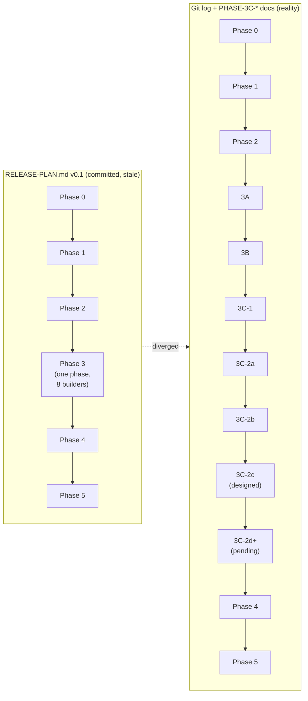
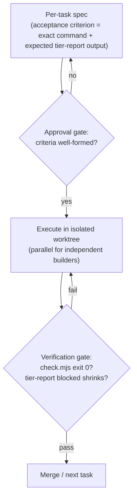
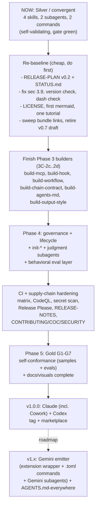

# v1 release plan audit - agent-skills-toolkit

> Audit date: 2026-05-30. Auditor: Claude (Opus 4.8), multi-agent audit workflow + hand verification.
> Scope: the planning bundle now at `docs/internal/release-plans/plan_v1.0.0/` (RELEASE-PLAN.md v0.1, DECISIONS-OPEN.md, the PHASE-* docs, the builder catalog, session logs), measured against the maintainer's stated goal and against 2026 best practice for agentic development.
> Companion: [`2026-05-30_audit-repo.md`](./2026-05-30_audit-repo.md) audits the repository itself.
> The goal it is measured against: "THE best-in-class, best-practice-aligned, user-centered (beginner to advanced engineer), comprehensive, advanced plugin builder that works with the Claude ecosystem (Claude Code and Claude Cowork), Codex, Gemini, and other major tools."

---

## 1. Verdict

The plan is **unusually well-reasoned** at the level of ideas (the self-hosting bootstrap resolution, the monotonic milestone-validity model, the counterintuitive late placement of `init-plugin`, a disciplined decisions log) and **structurally out of date** at the level of execution. The committed master plan describes a world that no longer exists, points readers at a stale Standard, and does not target the breadth or the beginner-to-advanced UX the goal now demands.

Three things must happen before this plan can be "cleanly executed" by you or by a coding agent:

1. **Re-baseline it to reality** (the documented Phase 3 was subdivided into 3A through 3C-2d; the canonical Standard is v0.8, not the v0.7 draft the plan cites).
2. **Decide the scope explicitly** (is Gemini / Cowork / "other tools" in v1, or a named roadmap?) and **bound the comprehensiveness** (the ~60-builder catalog has no v1 cut line, which is the plan's own top risk R6 made manifest).
3. **Add the workstreams the plan never had**: an update-ingestion process, visuals, a beginner on-ramp, governance/community surfaces, and an agent-executable task layer.

**One-line summary:** the thinking is excellent and largely still valid; the plan-of-record is stale, under-scoped against the new goal, and missing several whole categories the goal explicitly asks for.

---

## 2. Plan versus reality: the staleness problem

The single most important finding for this audit. The committed `RELEASE-PLAN.md` (v0.1, 2026-05-25) still presents **one coarse "Phase 3"** that ships eight builders in a single step. Git history and the PHASE-3C-* docs show execution actually **subdivided Phase 3 into at least seven sub-phases**.

Concrete evidence:
- `RELEASE-PLAN.md` sec 3 is a monolithic Phase 3; its change log ends "2026-05-25 v0.1." Git log shows discrete merged PRs: 3A `c79be5c`, 3B `65ba9a8`, 3C-1 `a672485`, 3C-2a `c2dca9b`, 3C-2b `6b9d419`.
- `RELEASE-PLAN.md:3` cites `STANDARD.draft.md` (v0.7) as a canonical input; the canonical normative document is `STANDARD.md` v0.8 at repo root. The bundle's `README.md` read-order still says "start here: agent-skills-toolkit-DESIGN.md, then STANDARD.draft.md."
- The plan never recorded the architectural decisions execution actually made: the "Option A" subagents-are-Claude-only escalation, the "no render-harness" synthesis that dissolved risk R4, and the pending sec 3.9 MCP correction.
- **There is no single committed "where are we / what is next" tracker.** Current state is reconstructable only from the latest session log plus `MEMORY.md`. The repo has no STATUS or ROADMAP file; `docs/internal/{decisions,rfcs,backlog}` are README-only stubs.

Two move-induced problems compound it (the bundle was relocated from `` during this audit):
- The bundle is **git-untracked** under a committed `docs/` path (verified: `git grep` finds nothing inside it because it is not tracked), yet its own `README.md` still calls it "Gitignored working material (`_LOCAL/`)." It is neither cleanly committed nor cleanly working.
- **19 files contain stale `` cross-references** (114 occurrences) that are now dead links, including every session log's continuation prompt. A fresh agent told to "follow the continuation prompt" would load nothing.

`★ Insight ─────────────────────────────────────`
A stale master plan is the single biggest *agentic-execution* hazard. The plan's own Section 1 warns "if the bootstrap is sloppy, the whole self-hosting pitch collapses." The same logic applies to the plan-of-record: hand a coding agent the current `RELEASE-PLAN.md` and it will mis-sequence (a Phase 3 that no longer exists) and re-derive decisions already made (against a v0.7 draft of a v0.8 Standard). Re-baselining is not bookkeeping; it is a precondition for clean execution.
`─────────────────────────────────────────────────`

---

## 3. Strengths of the plan (preserve these)

1. **The reasoning is genuinely high quality.** The self-hosting bootstrap paradox and its resolution (freeze the Standard, hand-author a seed, build the validation spine, then born-validated thereafter), the F-07 monotonic-tier milestone-validity model, and the late placement of `init-plugin` (so it encodes a stable anatomy and is proved by regenerating the seed) are all correct and well-argued.
2. **The monotonic declared-tier model gives an honest, observable burndown.** `tier-report`'s `blocked` list keyed to requirement IDs literally measures remaining work, and the toolkit is shippable at every phase exit (this de-risks the over-scope warning R6).
3. **DECISIONS-OPEN.md is disciplined.** Every decision carries Context / Desired outcome / Options / Recommendation / Decision / Status; all seven (Q-A through Q-G) are resolved with a one-line summary and a change log.
4. **The risk register anticipated the real hazards.** R2 (Codex packaging unknown) and R4 (builder sprawl) were exactly what execution hit; R2's mitigation (spike the round-trip first) was followed and paid off.
5. **Per-phase executable plans exist and the agentic muscle works.** PHASE-1 through PHASE-3C-2b plans are detailed, and recent commits are clean phase-scoped PRs (#49, #53, #63, #74). The decompose -> gate -> ship-via-PR loop is demonstrably functioning.

The fix is not to throw this away. It is to roll it up to reality, bound it, and extend it.

---

## 4. Your eight questions, answered directly

### 4.1 "How can the plan be improved? Is it missing anything?"

Yes - five categories are missing entirely:

| Missing category | Why it matters | Where it should live |
|---|---|---|
| **A live status / single source of truth** | "Where are we / what is next" is reconstructable only from session logs. | A committed `STATUS.md` (or a live header on RELEASE-PLAN v0.2). |
| **An explicit v1 scope boundary** | The ~60-builder catalog has no v1 cut line; "comprehensive" is unbounded (this is risk R6 unmitigated). | A finite "v1 ships exactly these N components; these M are v1.x" manifest. |
| **A multi-tool / Gemini / Cowork decision** | The goal names them; the plan targets only Claude + Codex. | A recorded scope decision + roadmap (see section 6). |
| **An update-ingestion process** | The Standard depends on three moving upstream specs and has absorbed three corrections reactively; sec 3.9 is wrong on main right now. | A "spec-sync" process + a versioned compatibility matrix (see 4.6). |
| **Beginner-to-advanced UX as a tracked deliverable** | Every beginner surface (init, tutorials, install path) is deferred to the last unbuilt phases. | A pulled-forward minimal on-ramp (see 4.3). |

### 4.2 "Does it have the proper CI planned?"

**No.** The plan treats CI as "YAML that shells out to scripts" and stops there. That principle is correct and worth keeping, but the plan never schedules the CI surface a public, security-preaching, cross-platform standard needs. Missing from the plan: an OS x Node matrix (the Standard itself says CI SHOULD exercise the current Active LTS; the implementation does not), security scanning (CodeQL, dependency-review, secret scanning, Scorecard) despite sec 9, release automation + RELEASE-NOTES (sec 10.6), link-checking, and the repo-enforced no-dash check. These belong in the plan as a named "CI hardening" workstream, ideally folded into Phase 5 (Gold G2 "full tier-applicable suite") with the cheapest items (LICENSE, version check, dash check, matrix) pulled before the public preview. See the repo audit R-05 through R-11 for the concrete list.

### 4.3 "Does it have proper human and agent-focused documentation, visuals, samples, reference resources?"

| Asked for | Planned? | Reality |
|---|---|---|
| Agent-focused docs | Partially | `AGENTS.md` exists and is strong (possibly too verbose - see repo R-16); machine-readable surfaces (library.json, `--json` outputs) are first-class. |
| Human docs (beginner to advanced) | Deferred | Diataxis how-to/reference/explanation exist; **tutorials quadrant is empty**; no install path; the only beginner ramp is one 4-step how-to. |
| Visuals / mermaid | **Not planned** | **Zero** diagrams in the committed tree. You explicitly want mermaid; the plan never mentions visuals. |
| Samples / examples | In the Standard, **not in the toolkit** | The Standard requires >=3 golden + >=1 anti per skill; the toolkit's own 4 skills ship none (a self-conformance gap). |
| Reference resources | Partial | Good reference docs for shipped checks; no glossary, FAQ, troubleshooting, CONTRIBUTING, or LICENSE. |
| The "Dana's journey" walkthrough the README implies | Not real | "Dana" appears only in `docs/internal/DESIGN.md`, references unbuilt components, and is not linked from the README. |

Recommendation: make "docs, visuals, samples" a first-class v1 acceptance workstream, not a Phase 5 afterthought. Mermaid in particular is free (renders on GitHub, no binaries, dash-safe) and should land now. This audit dogfoods that by using mermaid throughout.

### 4.4 "Update ingestion process for when standards and updates release?"

**Not planned, and this is a real gap given a fast-moving ecosystem.** The Standard sits on three moving upstream specs: agentskills.io (now evolving under AAIF/Linux Foundation governance), the Codex plugin format (pinned v0.133-0.135), and the Claude plugin format (unpinned). The only commitment is one sentence (sec 6: "Where agentskills.io evolves, the Universal tier MUST track it") with no cadence, owner, or mechanism. Tracking has been ad-hoc spikes, and the evidence that this fails is on main today: the sec 3.9 MCP clause is wrong because a verified correction never made it from a spike into the canonical Standard. Recommended process in section 4.6.

### 4.5 "How can it be optimized for agentic development?"

The repo already half-implements the 2026 agent-execution pattern (deterministic verification gate via `check.mjs`; a requirement-ID-keyed acceptance signal via `tier-report`'s `blocked` list). Five upgrades make it fully agent-executable:

1. **Convert phases into task specs with machine-checkable acceptance criteria** (the EviBound approval-gate / verification-gate pattern). Each task's "done" = an exact command exits 0 and `tier-report` shows a specific state, keyed to a requirement ID. This eliminates false-completion claims and reuses infrastructure that already exists.
2. **Make the plan machine-readable** (a structured task list keyed to STANDARD requirement IDs and the `blocked` list) so "what is left for the next tier" is literally the tool's output.
3. **Adopt worktree-isolated parallel subagents** for the independent builders (build-skill/subagent/command/hook/workflow/mcp), with recombination as its own serialized step (merge is the documented hard part). The environment exposes `EnterWorktree`/`ExitWorktree`.
4. **Wire a GitHub-native coding-agent surface** (`@claude` on issue-assignment driving the existing epic-per-phase + sub-issue + Project #3 backlog into an issue-to-PR flow). Budget for the 2026-06-15 billing change: programmatic runs move to a separate full-API-rate credit pool, so scope prompts tightly and cap `--max-turns`.
5. **Build the behavioral eval layer the Standard promises but the repo lacks** (per-skill >=20-case triggering evals with negative controls + a two-layer deterministic-plus-rubric grader, run in CI as a regression suite). This is required for the core differentiator, grading whole libraries, not just structure.

### 4.6 "What clarity or decisions are needed from me?"

The crisp decision list is section 7. The highest-leverage ones, with my recommendations:

- **Multi-tool scope:** ship v1.0.0 as Claude (incl. Cowork) + Codex at Gold, with Gemini and "other tools" as a written, additive roadmap. (Recommended: defer; the wedge is the grade, not the breadth.)
- **v1 component boundary:** freeze a finite v1 manifest from the catalog; everything else is v1.x. (Recommended: the existing Phase 3+4 set, not the full 60.)
- **Plan re-baseline shape:** RELEASE-PLAN v0.2 plus a thin live STATUS. (Recommended: both.)
- **Bundle status:** commit a cleaned canonical subset as governance; treat session logs/spikes as history or working-only, but pick one. (Recommended: cleaned subset committed, draft deleted.)
- **Update-ingestion:** a lightweight standing spec-sync process. (Recommended: yes.)

---

## 5. Findings (plan-specific), by severity

| ID | Sev | Finding | Recommendation |
|---|---|---|---|
| P-01 | P0 | Master plan stale: coarse Phase 3 vs actual 3A-3C-2d; cites v0.7 draft as canonical. | Re-baseline to RELEASE-PLAN v0.2 with the real decomposition, DONE markers + SHAs, the Option A / no-render-harness / sec 3.9 decisions, and pointers to `STANDARD.md` v0.8. |
| P-02 | P0 | No committed single source of truth for current state / next action. | Add `STATUS.md`: declared tier, built-vs-DoD counts, ordered remaining slices, single next action. Treat session logs as history. |
| P-03 | P0 | Goal scope (Cowork, Gemini, other tools, beginner-to-advanced) is materially wider than the planned Claude+Codex scope, with no recorded decision. | Make the scope a written decision + roadmap (section 6). The architecture already generalizes (agent-targets is a list; Universal is agent-agnostic). |
| P-04 | P1 | Definition of Done remainder (13 of 17 skills, 5 of 7 subagents, Phase 4/5 surface) is scattered across three docs; "~17 + 7" does not reconcile with the ~60-builder catalog. | Build one DoD burndown table; make the v1 count exact, not "~". |
| P-05 | P1 | Moved bundle is untracked, self-mislabeled "gitignored," with 114 broken `_local/` links in 19 files and stale canonical anchors (STANDARD.draft v0.7). | Decide tracked-vs-working and make it true; sweep `` -> the new path; repoint canonical anchors to `STANDARD.md` v0.8; delete or mark the v0.7 draft superseded. |
| P-06 | P1 | No process for evolving the Standard or ingesting upstream changes; corrections are reactive (sec 3.9 wrong on main is the proof). | Add a Standard-governance section: re-verification cadence, a versioned compatibility matrix, an RFC path for amendments, and a committed open-items list. |
| P-07 | P1 | CI hardening, visuals, samples, beginner UX, governance files are not planned workstreams. | Add them as named v1 workstreams (cross-referenced to repo audit R-03, R-05..R-16). |
| P-08 | P2 | Q-C promised ADR graduation at Phase 4; `decisions/` is empty and the decision skill is unbuilt. | Acceptable to defer; record the Q-A..Q-G + new architectural decisions as the ADR backlog so none are lost. |
| P-09 | P2 | Beginner UX, docs site, and adoption/marketing are floating on "roadmap" with no commitment despite being in the goal. | Decide docs-site in/out explicitly; commit to at least a quickstart + one tutorial pre-1.0. |

---

## 6. Recommended re-baseline (the executable plan blueprint)

This is the shape I recommend for RELEASE-PLAN v0.2. It keeps everything that works, rolls up to reality, bounds scope, and adds the missing workstreams. I can produce the full document once you confirm the decisions in section 7.

Key structural changes from v0.1:
- **Reframe targets as three, not five:** "Claude Code and Cowork" is one target (same plugin format); Codex is the second; Gemini is the roadmap third. Add a third column to the per-target capability matrix (Gemini ships subagents; Codex does not).
- **Add a "Re-baseline" pre-step** that front-loads the cheap credibility fixes so the public Silver preview (already decided in Q-A) goes out clean.
- **Bound v1** to a finite component manifest (recommended: the existing Phase 3 + Phase 4 sets, not the full catalog).
- **Add the update-ingestion process** as a standing workstream: a pinned upstream-version table (agentskills.io spec, Codex CLI, Claude plugin format, each with last-verified date), a scheduled CI drift-detection job that opens an issue when a pin moves, and the `tests/fixtures/{golden,anti}` suite reframed as a conformance suite versioned in lockstep with the `standard` field.
- **Promote docs/visuals/samples/beginner-UX** from deferred to tracked v1 acceptance items.
- **Add the agentic-execution layer** (section 4.5) so the remaining build is safely agent-driven.

---

## 7. Decisions needed from you

These shape the executable plan. My recommendation is given for each; the highest-leverage ones are also offered as a structured question after this document.

1. **Multi-tool scope in v1.** Options: (A) widen v1 to include Gemini now; (B) ship v1 as Claude+Codex Gold and publish Gemini/Cowork/others as an additive roadmap; (C) add a placeholder third target that emits nothing. **Recommend B** - the architecture defers cheaply, pulling Gemini forward re-opens the highest-uncertainty work before the two-agent story is even Gold, and breadth dilutes the wedge (the grade, not the emission count, is the defensible asset). Reject C (a target that emits nothing makes the gate lie).
2. **v1 component boundary.** Options: (A) build the full ~60-builder catalog before tagging; (B) freeze a finite v1 manifest, push the rest to v1.x; (C) tag v1 at the current Silver+governance surface. **Recommend B**, leaning to the existing Phase 3+4 set. Converts "comprehensive" from a feeling into a gateable target and mitigates R6.
3. **Plan re-baseline shape.** Options: (A) update RELEASE-PLAN to v0.2 in place; (B) keep it historical, rely on per-phase docs; (C) both, plus a machine-readable task layer. **Recommend C** - bump to v0.2 so the master plan stops misdescribing Phase 3, add a thin live STATUS, then add the structured task layer keyed to requirement IDs for agentic execution.
4. **Bundle status.** Options: (A) commit the whole bundle as governance and fix links; (B) keep it working-only and move it out of `docs/`; (C) commit a cleaned canonical subset, treat logs/spikes as history. **Recommend C** + delete the stale v0.7 `STANDARD.draft.md` (its provenance survives in git history).
5. **Update-ingestion.** Options: (A) ad hoc / re-verify at build time (status quo); (B) a lightweight standing spec-sync process; (C) pin hard and ingest only at major Standard versions. **Recommend B** - drift becomes a detected event, not a surprise, and it is where a future Gemini target plugs in.
6. **Beginner UX timing.** Options: (A) pull a minimal on-ramp (install path + one tutorial) to the Silver preview; (B) keep it in Phase 4/5. **Recommend A** - the wedge is advanced, but adoption depends on getting a beginner to a passing Bronze plugin; build that funnel as soon as Silver is public.

---

## 8. Suggested next steps

1. Answer the section 7 decisions (the structured question after this doc captures the top four).
2. I produce **RELEASE-PLAN v0.2 + a committed STATUS.md** reflecting reality and your decisions, plus the DoD burndown table.
3. Land the **cheap re-baseline fixes** (sec 3.9 correction, version + dash checks, LICENSE, first mermaid, one tutorial, bundle link sweep, retire the v0.7 draft) as one or two PRs - these clear most P0s for the public Silver preview.
4. Resume the build (3C-2c onward) on the re-baselined, agent-executable plan, with the CI/security/docs hardening folded in toward Gold.

The plan's intellectual foundation is strong enough that this is a refresh-and-extend, not a rewrite. The work is to make the plan tell the truth, draw a finite line around v1, name the missing workstreams, and wire it for clean agentic execution.
