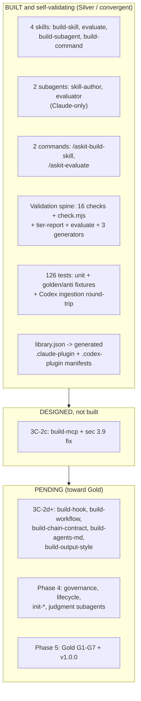

# Repository audit - agent-skills-toolkit

> Audit date: 2026-05-30. Auditor: Claude (Opus 4.8), multi-agent audit workflow + hand verification.
> Scope: the current state of the repository at HEAD `6b9d419` (Phase 3C-2b shipped, 3C-2c designed-not-built).
> Companion: [`2026-05-30_audit-plan-v1.md`](./2026-05-30_audit-plan-v1.md) audits the release plan and the path forward.
> Goal it is measured against (maintainer's stated bar): "THE best-in-class, best-practice-aligned, user-centered (beginner to advanced engineer), comprehensive, advanced plugin builder that works with the Claude ecosystem (Claude Code and Claude Cowork), Codex, Gemini, and other major tools."

---

## 1. Verdict

The repository is a **genuinely strong, honestly-scoped, self-validating Silver-tier plugin** that does what it claims today, plus a normative Standard of real quality. The self-hosting proof is not vapor: I ran the gate and it passes for real.

It is **not yet** the "best-in-class, multi-tool, beginner-to-advanced" product the goal describes. The distance is made of (a) a handful of credibility-cracking self-consistency defects, (b) the absent outward-facing surfaces every public standard needs (license, governance, security scanning, visuals, tutorials), (c) a self-conformance gap where the toolkit does not meet its own Standard on samples and eval coverage, and (d) a scope that names two agents while the goal names a broader set. Encouragingly, the ecosystem research shows the multi-tool gap is far cheaper to close than it looks.

**One-line summary:** the engine is sound and the wedge is real; the bodywork, the dashboard, and the second and third gears are missing.

### Verified ground truth (commands I ran on 2026-05-30, Windows)

| Check | Result |
|---|---|
| `node scripts/check.mjs` | exit 0, "Tier: Convergent (no blockers detected)", 0 errors / 0 warnings |
| `node scripts/tier-report.mjs` | "Tier: Convergent (no blockers detected)" |
| `npm test` | 126 tests, 126 pass, 0 fail |
| `library.json` version vs `package.json` version | **0.2.0 vs 0.1.0 (mismatch)** |
| `git grep '```mermaid'` committed tree | **0 files** |
| `ls LICENSE*` | **absent** |
| `STANDARD.md` MCP registration (sec 3.9 line 190, sec 10.1 line 351) | **states `config.toml mcp_servers` (wrong per the 3C-2c spike)** |

The Silver self-validation claim is **true**. The defects below sit *around* that working core, which is exactly why they are worth fixing: a self-validating product is judged most harshly on the things its own gate fails to catch.

---

## 2. What exists today



Against the plan's Definition of Done ("~17 skills + 7 subagents at Gold"), the repo holds roughly **4 of 17 skills and 2 of 7 subagents**. That is fine for a mid-build Silver preview; it matters only because the gap is not enumerated anywhere committed (see the plan audit).

---

## 3. Strengths (preserve these - do not regress them)

These are the assets the rest of the work should build on, not reinvent:

1. **A real deterministic grading gate.** 16 composable check scripts, an aggregate `check.mjs` that fails on error and surfaces warnings, `tier-report` whose `blocked` list is keyed to requirement IDs, and golden + anti fixtures that prove checks fail when they should. This is the defensible, hard-to-copy wedge, and it works.
2. **Honest self-validation via the monotonic declared-tier model.** The toolkit declares the tier it actually meets and the gate enforces exactly that. "Self-valid at every milestone" has a precise, observable meaning. This is intellectually honest and rare.
3. **CI-agnostic local/CI parity.** The CI YAML holds no validation logic; it only shells out to portable Node scripts. I reproduced the exact CI gate locally on Windows. A contributor can reproduce any CI failure with one command.
4. **Single source of truth for the manifest.** `library.json` is canonical; the native `.claude-plugin` and `.codex-plugin` manifests are generated and drift-checked. This is best practice and it is actually implemented.
5. **The Codex round-trip verifies ingestion, not just listing.** The integration test installs the emitted manifest into a throwaway marketplace and asserts the skill is ingested, defending against the documented "listing != ingestion" trap.
6. **The Standard is genuinely normative.** RFC-2119 throughout, mostly testable requirements, a frozen G1-G7 Gold criteria set each mapped to a satisfying check, a deterministic `max(component-bump)` versioning rule, and a named "embedded marketplace" anti-pattern.

---

## 4. Findings

Severity: **P0** blocks a credible public or Gold release. **P1** is a best-practice or self-conformance gap to close before v1.0.0. **P2** is polish that can land in the open shortly after.

### 4.1 Self-consistency and self-conformance (the credibility cracks)

| ID | Sev | Finding | Evidence | Recommendation |
|---|---|---|---|---|
| R-01 | P0 | **`STANDARD.md` sec 3.9 + 10.1 state the wrong Codex MCP registration mechanism inside a normative MUST clause.** | `STANDARD.md:190` ("the plugin's `config.toml` mcp_servers entries ... MUST emit the registration for each declared target") and `:351`. Contradicted by `PHASE-3C-2c-DESIGN.md:16` and the 2026-05-27 spike: plugin MCP registers via a bundled `.mcp.json` referenced by the manifest `mcpServers` pointer; `config.toml [mcp_servers]` is the user-level path. | Apply the documentation correction to `STANDARD.md` **now**, decoupled from the 3C-2c build slice. A known-wrong normative clause should not sit on main waiting for a build. |
| R-02 | P1 | **`package.json` (0.1.0) and `library.json` (0.2.0) disagree on the version, and no check catches it.** | Verified: `node -p require('./library.json').version` = 0.2.0; `package.json` = 0.1.0. No script reads `package.json` for a version assertion. | Make `library.json` the version source of truth; add a check (extend `manifest-drift.mjs`) asserting `package.json.version === library.json.version`, wired into `check.mjs`. Highest symbolic value per unit of effort on a self-validating product. |
| R-03 | P0 | **The toolkit's own 4 skills ship no samples and no triggering eval sets, violating its own Standard at the tier it declares.** | No `examples/`, `golden/`, or `anti/` under any `skills/*`. `STANDARD.md:284` (sec 7.2) requires >=3 golden + >=1 anti per skill; `:327` (sec 8.3) recommends a >=20-case `{query, should_trigger}` set. The repo declares Silver but its flagship components miss the Standard's own quality bar. | Ship `examples/golden/` + `examples/anti/` and triggering eval sets for the 4 builder skills, wired into CI sample-drift validation. This is the most important self-conformance fix: the repo *is* the marketing, and right now it does not eat its own dog food on samples. |
| R-04 | P1 | **`agentskills.mjs` reimplements the agentskills.io surface rather than wrapping the canonical `skills-ref`, so the toolkit can silently drift from the standard it grades against.** | `scripts/checks/agentskills.mjs` is a compositor, explicitly a swap point. The agentskills.io spec page names `skills-ref validate ./my-skill` as the reference validator. | Add a CI job (or release-time job) that runs the real `skills-ref` against emitted skills, or wrap it behind the existing adapter seam. Hardens the central Universal-tier conformance claim. |

### 4.2 CI/CD, security, and release readiness

| ID | Sev | Finding | Evidence | Recommendation |
|---|---|---|---|---|
| R-05 | P0 | **No LICENSE file and no `license` field; a public repo defaults to all-rights-reserved and is non-distributable.** | `ls LICENSE*` empty; no `license` in `library.json` or `package.json`. A v0.2.0 GitHub release already exists. | Add a `LICENSE` (Apache-2.0 recommended for a standard, for the patent grant; MIT if simplicity is preferred) and set the SPDX id in both manifests before any public release. Table stakes. |
| R-06 | P1 | **Zero security scanning, despite the Standard's sec 9 being entirely about security and least privilege.** | `.github/` contains only `workflows/ci.yml`. No CodeQL, dependency-review, secret scanning, OpenSSF Scorecard, SLSA/provenance, SBOM, Dependabot, or Renovate. | Add CodeQL + dependency-review + secret scanning/push protection, an OpenSSF Scorecard workflow + badge, and npm provenance/SLSA attestation at release. A grader of other people's supply chains must secure its own. Extend `STANDARD.md` sec 9 with a supply-chain clause so the toolkit grades on the axis it currently ignores. |
| R-07 | P1 | **CI is single-axis (ubuntu-latest, Node 20 only); it violates the Standard's own "CI SHOULD additionally exercise the current Active LTS," and never tests Windows where the maintainer develops.** | `ci.yml:22` (`runs-on: ubuntu-latest`), `:30` (`node-version: "20"`). `STANDARD.md` sec 4.1. The Codex round-trip test even has Windows-specific spawn handling, yet Windows is never run in CI. | Add `strategy.matrix` over `os: [ubuntu, windows, macos]` x `node: [20, 22]` with `cache: npm`. At minimum add `windows-latest` + Node 22. Cross-platform path/line-ending bugs ship undetected today. |
| R-08 | P1 | **The maintainer's hard no-em-dash / no-en-dash rule is enforced only by a machine-local global hook, not by the repo or CI.** | Only enforcement is `~/.claude/hooks/no-em-dashes.py` (global). No repo hook, no `scripts/checks` entry, no CI step. The committed tree is clean **today** only because that hook catches the maintainer's own edits. | Add a portable `scripts/checks/no-dashes.mjs` (build the forbidden chars from `String.fromCharCode(0x2013,0x2014)` so the checker never embeds them) wired into `check.mjs`. The prose is clean now, so the gate locks in a passing state rather than creating cleanup. Doubles as the toolkit's own Gold G1 hook candidate (already the H1 pick in Q-F). |
| R-09 | P1 | **No release automation, and no `RELEASE-NOTES.md` (mandated distinct from CHANGELOG by sec 10.6).** | No release workflow in `.github/`; v0.2.0 was hand-tagged. `CHANGELOG.md` is well-formed but only the changelog exists. | Adopt Release Please (review-gated, changelog-driven; fits a single self-hosting plugin and maps onto the deterministic `max(component-bump)` rule) over semantic-release (no review gate) or changesets (monorepo-oriented). Wire it to emit provenance. Create `RELEASE-NOTES.md` before Gold. |
| R-10 | P2 | **No branch protection evidence, CODEOWNERS, issue/PR templates, or link-checking.** | No `CODEOWNERS`, no `.github/ISSUE_TEMPLATE`, no lychee/markdown-link-check config. Branch protection is server-side and undocumented. | Enable branch protection requiring the CI `validate` job; add CODEOWNERS, issue/PR templates, and a scheduled lychee link-check (so doc rot is caught without blocking PRs on transient 404s). |
| R-11 | P2 | **The Q-G `@claude` automation is decided but not wired; the Q-E manual Codex gate is not in a repo release checklist.** | `grep -rIn claude .github/` returns nothing. The Q-E manual round-trip lives only in the plan bundle and CHANGELOG, not a `RELEASE.md`. | Either implement `claude-code-action` (with `CLAUDE_CODE_OAUTH_TOKEN`) or annotate Q-G as deferred. Add a `RELEASE.md` checklist listing `CODEX_REQUIRED=1 npm test` as a required pre-tag step. Note the 2026-06-15 billing change for programmatic runs. |

### 4.3 Documentation, visuals, samples, reference resources

| ID | Sev | Finding | Evidence | Recommendation |
|---|---|---|---|---|
| R-12 | P0 | **Diataxis is incomplete: no `docs/tutorials/` quadrant, the one that serves beginners, though the Standard prescribes it.** | `ls docs/tutorials` = absent. Quadrant counts: how-to 5, reference 6, explanation 1, tutorials 0. `STANDARD.md:368,:403`. | Add at least one end-to-end beginner tutorial (zero to a passing skill, then climb to Silver) against the current `node scripts/*` dev workflow. Directly serves the beginner-to-advanced bar. |
| R-13 | P0 | **Zero visual aids anywhere; no mermaid, no diagrams, no ASCII trees - and the maintainer explicitly wants mermaid.** | `git grep '```mermaid'` = 0 files. Only images are gitignored under `_local/initial-discovery/`. | Add mermaid at high-leverage points: (1) the Bronze/Silver/Gold tier model, (2) the build -> evaluate -> improve loop, (3) the `library.json -> gen-manifest -> per-target manifests` emission flow, (4) the chain contract, (5) a repo architecture map. Mermaid renders natively on GitHub, needs no binaries, and is dash-rule-safe. (This audit dogfoods that.) |
| R-14 | P1 | **Stale tier docs: `conformance-and-tiers.md` and `climb-from-bronze-to-silver.md` describe S1-S6 and "wait for 3B," but shipped reality is S1-S7 with emission done.** | `docs/explanation/conformance-and-tiers.md` has 0 occurrences of S7; `climb-from-bronze-to-silver.md` step 4 says "Wait for 3B to ship emission"; `CHANGELOG.md:37` still says "S1-S6 gate green." | Update to S1-S7, present emission as done, fix the CHANGELOG wording. Add a doc-drift check asserting the documented S-check set matches `scripts/checks/` (Gold target: generate the tables from the registry). |
| R-15 | P1 | **No governance/community-health files: no CONTRIBUTING, CODE_OF_CONDUCT, SECURITY, glossary, FAQ, or troubleshooting.** | None tracked. The Standard mandates a contribution process (sec 7.6); `docs/internal/{decisions,rfcs,backlog}` are README-only stubs. | Add CONTRIBUTING (how to propose a check/builder; how RFCs/ADRs work), CODE_OF_CONDUCT (Contributor Covenant), SECURITY (disclosure policy aligned to sec 9), a glossary (the two-axis terminology is a recurring confusion point), and a troubleshooting/FAQ for common `evaluate`/`check` failures. Promote `docs/internal/rfcs/` from stub to a real spec-amendment RFC process. |
| R-16 | P1 | **`AGENTS.md` may be too verbose for its own good.** | The repo's `AGENTS.md` is ~6 KB and dense, with multiple negative "do not" clauses. An ETH Zurich study (arXiv 2602.11988, 138 repos, 5,694 PRs) found verbose, LLM-style context files reduce task success ~3% and raise cost 20%+, and negative instructions frequently backfire. | Trim `AGENTS.md` to essential, mostly-positive guidance; measure changes by net agent task-success/cost. Add a brevity/anti-redundant-negative rule to the sec 8.1 discoverability bar and to any future `build-agents-md` builder. |

`★ Insight ─────────────────────────────────────`
R-03, R-12, and R-13 cluster into one theme: **the flagship does not yet model the experience it sells.** A toolkit whose pitch is "we grade whole libraries to a quality bar" loses credibility if its own skills lack the samples and eval coverage the bar requires, and a "beginner to advanced" product with no tutorial and no diagram is advanced-only in practice. These are the highest-leverage fixes because the repo is meant to *be* the proof.
`─────────────────────────────────────────────────`

---

## 5. Ecosystem reality check (this reframes the multi-tool goal)

The audit's web research (fetched 2026-05-30, sources cited in the harvested reports under `audit/` workspace) changes the cost calculus of "works with Claude Code + Cowork, Codex, Gemini, and other major tools":

| Tool | What it actually consumes (2026) | Implication for the toolkit |
|---|---|---|
| **Claude Code** | Plugin format (skills + commands + subagents + hooks + MCP) | Already the primary target. |
| **Claude Cowork** | **The same Claude plugin format.** claude.com/plugins is titled "Plugins for Claude Code and Cowork." | "Support Cowork" is **not a new emitter**. It is one target with Claude Code. The only real work is a *verify-it-loads-in-Cowork* step plus Cowork-flavored positioning. Reframe "Claude Code AND Cowork" as ONE target. |
| **Codex** | `.codex-plugin/plugin.json` (skills/MCP/hooks/apps pointers); subagents are `config.toml`-only, not plugin-shipped | Repo's pin (v0.133-0.135) and the subagents caveat are **confirmed accurate**. New optional surface: `plugin.json` now has a rich `interface{}` install-surface object (displayName, category, brandColor, screenshots) the emitter does not populate. |
| **Gemini CLI** | **Natively reads `SKILL.md`** and even the cross-tool `~/.agents/skills` and `.agents/skills` paths; distribution unit is an *extension* (`gemini-extension.json`); commands are `.toml`; **extensions DO ship subagents** (unlike Codex) | Gemini is the only genuinely new emitter, and it is cheaper than feared: Bronze skills port nearly for free. Real work = the extension wrapper + `.toml` commands + a Gemini subagent format. Add a **third column** to the per-target capability matrix. |
| **Copilot, Cursor, +29 others** | Read `AGENTS.md` and unchanged `SKILL.md` | Reached **for free** via the Universal tier. `AGENTS.md` is confirmed to work across Claude/Codex/Gemini/Copilot/Cursor. Elevate `AGENTS.md` as the cheapest credible "works everywhere" surface. |

**Governance context:** agentskills.io and AGENTS.md are now stewarded by the Linux Foundation's Agentic AI Foundation (AAIF, announced Dec 2025, ~146 member orgs by Feb 2026; agentskills.io reports 32 adopters by March 2026). The "Agent Skill Report" found **22% of analyzed skills fail even structural validation**, and there is **no mandatory conformance testing**. That is precisely the unoccupied niche this toolkit targets: a deterministic, tiered grade over whole libraries. The strategic move is to position the toolkit as **the conformance/grading layer above the AAIF-owned standards** (SKILL.md, AGENTS.md, MCP), aligning its vocabulary with them rather than competing.

`★ Insight ─────────────────────────────────────`
The multi-tool goal looked like "build five emitters." Reality: it is **three distribution targets** (Claude-including-Cowork, Codex, Gemini), the Universal tier already reaches roughly 32 tools through the same `SKILL.md`, and `AGENTS.md` reaches Copilot and Cursor at no marginal cost. The expensive, differentiated work is not breadth of emission (that space is crowded); it is the tiered grading gate, which you already own.
`─────────────────────────────────────────────────`

There is also one Standard-text accuracy fix the research surfaced: `STANDARD.md:143` describes only the Codex skill *discovery* path (`.agents/skills`), not the *distribution* path (`.codex-plugin/plugin.json` ingestion) the toolkit actually emits to. Distinguish the two so authors are not misled about how a shipped plugin is consumed.

---

## 6. Prioritized remediation checklist

A suggested ordering. Each item is small; the value is in clearing them before the public/Gold milestones.

**Before going public (P0 + the cheapest credibility P1s):**
- [ ] R-05 Add LICENSE + `license` field.
- [ ] R-01 Apply the sec 3.9 / 10.1 MCP correction to `STANDARD.md`.
- [ ] R-02 Add the `package.json` vs `library.json` version-equality check; reconcile to 0.2.0.
- [ ] R-08 Add the portable no-dashes check, wired into `check.mjs` and CI.
- [ ] R-13 Add the first mermaid diagrams (tier model + build/evaluate loop + emission flow).
- [ ] R-12 Add one beginner tutorial under `docs/tutorials/`.
- [ ] R-14 Fix the stale S1-S6 / "wait for 3B" docs.

**Before v1.0.0 (Gold) - self-conformance and hardening:**
- [ ] R-03 Ship samples + triggering eval sets for the 4 skills (self-conformance).
- [ ] R-06 Add security scanning (CodeQL, dependency-review, secret scanning, Scorecard) + a sec 9 supply-chain clause.
- [ ] R-07 Expand CI to the OS x Node matrix.
- [ ] R-09 Add Release Please + `RELEASE-NOTES.md` + provenance.
- [ ] R-15 Add CONTRIBUTING / CODE_OF_CONDUCT / SECURITY / glossary / FAQ.
- [ ] R-04 Wire real `skills-ref` conformance into CI.
- [ ] R-16 Trim `AGENTS.md` per the brevity findings.

**Shortly after (P2, fine to do in the open):**
- [ ] R-10 Branch protection, CODEOWNERS, templates, link-check.
- [ ] R-11 `@claude` automation (or mark deferred) + `RELEASE.md` Codex-gate checklist.
- [ ] Populate the Codex `plugin.json` `interface{}` install-surface for polish.
- [ ] Fix `STANDARD.md:143` Codex discovery-vs-distribution wording.

The strategic and scope decisions (Gemini/Cowork in v1 or roadmap, how to bound the ~60-builder catalog, the update-ingestion process, re-baselining the plan) are covered in the companion plan audit, where they belong.

---

## 7. Sources

The structured findings, with per-claim evidence and source URLs, are the eight harvested agent reports produced for this audit. The repository facts above were re-verified by hand on 2026-05-30 (commands and outputs in section 1). External ecosystem claims (Cowork plugin parity, Gemini `SKILL.md` support, AAIF governance, the ETH Zurich `AGENTS.md` study) carry their source URLs in the harvested research reports.
