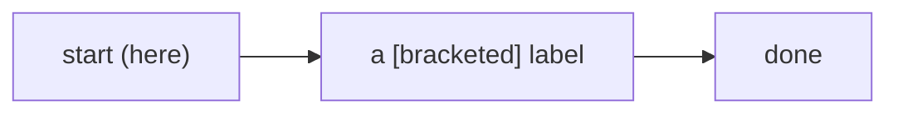

# P3 - README hero rewrite + mermaid diagrams + mermaid-valid (U12) - implementation plan

> Per-phase cadence (PROGRAM-PLAN sec 5, IMPL-PLAN P3): branch from `main`; write the validator and sweep the repo read-only; author the four diagrams + the hero rewrite so the whole tree is clean; register the check last (the flip); run `node scripts/check.mjs` + `npm test` + `(cd site && npm run build)` + the 14.11 guards; regenerate `INDEX.md`/manifests only if a generated input changed; run an adversarial gate; squash-merge; confirm `main` green. One PR vs protected `main`, individually green.

## Author-before-enforce micro-order

The exact ordering within P3 (the check is flipped on LAST):

1. **Write the validator unregistered.** Create `scripts/checks/mermaid-valid.mjs` but do NOT add it to the `CHECKS` array yet. At this point it is dead code the gate ignores.
2. **Sweep read-only.** Run the validator over the whole repo via a throwaway one-liner (a `node -e` that imports `check` and calls it with `{ root: process.cwd() }`) to enumerate every pre-existing structural defect in the existing tracked mermaid blocks (README, `docs/explanation/**`, `docs/how-to/**`, `docs/internal/**`, the curated site `.mdx`). Record the list.
3. **Author + fix.** Write the four new diagrams and the hero rewrite, AND fix any pre-existing defect the sweep found, so the entire tree satisfies the four rules.
4. **Export `SKIP_DIRS`.** Add the `export` keyword to the `SKIP_DIRS` const in `no-dashes.mjs` and import it in `mermaid-valid.mjs` (so the skip set is shared, not duplicated).
5. **Register (the flip).** Add the import line and the `CHECKS` array entry in `scripts/lib/registry.mjs`. Now U12 binds.
6. **Fixtures + test.** Create the golden + anti fixtures and the unit test.
7. **Verify** (gate + npm test + site build + guards), then the adversarial gate, then squash-merge.

The check ships green on its own dogfood because steps 2-3 guaranteed the repo is clean before step 5 turned the check on (R-SEQ-1).

## Steps

Each step names the exact files. Paths are repo-relative to `E:\Projects\product-on-purpose\agent-skills-toolkit`.

### Step 1 - branch

```
git switch main && git pull
git switch -c phase-3-readme-mermaid
```

### Step 2 - create the validator (unregistered)

Create `scripts/checks/mermaid-valid.mjs`. Skeleton (the executor fills in the body to the SPEC asserts):

```js
import { readFileSync, readdirSync, statSync, existsSync } from "node:fs";
import path from "node:path";
import { relPath } from "../lib/fs-utils.mjs";
import { finding, SEVERITY } from "../lib/findings.mjs";
import { SKIP_DIRS } from "./no-dashes.mjs"; // shared skip set, by basename

export const meta = { id: "mermaid-valid", tier: "universal", reqId: "U12" };

// One named constant, easy to extend. Longer variants (stateDiagram-v2) before their prefixes.
const DIAGRAM_KEYWORDS = [
  "flowchart", "graph", "sequenceDiagram", "classDiagram",
  "stateDiagram-v2", "stateDiagram", "erDiagram", "journey",
  "gantt", "pie", "mindmap", "timeline", "quadrantChart",
  "gitGraph", "C4Context",
];

const SCAN = /\.(md|mdx)$/;

function collect(dir, out) {
  let entries;
  try { entries = readdirSync(dir); } catch { return; }
  for (const name of entries) {
    if (SKIP_DIRS.has(name)) continue;             // skip by basename, any depth
    const full = path.join(dir, name);
    let st;
    try { st = statSync(full); } catch { continue; }
    if (st.isDirectory()) collect(full, out);
    else if (SCAN.test(name)) out.push(full);
  }
}

/** Extract fenced mermaid blocks: returns [{ startLine, body }]; flags unterminated fences. */
function extractMermaidBlocks(text) {
  const lines = text.split(/\r?\n/);
  const blocks = [];
  let open = null;
  for (let i = 0; i < lines.length; i++) {
    if (open === null && /^```mermaid\s*$/.test(lines[i])) { open = { startLine: i + 1, body: [] }; continue; }
    if (open !== null && /^```\s*$/.test(lines[i])) { open.body = open.body.join("\n"); blocks.push(open); open = null; continue; }
    if (open !== null) open.body.push(lines[i]);
  }
  if (open !== null) { open.body = open.body.join("\n"); open.unterminated = true; blocks.push(open); }
  return blocks;
}

/** True iff brackets [] () {} balance across s, ignoring chars inside "..." quotes. */
function bracketsBalanced(s) {
  const pairs = { "]": "[", ")": "(", "}": "{" };
  const stack = [];
  let inQuote = false;
  for (const ch of s) {
    if (ch === '"') { inQuote = !inQuote; continue; }
    if (inQuote) continue;
    if (ch === "[" || ch === "(" || ch === "{") stack.push(ch);
    else if (ch in pairs) { if (stack.pop() !== pairs[ch]) return false; }
  }
  return stack.length === 0;
}

/**
 * what-it-is:   the U12 mermaid-valid Bronze check
 * what-it-does: structurally validates every fenced mermaid block in .md/.mdx (non-empty,
 *               recognized first keyword, balanced brackets ignoring quotes, no tabs)
 * why:          a malformed diagram renders broken on the site; the portable gate catches it
 *               without the heavy mermaid runtime (the astro-mermaid build is the second layer)
 * used-by:      scripts/lib/registry.mjs (the CHECKS array), scripts/check.mjs, tier-report.mjs
 */
export function check(ctx) {
  const root = ctx.root;
  if (!root || !existsSync(root)) return [];
  const files = [];
  collect(root, files);
  const out = [];
  for (const f of files) {
    let text;
    try { text = readFileSync(f, "utf8"); } catch { continue; }
    if (!text.includes("```mermaid")) continue; // fast skip: no diagram -> vacuous
    const rel = relPath(root, f);
    for (const b of extractMermaidBlocks(f === f ? text : text) ? [] : []) { /* replaced below */ }
    for (const b of extractMermaidBlocks(text)) {
      if (b.unterminated) { out.push(finding(meta.id, SEVERITY.ERROR, `unterminated mermaid fence starting at line ${b.startLine}.`, { file: rel, reqId: meta.reqId })); continue; }
      const body = b.body;
      if (body.trim() === "") { out.push(finding(meta.id, SEVERITY.ERROR, `mermaid block at line ${b.startLine} is empty.`, { file: rel, reqId: meta.reqId })); continue; }
      const first = body.split(/\r?\n/).find((l) => l.trim() !== "")?.trim() ?? "";
      if (!DIAGRAM_KEYWORDS.some((kw) => first.startsWith(kw))) {
        out.push(finding(meta.id, SEVERITY.ERROR, `mermaid block at line ${b.startLine} does not start with a recognized diagram keyword (got ${JSON.stringify(first.split(/\s+/)[0])}).`, { file: rel, reqId: meta.reqId }));
      }
      if (!bracketsBalanced(body)) {
        out.push(finding(meta.id, SEVERITY.ERROR, `mermaid block at line ${b.startLine} has unbalanced brackets [] () {} (quotes ignored).`, { file: rel, reqId: meta.reqId }));
      }
      if (body.includes("\t")) {
        out.push(finding(meta.id, SEVERITY.ERROR, `mermaid block at line ${b.startLine} contains a tab; mermaid is whitespace-sensitive, use spaces.`, { file: rel, reqId: meta.reqId }));
      }
    }
  }
  return out;
}
```

Note: the executor MUST delete the placeholder `for (const b of ... ? [] : [])` line shown above (it is a copy-paste artifact in this skeleton); the real loop is the one that follows it. The validator carries its own four-field `source-doc` docblock (so it already passes `G9` when P5 flips), which is shown on `check`.

### Step 3 - sweep the repo read-only

With the validator written but unregistered, enumerate pre-existing defects:

```
node -e "import('./scripts/checks/mermaid-valid.mjs').then(m => { const r = m.check({ root: process.cwd() }); console.log(JSON.stringify(r, null, 2)); console.log('findings:', r.length); })"
```

Expected at this stage: ideally `findings: 0` (the existing diagrams in README / `docs/**` are already balanced, per the P3 grounding read). If any pre-existing block fails (for example a stray bracket in a `docs/internal/**` audit diagram), record it and fix it in Step 5 BEFORE registering the check.

### Step 4 - export the shared skip set

Edit `scripts/checks/no-dashes.mjs`: change

```js
const SKIP_DIRS = new Set([...]);
```

to

```js
export const SKIP_DIRS = new Set([...]);
```

No behavior change to `no-dashes`; this only makes the set importable so `mermaid-valid` reuses it by basename (CHECKS-SPEC requirement). Update the `no-dashes` docblock comment if it documents the const as private.

### Step 5 - author the four diagrams + the hero rewrite, fix any swept defect

Edit `README.md`:

- Confirm/normalize the hero block to the family pattern (centered title, value line, nav `<p>`, badge `<p>`, `<details>` TOC) per SPEC RQ-CONTENT-HERO-1. Do NOT change the version badge or the check count (P6 owns those).
- Place the four canonical diagrams per SPEC "Content / artifacts to author": **tier-climb** in the "What it is" region (this is the existing `L -> B -> S -> G` hero diagram, kept and named); **architecture** near the gate / "What makes it different" prose; **eval-boundary** near the deterministic-gate prose; **build-evaluate-improve** near "Use it". Reuse the `flowchart`/`graph` family and keep all paren/bracket characters inside quoted node labels so rule 3 stays balanced.
- Fix any pre-existing mermaid defect Step 3 surfaced (in README or anywhere in the tree, including `docs/internal/**`).

If Step 3 found defects in files other than README, edit those files too (they are in scope for the fix because U12 is repo-wide and the flip must be green).

### Step 6 - register the check (the flip)

Edit `scripts/lib/registry.mjs`:

- Add the import near the other check imports:

```js
import * as mermaidValid from "../checks/mermaid-valid.mjs";
```

- Add `mermaidValid` to the `CHECKS` array. Place it next to the other universal content-hygiene checks (e.g. after `noDashes` in the `versionMatch, noDashes, mcpValid,` group), keeping the array's tier-grouped ordering:

```js
  versionMatch, noDashes, mermaidValid, mcpValid,
```

### Step 7 - golden + anti fixtures

Create `tests/fixtures/golden/mermaid-ok/`:

- `library.json`:

```json
{ "name": "mermaid-ok", "version": "0.1.0", "description": "A fixture plugin with a structurally valid mermaid diagram, used as the golden baseline for the mermaid-valid (U12) check.", "standard": "0.10", "tier": "universal" }
```

- `docs/diagram.md` with a valid `flowchart` including a quoted-bracket label and a parenthesized label (to prove rule 3's quote-ignoring path):

````
---
title: "Diagram fixture"
---


````

Also add a second valid block using `stateDiagram-v2` so the longer-keyword path is exercised.

The anti cases are **NOT committed as a fixture**. Because U12 is repo-wide (it does not exclude `tests/fixtures/`), a committed `docs/diagram.md` containing an invalid ` ```mermaid ` block would be flagged by the toolkit's own self-scan and make the gate red. So the anti cases are constructed in a **temp dir inside the test** (the same pattern `no-dashes` uses for its forbidden-byte cases). The illustrative content each temp-dir case writes (shown here in a `text` fence, not a real ` ```mermaid ` fence, for the same reason):

```text
notadiagram LR        <- first token unrecognized: rule 2 fails
  A[unbalanced --> B]] <- ]] closes twice: rule 3 fails

(an empty block: ```mermaid immediately followed by ```)  <- rule 1 fails
(a block whose body contains a literal \t)                <- rule 4 fails (build the tab from "\t" in the test)
```

Each temp-dir case isolates one rule so the test can assert the specific message. Only the GOLDEN fixture (`tests/fixtures/golden/mermaid-ok/`, a valid diagram) is committed - it passes the self-scan.

### Step 8 - the unit test

Create `tests/unit/mermaid-valid.test.mjs`, modeled on `tests/unit/no-dashes.test.mjs` (temp-dir construction for the tab/`.mdx`/skip cases) and `tests/unit/docs-frontmatter.test.mjs` (fixture-based golden/anti). Cases:

1. `meta declares U12 universal` - assert `meta.reqId === "U12"`, `meta.tier === "universal"`.
2. `a structurally valid diagram passes with no findings` - `check(loadPlugin(golden/mermaid-ok)).length === 0`.
3. `an unrecognized first keyword fails naming the rule` - over `anti/mermaid-bad`, a finding matches `/recognized diagram keyword/`, `reqId === "U12"`.
4. `unbalanced brackets fail` - a finding matches `/unbalanced brackets/`.
5. `an empty block fails` - a finding matches `/empty/`.
6. `a tab in a block fails` - build a temp dir, write a `.md` with a mermaid block containing `\t`, assert a `/tab/` finding (programmatic tab, like the `no-dashes` em-dash-from-code-point pattern).
7. `a block inside an .mdx file is scanned` - temp dir, `x.mdx` with a valid block and an unbalanced block; assert the unbalanced one is flagged (proves `.mdx` scope).
8. `a quoted bracket does not trip the balance rule` - temp dir, a block with `A["a [b] c"]`; assert zero findings (proves quote-ignoring).
9. `a plugin with no diagrams passes vacuously` - `check(loadPlugin(golden/minimal-skill)).length === 0`.
10. `skips node_modules and _local` - temp dir with a bad block under `node_modules/` and `_local/`; assert zero findings (proves the shared SKIP_DIRS).
11. `stateDiagram-v2 is recognized` - temp dir, a `stateDiagram-v2` block; assert zero findings.

Import `loadPlugin` from `../../scripts/lib/load-plugin.mjs` and `check, meta` from `../../scripts/checks/mermaid-valid.mjs`, mirroring the existing tests.

### Step 9 - regenerate only if needed

The README is hand-authored and is not a generated input, so `INDEX.md` / `manifest.generated.json` should not change. Run the generators defensively per the cadence and confirm no diff:

```
node scripts/generators/gen-manifest.mjs . --write --target=all
node scripts/generators/gen-index.mjs . --write
git diff --name-only
```

If the only changes are the intended files (README, the check, the registry, fixtures, the test, `no-dashes.mjs`), proceed. If a generated file changed unexpectedly, investigate before committing.

### Step 10 - count/wording sweep

Confirm P3 introduced no contradictory check count or tier label in the README hero. P3 does NOT move the count to 30 or relabel to `G1-G10` (that is P6). Verify the badges still read whatever the repo states at P3 time and that the nav anchors resolve to existing headings.

## Verification

Exact commands and expected results (run from the repo root unless noted):

| Command | Expected |
|---|---|
| `node scripts/check.mjs` | `Advanced`, `0 errors, 0 warnings`; a `U12` line present; exit 0. |
| `npm test` | All green, including `mermaid-valid.test.mjs` (11 cases) and `registry-sync.test.mjs`. |
| `node -e "import('./scripts/checks/mermaid-valid.mjs').then(m=>console.log(m.check({root:process.cwd()}).length))"` | `0` (repo-wide sweep clean). |
| `(cd site && npm run build)` | Build succeeds; all four README diagrams (and the site's own) render via astro-mermaid; no broken-render box. |
| `node site/scripts/check-rendered-links.mjs` (and the route-parity guard) | Exit 0 on the built `dist` (14.11 guards). |
| `git diff --name-only` | Only: `README.md`, `scripts/checks/mermaid-valid.mjs`, `scripts/checks/no-dashes.mjs`, `scripts/lib/registry.mjs`, `tests/fixtures/golden/mermaid-ok/**`, `tests/fixtures/anti/mermaid-bad/**`, `tests/unit/mermaid-valid.test.mjs` (plus any pre-existing-defect fix files Step 3 surfaced). |
| Adversarial probe: temporarily break a README diagram (unbalance a bracket) and run `node scripts/check.mjs` | U12 fails naming `README.md` and the bracket rule; restore. |

## Adversarial review

Run an adversarial gate before merge (PROGRAM-PLAN R-SEQ-2). Note the Codex CLI is unreliable on this Windows setup (MEMORY: "Codex /codex:review unreliable on this Windows setup"), so use an **own multi-agent read-only review** rather than `/codex:review`. Lenses to run:

- **Soundness (false pass):** can a diagram that renders broken still pass U12? Confirm the two-layer claim holds (structural gate + astro-mermaid render); confirm the `startsWith` keyword match cannot be gamed by a real broken diagram that also passes the build. Confirm the quote-ignoring bracket logic does not mask a genuinely unbalanced structural bracket outside quotes.
- **Soundness (false fail):** does the check flag any legitimate diagram? Re-sweep the whole repo and any sample diagrams; check the `stateDiagram-v2`/`stateDiagram` ordering, CRLF handling, multi-block files, and quoted brackets.
- **Scope correctness:** confirm `.mdx` is scanned and `docs/internal/**` is NOT excluded (U12 is repo-wide, unlike G7); confirm `SKIP_DIRS` is imported, not re-listed; confirm a nested `node_modules` is skipped by basename.
- **Determinism / sync:** confirm `check` is synchronous and returns an array (the `registry-sync` test guards this; verify no `async`/Promise crept in).
- **No spec violations:** no version bump, no Standard bump, no renumber introduced; no em/en dash in the diff; no stale count in the README.
- **Fixture integrity:** the anti fixture bites each rule; the golden passes; the fixtures are not accidentally picked up by other checks (they live under `tests/fixtures/`, excluded from the folder-readme/source-doc scopes).

Fix every confirmed finding before merge; record the review.

## The PR

- **Title (Conventional Commit):** `feat(checks): add U12 mermaid-valid (Bronze) + README hero rewrite and four diagrams`
- **Body outline:**
  - **What:** the README hero rewrite to the family pattern; the four canonical diagrams (architecture, tier-climb, eval-boundary, build-evaluate-improve); `scripts/checks/mermaid-valid.mjs` as Bronze `U12` (structural, zero-dependency, two-layer with astro-mermaid); fixtures + test; `SKIP_DIRS` exported and shared.
  - **Why:** ADR 0024 D4/D6 - the visible README win plus the deterministic backing, author-before-enforce; closes R-CHECK-U12 and the README slice of R-CONTENT; ADR 0021 D6's never-built mermaid check.
  - **How it stays green:** the repo was swept clean over all tracked mermaid blocks before the check was registered (R-SEQ-1); the check ships green on its own dogfood.
  - **Scope guard:** no version bump, no Standard bump, no renumber (P6); no new content quadrants (P1/P2).
  - **Verification:** gate Advanced 0/0; `npm test` green; site build renders all diagrams; 14.11 guards pass; the adversarial gate ran.
  - **Trailer:** `Co-Authored-By: Claude Opus 4.8 <noreply@anthropic.com>`.

## Rollback / risk notes

- **Independent PR:** if U12 proves unsound after merge (a false pass or false fail surfaces), revert the single P3 PR. Because P3 only adds a check + README content and bumps nothing, a revert strands nothing: no Standard version moved, no release was cut. The README hero rewrite would revert with it; if only the check is unsound, a follow-up can keep the README and remove just the `CHECKS` entry.
- **Pre-tag safety:** P3 is pre-release (the `v1.1.0` tag is P6). Nothing is published, so a revert is clean.
- **Bronze blast radius:** because U12 is Bronze, it binds every plugin the toolkit grades from the moment it merges. If a downstream consumer reports a false fail, the fix is to extend `DIAGRAM_KEYWORDS` (a one-line addition) or refine the quote/bracket logic, shipped as a patch; the named constant makes this cheap.
- **The `SKIP_DIRS` export:** if the maintainer prefers a dedicated `scripts/lib/` home for the shared skip set rather than exporting it from `no-dashes.mjs`, that relocation is a safe follow-up and does not block P3; the import path in `mermaid-valid.mjs` updates in one line.
