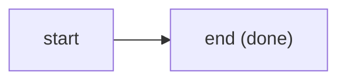

# P3 - README hero rewrite + mermaid diagrams + mermaid-valid (U12) - SPEC

> Realizes packet [`SPEC.md`](../SPEC.md) requirements **R-CHECK-U12** (the Bronze `mermaid-valid` check), **R-CHECK-6** (the shared module/fixture/test contract), and the README slice of **R-CONTENT** (the hero rewrite + diagrams; R-CONTENT-5 house-style and U5-shape obligations apply to the new prose). Normative per-check detail: [`CHECKS-SPEC.md`](../CHECKS-SPEC.md) section "U12 - mermaid-valid". ADR source: [ADR 0024](../../../decisions/0024-documentation-depth-and-discoverability.md) D4 (the check + its Bronze tier rationale) and D6 (author-before-enforce).

## Requirements

RFC 2119 language. Each requirement carries a testable acceptance criterion.

### RQ-U12-1 - the check exists as a Bronze module

The toolkit MUST ship `scripts/checks/mermaid-valid.mjs` exporting `meta = { id: "mermaid-valid", tier: "universal", reqId: "U12" }` and a **synchronous** `check(ctx)` returning an array of `finding(...)` objects, registered in the `CHECKS` array in `scripts/lib/registry.mjs`.

- **Acceptance:** the module is imported and listed in `registry.mjs`; the `registry-sync` test passes (the check returns an array synchronously); `node scripts/check.mjs` includes a `U12` line; `tier.mjs` maps the `U`-prefix reqId to the `universal` tier, so U12 binds every plugin regardless of declared tier.

### RQ-U12-2 - every fenced mermaid block MUST be structurally well-formed

For every fenced ` ```mermaid ` block in every in-scope file, the check MUST assert all four structural rules and MUST emit one `finding` per violation, naming the file and the violated rule. The four rules:

1. The block body (between the opening ` ```mermaid ` fence line and the closing ` ``` ` fence) MUST be non-empty after trimming.
2. The first non-blank line of the block body MUST begin with a recognized diagram keyword from the named constant `DIAGRAM_KEYWORDS` (see "The check").
3. The bracket characters `[]`, `()`, `{}` MUST be balanced across the whole block body, where characters inside a quoted span (`"..."`) are ignored for the count.
4. The block body MUST contain no tab character (`\t`).

- **Acceptance:** the golden fixture (a valid `flowchart`) yields zero findings; the anti fixture yields at least one finding per injected defect; each finding's `reqId` is `U12` and `severity` is `error`; the message names the file and the rule.

### RQ-U12-3 - scope is `.md` AND `.mdx`, repo-wide, with the shared skip set

The check MUST walk all tracked `*.md` and `*.mdx` files under the plugin root, skipping directories by basename using the shared `SKIP_DIRS` constant (`node_modules`, `.git`, `.memsearch`, `_local`, `_LOCAL`, `_agent-context`, `dist`, `.astro`). The check MUST NOT exclude `docs/internal/**` (unlike `G7 docs-frontmatter`, U12 is repo-wide content hygiene, the same as `U10 no-dashes`).

- **Acceptance:** an `.mdx` file with a mermaid block is scanned (a test proves it); a mermaid block under `node_modules/` or `_local/` is skipped; a mermaid block under `docs/internal/` IS scanned (it is not excluded). The recognized-keyword set is a single named constant, importable/extensible.

### RQ-U12-4 - vacuous pass when there are no diagrams

A file or plugin with no fenced ` ```mermaid ` blocks MUST produce zero findings. The check MUST NOT penalize a diagram-free plugin.

- **Acceptance:** the `golden/minimal-skill` fixture (no diagrams) passes U12 with zero findings.

### RQ-U12-5 - the repo passes U12 before the flip (author-before-enforce)

Before `mermaid-valid.mjs` is registered in `CHECKS`, every tracked mermaid block in the repo (the existing diagrams plus the four new ones) MUST satisfy the four structural rules. The check MUST ship green on the toolkit's own dogfood (R-SEQ-1).

- **Acceptance:** after registration, `node scripts/check.mjs` is Advanced 0/0; a manual sweep over all tracked ` ```mermaid ` blocks finds none that violate the rules.

### RQ-CONTENT-HERO-1 - the README hero MUST follow the family pattern

The README MUST carry a hero block in the pm-skills / product-on-purpose family pattern: a centered title linking the repo, a single bold one-line value statement, a nav strip of in-page anchors plus the live-docs link, a badge row, and a collapsible table of contents. The hero MUST NOT introduce a check-count or tier-label claim that contradicts the rest of the README or the real spine.

- **Acceptance:** the rendered README hero matches the family structure (centered `<div align="center">` block, value line, nav `<p>`, badge `<p>`, `<details>` TOC); a grep finds no internally-contradictory check count introduced by P3; the nav anchors resolve to headings that exist.

### RQ-CONTENT-DIAG-1 - the four canonical diagrams MUST be present and valid

The README MUST contain four fenced ` ```mermaid ` blocks, one each for: **architecture**, **tier-climb**, **eval-boundary**, **build-evaluate-improve** (named and specified in "Content / artifacts to author"). Each MUST satisfy the four U12 structural rules and MUST render under `astro-mermaid` in the site build.

- **Acceptance:** the four blocks exist; U12 passes over them; the site build renders all four with no broken render; each uses a recognized diagram keyword.

### RQ-CONTENT-STYLE-1 - new prose obeys house style and the U5 shape

All prose P3 adds (the hero value line, diagram captions, any new sentence) MUST contain no em-dash (U+2014) or en-dash (U+2013) and MUST follow the U5 description shape where a description is authored (action verb + use-when, no colon-space), per R-CONTENT-5.

- **Acceptance:** `U10 no-dashes` is clean over the changed files; any authored description has no `": "` colon-space.

## The check

**reqId:** `U12` · **tier:** `universal` (Bronze) · **module:** `scripts/checks/mermaid-valid.mjs`

**meta:**

```js
export const meta = { id: "mermaid-valid", tier: "universal", reqId: "U12" };
```

**Recognized diagram keywords (the named constant).** A single exported constant, easy to extend:

```js
const DIAGRAM_KEYWORDS = [
  "flowchart", "graph", "sequenceDiagram", "classDiagram",
  "stateDiagram-v2", "stateDiagram", "erDiagram", "journey",
  "gantt", "pie", "mindmap", "timeline", "quadrantChart",
  "gitGraph", "C4Context",
];
```

Order matters for prefix matching: `stateDiagram-v2` MUST be tested before `stateDiagram` so the longer keyword wins. Rule 2 is satisfied when the first non-blank line of the block body, after trimming, **starts with** one of these keywords (a `startsWith` test, so `flowchart LR`, `graph TD`, `stateDiagram-v2` all pass). The set is the one named in CHECKS-SPEC; keep it in one place so a new diagram type is a one-line addition.

**Exact asserts (per block, in order):**

1. **Non-empty:** `body.trim() === ""` -> `finding(..., "mermaid block is empty (...)", { file, reqId })`.
2. **Recognized first keyword:** let `first` be the first non-blank line trimmed; if no `DIAGRAM_KEYWORDS` entry satisfies `first.startsWith(kw)` -> `finding(..., "mermaid block does not start with a recognized diagram keyword (got '<first-token>'); ...", { file, reqId })`.
3. **Balanced brackets ignoring quotes:** walk the body char by char; toggle an `inQuote` flag on `"`; while not `inQuote`, push on `[ ( {` and pop on `] ) }`, requiring the matching opener; a mismatch or a nonzero depth at end -> `finding(..., "mermaid block has unbalanced brackets (...)", { file, reqId })`.
4. **No tabs:** `body.includes("\t")` -> `finding(..., "mermaid block contains a tab character; mermaid is whitespace-sensitive, use spaces", { file, reqId })`.

All findings use `SEVERITY.ERROR`, `meta.id` as the check, `meta.reqId` (`"U12"`) as the reqId, and the repo-relative `file` via `relPath(root, f)`.

**Block extraction.** The check reads each in-scope file and extracts fenced mermaid blocks. The opening fence is a line matching `/^```mermaid\s*$/` (allow trailing whitespace, ignore an info string beyond `mermaid`); the block body is every subsequent line until the next line matching `/^```\s*$/`; the closing fence ends the block. A file may contain multiple blocks; an unterminated block (opening fence with no closing fence before EOF) is itself a finding ("unterminated mermaid fence"). Quote handling for rule 3 is intra-block and resets per block.

**Scope + the exact skip set.** Walk `ctx.root` recursively. Skip any directory whose basename is in the shared `SKIP_DIRS` set imported from `no-dashes.mjs` (`node_modules`, `.git`, `.memsearch`, `_local`, `_LOCAL`, `_agent-context`, `dist`, `.astro`). Collect files matching `/\.(md|mdx)$/`. There is deliberately **no** `docs/internal/**` exclusion: U12 is repo-wide Bronze content hygiene. There is no literal `site/node_modules` entry; a nested `node_modules` is matched by basename at any depth.

**The conditional / vacuous rule.** A file with no mermaid blocks contributes no findings. A plugin with no mermaid blocks anywhere passes with zero findings. The check is conditional on the presence of mermaid blocks, the same precedent as `mcp-valid` / `deprecation`.

**Edge cases (must be handled correctly):**

- A bracket inside a quoted label, e.g. `A["label with [brackets]"]` - the quoted `[brackets]` are ignored; only the structural `["..."]` count. Must pass.
- `stateDiagram-v2` vs `stateDiagram` - both recognized; the `-v2` variant must not be misread as `stateDiagram` plus junk.
- A diagram keyword that is a substring of a longer non-keyword first token (e.g. a stray `graphX`) - `startsWith("graph")` would match; this is accepted as structural-only (U12 does not parse), consistent with "not a full parse." The render-time layer catches a genuinely broken `graphX`.
- An empty block (` ```mermaid ` immediately followed by ` ``` `) - fails rule 1.
- A block with only blank lines - fails rule 1 (trim is empty).
- CRLF line endings - the line split must handle `\r\n` (split on `/\r?\n/`), matching `parseFrontmatter`'s `\r?\n` handling.
- An `.mdx` file - scanned (rule 3 applies to mermaid blocks inside MDX too).

**Example pass (golden):**



Non-empty, first line `flowchart LR` starts with `flowchart`, brackets balanced (the `(done)` is inside the quoted label so ignored, and the structural `["..."]` pair balances), no tabs. Zero findings.

**Example fail (anti):**

```mermaid
flowchartt LR
  A[unbalanced --> B]]
```

First token `flowchartt` matches no `DIAGRAM_KEYWORDS` entry (rule 2 fails), and the brackets are unbalanced (`[` opens once, `]]` closes twice -> rule 3 fails). Two findings, both `reqId: U12`, both naming the file.

## Content / artifacts to author

### The four mermaid diagrams (name, purpose, diagram type)

Each is a fenced ` ```mermaid ` block in the README, placed where the family pattern teaches the model before the prose. All four reuse the same `flowchart`/`graph` family already used in the repo so they render under the configured `astro-mermaid` theme and the branded line color (`#5C7CFA`, set in `site/astro.config.mjs`).

| Diagram | Purpose (what mental model it teaches) | Diagram type | Notes |
|---|---|---|---|
| **architecture** | How a plugin is graded: the on-disk plugin feeds the per-reqId check modules, which emit findings, which roll up to a tier + burndown. Shows the deterministic spine at a glance. | `flowchart LR` | Nodes: plugin on disk -> `scripts/checks/*` (one module per reqId) -> findings -> tier-report (tier + burndown). The repo already has a near-equivalent in `docs/explanation/architecture.md`; the README version is the condensed front-page cut. |
| **tier-climb** | The monotonic ladder: loose components become Bronze, then Silver, then Gold, each rung including the last. | `flowchart LR` | Nodes `L -> B -> S -> G` with the Bronze/Silver/Gold class styling already used in the current README hero diagram (`classDef bronze/silver/gold`). This is effectively the existing hero diagram, kept and named as the canonical tier-climb. |
| **eval-boundary** | Where the deterministic gate ends and behavioral/qualitative evidence begins (Design Principle 3): structure goes through the model-free gate (decides pass/fail), quality goes through `askit-evaluate` (sits beside, never decides). | `flowchart TD` | Two lanes: a "Deterministic gate (decides pass/fail)" lane and a "Behavioral evidence (beside the gate, opt-in)" lane, with a clear boundary. Answers the "is this just an LLM opinion?" skepticism visually. |
| **build-evaluate-improve** | The authoring loop the `askit-build-*` + `askit-evaluate` skills drive: create -> evaluate -> improve, looping until the tier is earned. | `flowchart LR` | Nodes Create (`askit-build-*`) -> Evaluate (`node scripts/check.mjs` / `askit-evaluate`) -> Improve, with the Improve->Evaluate back-edge. Mirrors the existing `docs/how-to/build-and-evaluate-a-skill.md` diagram, condensed for the README. |

Each diagram MUST satisfy the four U12 structural rules (the executor runs `mermaid-valid.mjs` over the README before flipping the check). Labels that contain structural-looking characters (parens, brackets) MUST keep them inside quoted node labels so rule 3 stays balanced.

### The README hero structure (family pattern)

The hero block (already mostly present in the current README) is confirmed/rewritten to:

- `<a id="readme-top"></a>` anchor.
- `<div align="center">` wrapping: the `#` title linking the repo URL; a single bold value line (one sentence, no em/en dash); a nav `<p>` of in-page anchors (`Install`, `What it is`, `Use it`, `Tiers`, `Catalog`) plus the live-docs link; a secondary `<p>` of report-bug / request-feature / read-docs links; a badge `<p>` (status, license, version, tier, skills, checks, spec).
- A `<details><summary>Table of Contents</summary>` block listing the section anchors.
- The first canonical diagram (tier-climb) sits in the "What it is" region where the current hero diagram already is; the other three diagrams are placed in the sections they explain (architecture near "What makes it different" / the gate prose; eval-boundary near the deterministic-gate prose; build-evaluate-improve near "Use it").

P3 MUST NOT change the version badge to `1.1.0` or the check count to 30 (those are P6). It keeps the badges at whatever the repo states when P3 runs, and only ensures internal consistency.

## Acceptance criteria

A checklist the executor verifies before opening the PR and again before merge:

- [ ] `node scripts/check.mjs` -> Advanced, 0 errors / 0 warnings, with `U12` registered and green repo-wide.
- [ ] `npm test` green: the new `tests/unit/mermaid-valid.test.mjs` passes; `registry-sync` still passes; no other test regresses.
- [ ] The anti fixture `tests/fixtures/anti/mermaid-bad/` makes U12 emit findings (one per defect, naming the file + rule); deleting the defect makes the fixture pass.
- [ ] The golden fixture `tests/fixtures/golden/mermaid-ok/` passes with zero findings, including a quoted-bracket label case.
- [ ] A no-diagram plugin (`golden/minimal-skill`) passes U12 vacuously.
- [ ] A test proves U12 scans `.mdx` (a diagram in an `.mdx` fixture is validated).
- [ ] A test proves U12 scans `docs/internal/**` (not excluded) - or at minimum the repo-wide sweep confirms internal diagrams are covered.
- [ ] `(cd site && npm run build)` succeeds and renders all four new diagrams (astro-mermaid second layer); no broken render box.
- [ ] The 14.11 guards pass: `site/scripts/check-rendered-links.mjs` and `site/scripts/check-route-parity.mjs` (or the wired equivalents) exit 0 on the built `dist`; the route manifest is unchanged by P3 (no new routes) or updated if a route changed.
- [ ] The README hero matches the family pattern; no stale or contradictory check count / tier label is introduced; nav anchors resolve.
- [ ] A repo-wide sweep over all tracked ` ```mermaid ` blocks finds no remaining structural defect (the pre-flip sweep, re-run as a final check).
- [ ] No em-dash (U+2014) or en-dash (U+2013) in any changed file (`U10` clean; the PreToolUse hook did not fire).
- [ ] `git diff --name-only` shows only the intended files (README, the check module, the registry, the two fixtures, the one test, and any generator output that legitimately changed).

## Out of scope

- The `G7`-inclusion renumber, `STANDARD.md v0.10`, and the `1.0.0 -> 1.1.0` version bump (P6).
- New Diataxis content pages and the site generator (P1, P2).
- Folder READMEs / `G8` (P4), source docblocks / `G9` (P5), `docs-presence` / `G10` (P6).
- A full Mermaid parse or any new runtime dependency.
- Adding diagrams to files beyond the README, except where a family-pattern placement or a pre-existing block requires validation; P3 validates all blocks but only authors the four named ones.
