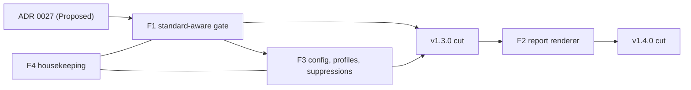

# v1.3.0 + v1.4.0 program plan - the gate-evolution program, then the designed report

> The plan for the next two milestones, run as one program: **v1.3.0 (gate evolution)** makes the deterministic gate legitimate to point at third-party libraries and configurable like a real linter, and **v1.4.0 (the designed report)** ships the report renderer the assessment skills have been waiting for.
> Created 2026-06-06. Owner: maintainer. Source of truth: [ADR 0027 (Standard versioning and compatibility policy)](../../decisions/0027-standard-versioning-and-compatibility-policy.md), [ADR 0028 (retire U10 from the spine)](../../decisions/0028-retire-u10-no-dashes-from-the-spine.md), the linter-vs-judge note (`_local/notes/evaluator-linter-vs-judge-and-consistency.md`), and the [enhancement backlog](../../backlog/enhancements.md) (E1, E2). Live status: [`docs/internal/STATUS.md`](../../STATUS.md).
> Feature packets: [`F1-standard-versioning/SPEC.md`](./F1-standard-versioning/SPEC.md) | [`F3-gate-config/SPEC.md`](./F3-gate-config/SPEC.md) | F4-housekeeping (folded into F1/F3, see sec 6) | [`F2-report-renderer/SPEC.md`](./F2-report-renderer/SPEC.md).

## 1. Goal

The toolkit shipped its self-proving Gold reference (v1.0.0 - v1.2.0): a 29-check spine, a deterministic gate, a docs site, and a Standard it dogfoods. Two real external evaluations (a Pushpay plugin and Anthropic's own `product-management` plugin) and the linter-vs-judge analysis exposed the next problem: the gate is built to grade other people's libraries, but it is not yet **legitimate** to do so. It re-grades a pinned-older plugin against the newest spine (the ADR 0027 gap), it cannot be configured or scoped per consumer (no per-rule severity, no profiles, no suppressions), and it has no designed report to hand a non-engineer or a PR reviewer (only terminal text and `--json`).

This program closes those gaps in two releases, deliberately separated by audience and risk:

- **v1.3.0 evolves the gate toward legitimacy + external graders.** It makes the gate honor the Standard a plugin pins (ADR 0027), and gives it the linter ergonomics a framework for other teams' house rules needs: per-rule severity, named profiles, and suppressions. After v1.3.0 a third party can pin a Standard, opt into a profile, and trust that the gate grades the contract they adopted rather than whatever the spine grew to last week.
- **v1.4.0 ships the designed report (E1).** One renderer over the single report object `scripts/evaluate.mjs` already produces, adding `--format=md|html` beside terminal and `--json`, so a result is consumable by a non-engineer (HTML) and a reviewer/agent (Markdown), not only in a terminal.

The invariant across both: the deterministic gate stays synchronous and model-free (Design Principle 3 / ADR 0023). Everything v1.3.0 adds is plain version arithmetic and config resolution; everything v1.4.0 adds is a thin presentation skin over frozen, gate-derived facts. No model decides a tier, ever.

## 2. The two-release split (read this first)

This is a two-release program. The split is by coherence and by user-facing surface area, and it is pinned.

| Release | Theme | Features | Why grouped |
|---|---|---|---|
| **v1.3.0** | gate evolution | **F1** (standard-versioning / standard-aware gate, implementing ADR 0027) + **F3** (per-rule config, profiles, suppressions) + **F4** (housekeeping) | F1 and F3 are **coupled**: both add version-awareness and configurability to the deterministic gate, both touch the same surfaces (`registry.mjs`, `check.mjs`, the finding/meta shape, `STANDARD.md`), and F3 builds directly on the version-resolution F1 introduces. Shipping them apart would mean two churns of the same code and two contract changes to the same consumers. F4 is small cleanup that rides the same PRs. |
| **v1.4.0** | the designed report | **F2** (the E1 evaluation-report renderer) | F2 is a large, standalone, user-facing feature with its own information architecture, sample templates, and a multi-skill rollout surface. It depends on nothing F1/F3 add (it renders the existing report object), and bundling it into the gate-evolution release would blur a release that is otherwise about contract legitimacy. It earns its own cut. |

**Named deferral:** the **Gemini emitter** (the v1.x cross-agent target named since the v1.1.0 plan) is NOT built in this program. It is scoped here only as a note (sec 10) so the next planning pass picks it up; it is not a deliverable of v1.3.0 or v1.4.0.

## 3. The features (one paragraph each; full contract in each SPEC)

### F1 - standard-versioning + the standard-aware gate (v1.3.0)

Implements ADR 0027. Today `scripts/check.mjs` runs the live `CHECKS` array filtered only by the plugin's declared tier; `library.json.standard` is presence-validated by `U1` and otherwise a display string, so a plugin pinning `standard: "0.9"` is silently re-graded against the 0.11 spine. F1 adds a `since` (Standard version) annotation to each check's `meta`, teaches the gate to compare a plugin's pinned `library.json.standard` against each check's `since`, and downgrades a check introduced **after** the pinned version to `warn` for that run (surfaced, never gate-failing) for a one-minor burndown window before it graduates to `error`. The toolkit continues to pin the current Standard, so its own gate is unchanged at full strength. A new normative "Standard versioning and compatibility" section lands in `STANDARD.md` as **sec 7.7** (appended in the sec 7 lifecycle-and-governance block, beside the sec 7.4 versioning policy it cross-references). Full contract: [`F1-standard-versioning/SPEC.md`](./F1-standard-versioning/SPEC.md).

### F3 - per-rule config, profiles, and suppressions (v1.3.0)

Implements the highest-leverage change from the linter-vs-judge note: turn the fixed, source-only check registry into something a consuming team can configure without editing source. F3 adds an optional `askit.config.json` config layer for per-rule severity override (`error` / `warn` / `off`) and enable/disable, named **profiles** (a starter set: `askit-library` = the full spine, `plain-plugin` = the portable, vendor-grounded subset, and an opt-in `house-style` slot, empty for now, that ADR 0028 named as the eventual home for re-homed preferences), and a **suppressions/baseline** file so a team can accept a known finding durably. It also tags each check's `meta` with **provenance** (`objective` / `vendor-cited` / `house`) so the gate can report a "real issues" count separate from "profile conformance." F3 builds on F1's version resolution: the resolved severity for a finding is a function of `since` (the burndown), the active profile, and any per-rule override or suppression, evaluated in a fixed precedence. The buildable v1.3.0 scope is the [`F3-gate-config/IMPL-PLAN.md`](./F3-gate-config/IMPL-PLAN.md); the [`SPEC.md`](./F3-gate-config/SPEC.md) carries a fuller vision (an `info` severity, a `config-valid` spine check) whose adoption is reconciled in sec 7. Two reconciled decisions are now made: the config file is the visible `askit.config.json`, and a minimal `published-verdict` trust clamp ships in v1.3.0 (sec 7.2).

### F4 - housekeeping (v1.3.0)

The small cleanup the gate-evolution work makes natural to do at the same time: finish ratifying ADR 0027 (move it Proposed -> Accepted in the same release that implements it), retire the last `_local`-only doc drift, fold the deferred-but-bounded items the prior reviews surfaced (the E2 deeper-MCP-secret-scanning recursion is a candidate if it fits; otherwise it stays backlog), and sweep any stale "30-check" or "G1-G7" wording that survived the ADR 0028 29-check sweep. F4 has no SPEC of its own; its items are folded into the F1 and F3 PRs and tracked in the v1.3.0 IMPL-PLAN. See sec 6.

### F2 - the designed evaluation-report renderer (v1.4.0)

Implements backlog item E1. Over the ONE structured report object `scripts/evaluate.mjs` already produces (`{scope, target, findings, byRule, summary, tier, satisfies, blocked}`), F2 adds `--format=md|html` renderers alongside terminal and `--json`, so MD / HTML / JSON never diverge. The HTML is a self-contained page (inline CSS; a small amount of inline JS for the TOC scroll-spy and copy-prompt buttons; no external assets, no binaries). It follows the E1 information architecture (masthead/verdict, executive summary, what-was-evaluated, methodology and scope, tier-compliance evidence ledger, the climb/burndown, improvement path with copy-paste prompts, insights, evidence and sources, report metadata) and the maintainer's hard UX constraints (no tabs or expanders, a left-docked sticky scroll-spy TOC, a print/Save-PDF affordance, on-brand `#5C7CFA` plus the Bronze/Silver/Gold palette). It is ONE shared `report-render` lib parameterized by report type, not per-skill bespoke HTML, so `askit-evaluate`, `askit-migrate`, `askit-capability-advisor`, `askit-release`, and the reviewer/behavioral modes all render through it. Sample templates live at `docs/internal/template/evaluation-report--plugin.html` and siblings. Full contract: [`F2-report-renderer/SPEC.md`](./F2-report-renderer/SPEC.md).

## 4. Sequencing and dependencies

The hard ordering constraints:

- **F1 before F3 (within v1.3.0).** F3's severity resolution composes with F1's `since`/burndown result: the effective severity of a finding is resolved from (the pinned-Standard burndown from F1) then (the active profile) then (per-rule override) then (suppression). F3 cannot define that precedence until F1 has introduced the version-derived severity. F1 also adds the `meta` plumbing (`since`) that F3's provenance tag (`provenance`) sits beside, so doing F1 first avoids touching every check module's `meta` twice.
- **F1 and F3 are coupled, not merely ordered.** They are the same surface (the gate's grading semantics and the finding/meta shape). They ship as adjacent PRs in one release so the public conformance contract changes once, not twice. The version-bump PR that cuts v1.3.0 records both ADR 0027's policy text and the config/profile mechanism in `STANDARD.md` together.
- **F4 rides F1/F3.** No independent sequencing; its items are absorbed into the F1 and F3 PRs (the ADR 0027 ratification belongs with F1; the wording sweep belongs with whichever PR touches the affected docs).
- **F2 is standalone and follows the v1.3.0 cut.** F2 renders the existing report object and depends on nothing F1/F3 add. It could technically be built in parallel, but it is sequenced **after** v1.3.0 ships so the renderer targets the post-F1/F3 report object (which by then can carry profile, provenance, and resolved-severity fields F2's methodology/scope and evidence-ledger sections will want to surface). Building F2 first would mean re-touching the renderer to add those fields.

Each feature is one or more PRs against branch-protected `main`, each individually gate-green, each with an adversarial gate before merge (sec 8). The detailed phase breakdown for each release lives in that release's IMPL-PLAN; this program plan fixes the order and the dependencies.

## 5. How this builds on the decisions and the linter-vs-judge note

This program is the execution of reasoning already recorded; it invents no new direction.

- **ADR 0027 (Standard versioning and compatibility policy)** is F1's contract verbatim: the `since` annotation, the warn-for-one-minor burndown, the standard-aware gate that reads `library.json.standard`, and the new `STANDARD.md` section. ADR 0027 is Proposed and explicitly deferred "as a fast-follow before any third party is invited to grade against the Standard." v1.3.0 is that fast-follow; F4 ratifies the ADR in the same release that implements it.
- **ADR 0028 (retire U10 from the spine)** set the precedent F3 generalizes. ADR 0028 retired the no-dashes house rule from the universal gate and kept it as an opt-in `PreToolUse` hook, with option 4 ("move it into an opt-in house-style profile") explicitly deferred "until the gate has per-rule config or a profile mechanism." F3 is that mechanism: the `house-style` profile is where the no-dashes preference (and any future house rule) lives as a deliberate opt-in, default off for third-party grading. ADR 0028 also validated the always-safe direction of the burndown (relaxation needs no warn window), which F1 must encode.
- **The linter-vs-judge note** is the design rationale for the whole program. Its one idea ("decide deterministically, present as a linter, and only put on the judge's robe where you have earned the authority") maps directly: F3 adds the linter ergonomics the note says the toolkit lacks (per-rule severity, profiles, suppressions, provenance tags); F1 keeps the spine honest about which contract it grades; F2 renders the deterministic facts as a thin skin and stamps provenance/limitations, never letting the model decide the grade. The note's punch-list items 1-3 and 6 are F3; item 5 (stamp the report, per-finding confidence) is F2.

## 6. F4 housekeeping (the folded items)

F4 is intentionally small and has no SPEC; each item is a sub-task of an F1 or F3 PR, listed here so none is dropped:

- **Ratify ADR 0027.** Move ADR 0027 from Proposed to Accepted in the F1 implementation PR (the standard practice: the implementing PR ratifies the ADR it implements, the way ADR 0028 was Accepted when v1.2.0 shipped it).
- **Wording sweep.** Confirm no stale "30-check / G1-G7" or pre-0.11 spine claim survives in tracked human docs (README, AGENTS.md, STATUS, the docs site, badges). ADR 0028 swept to 29 (`U1-U9` + `U11-U12` + `S1-S8` + `G1-G10`); F4 re-greps after F1/F3 touch the same files, since adding `since` and config docs is a natural place for a stale count to slip back in.
- **`_local` drift.** Fold the durable conclusions of the linter-vs-judge note into the tracked Standard/docs where they are now decisions (the profile vocabulary, the provenance taxonomy), so the gitignored note stops being load-bearing.
- **E2 (deeper MCP secret scanning), conditional.** The recursive MCP-secret scan (args/headers/nested objects, JWT/base64-ish shapes) is a candidate to ride F3 if it fits the release without risking the over-eager false positives the backlog warns about; otherwise it stays in the backlog. It is NOT a committed v1.3.0 deliverable, only a fold-if-it-fits.
- **Untracked report-template variants.** `docs/internal/template/` carries four untracked design explorations (`evaluation-report--plugin--dark.html`, `--dashboard.html` (v1), `--editorial.html`, and `--editorial.md`) beside the committed set (`--dashboard-v2.html`, `--plugin.html`, `--skill.html`, `--migration.html`). F2's IMPL targets `--dashboard-v2.html` + `--editorial.md` as the canonical IA, so `--editorial.md` should be committed (or its IA folded into F2's reference doc) and the superseded explorations (`--dark.html`, `--dashboard.html` v1, `--editorial.html`) decided on (kept as visual references or removed). This is sequenced with **F2 (v1.4.0)**, not v1.3.0, since the renderer becomes the source of truth that retires the hand-authored samples; listed here so the loose files are not forgotten.

If any F4 item grows beyond a fold (for example E2 needs its own golden/anti fixtures and tuning), it splits out into its own PR under the v1.3.0 IMPL-PLAN rather than bloating an F1/F3 PR.

## 7. SPEC vs IMPL reconciliation (canonical v1.3.0 scope; the two F3 maintainer calls are settled)

The SPEC and IMPL-PLAN for F1 and F3 were drafted in parallel and diverge in a handful of places. That is deliberate: the **SPEC captures the fuller design vision** (every mechanism the feature could carry), while the **IMPL-PLAN captures the canonical, buildable v1.3.0 scope** (what actually ships, sequenced and file-by-file). Where the two disagree, **the IMPL-PLAN governs what v1.3.0 builds** and the richer SPEC items are recorded as future vision, unless this section pulls one in. The two divergences that were genuinely the maintainer's call (the F3 config filename and the published-verdict clamp) are now **decided (2026-06-06)** and recorded in 7.2; every other divergence carries the resolution the SPECs are aligned to.

### 7.1 F1 (standard-aware gate)

| Topic | SPEC | IMPL-PLAN | Canonical for v1.3.0 | Why |
|---|---|---|---|---|
| **U8 `since`** | `0.10` (per-check "most recent tightening", sec 3.1) | `0.x` baseline (grandfather the v0.10 VERSION promotion) | **IMPL (`0.x`)** | The U8 warn-to-error tightening shipped in v1.1.0 before the policy existed, and no published Standard below 0.10 was ever externally pinned, so grandfathering it as baseline avoids the SPEC's awkward side effect (a 0.9-pinned plugin would otherwise see ALL U8 errors downgraded, not just the VERSION rule). Per-check exact `since` stays a safe future tightening. |
| **Burndown encoding** | an optional `enforcedSince` meta field plus a global-burndown branch in the transform | the per-check `warn`-to-`error` self-flip (no new field); the downgrade path handles older pins | **IMPL (per-check flip)** | F1 introduces no live burndown this release (0.11 was a relaxation), so `enforcedSince` would be unexercised machinery. The per-check flip is simpler and the STANDARD.md sec 7.7 text commits the maintainer to it. `enforcedSince` is a clean add if simultaneous tightenings ever need it. |
| **Helper module + names** | one `standard-aware.mjs`; `applyStandardAwareness(findings, metaByReq, pinned, current)` | `standard-version.mjs` (arithmetic) + `standard-gate.mjs` (`SINCE_BY_REQ` + `applyStandardDowngrade(findings, pinned)`) | **IMPL (two-module split)** | The split keeps pure arithmetic separate from registry coupling and avoids the `check.mjs` <-> `tier-report.mjs` import cycle the IMPL reasons through. `applyStandardDowngrade` names the actual effect. |

Net: **F1 builds to the IMPL-PLAN.** The SPEC's `enforcedSince` and a per-check `since` for U8 are recorded as future refinements, not v1.3.0 scope. STANDARD.md gains **sec 7.7** (the SPEC's "7.6" collided with the existing 7.6 "Contribution"; corrected).

### 7.2 F3 (gate config)

| Topic | SPEC | IMPL-PLAN | Canonical for v1.3.0 | Why |
|---|---|---|---|---|
| **Config filename** | `.askit.json` (dotfile) | `askit.config.json` (visible) | **Decided 2026-06-06: `askit.config.json`** (visible) | A hard-to-change published surface. The dotfile matches `.eslintrc`/`.prettierrc` and the linter-vs-judge note's wording; the visible name is more discoverable and pairs with a future `askit.config.*`. The maintainer chose the visible name; both F3 docs are aligned to it. |
| **`config-valid` as a spine check (U13)** | new `U13` check, spine 29 -> 30 | non-spine validator (`check:"config", reqId:null`), spine stays **29** | **IMPL (no new spine check)** | A consumer's local grading config is not part of the plugin conformance contract, so "your config is well-formed" should not be a Universal-tier requirement every graded plugin must satisfy (and it is vacuous for the common no-config plugin). Keeping it off the spine also avoids a Standard 0.12 bump plus a burndown in the same release that introduces the burndown machinery. A malformed config still gates via the `null`-reqId-to-universal mapping. |
| **`info` severity** | adds `INFO` to `SEVERITY` (4 levels) | `error\|warn\|off` (3 levels) | **IMPL (3 levels)**, `info` deferred | `info` matters mainly for surfacing house preferences without a warning, but `house-style` ships empty in v1.3.0 (no house check exists post-ADR-0028), so the level is unexercised. Touching the core `finding()` contract for an unused level is premature; fast-follow when `house-style` gets content. |
| **Suppression model** | content-addressed fingerprint + `expires`/stale/expired tracking | `{reqId, file glob, message substring, reason}` matcher | **IMPL (matcher)**, fingerprint future | The matcher is hand-authorable with no helper; the fingerprint + staleness model is the richer design once an `askit suppress` helper exists to compute fingerprints. Both keep `reason` required. |
| **Published-verdict clamp** | `mode: local\|published-verdict`; clamp objective/vendor-cited findings to at least `warn` so a subject cannot disable a real check to dodge a PUBLISHED verdict (RQ-F3-TRUST-1) | now folded in (F3 IMPL-PLAN sec 5) | **Decided 2026-06-06: the minimal clamp ships in v1.3.0** | This closes the exact "a profile becomes a backdoor to weaken the spine" gameability risk in sec 9. It only affects PUBLISHED third-party verdicts (default `local` mode is unaffected). The minimal version (no trust file, no `info` level: an `objective`/`vendor-cited` finding turned `off`/suppressed surfaces at `warn` with a notice, `house` never clamped, warn-only so it can never gate-fail) is folded into the F3 IMPL-PLAN sec 5. |
| **Profile names** | `askit-library`, `claude-code-plugin`, `house-style` | `askit-library`, `plain-plugin` | **align: `askit-library` + `plain-plugin` + empty `house-style`** | `plain-plugin` is agent-neutral (the toolkit is cross-agent), better than `claude-code-plugin`. Ship the `house-style` profile slot empty per ADR 0028 (its eventual home for opt-in preferences), with no check in it yet. |
| **Resolver module/signature** | `resolve.mjs`; options-bag `resolveFindings(raw, {config, profile, suppressions, since, mode, now})` | `resolve-config.mjs`; positional `resolveFindings(findings, config, provenanceByReq)` | **IMPL module name**; adopt an options-bag only if `mode`/`since` land | Minor. The options-bag is more extensible if the published-verdict `mode` is pulled in. |

Net: **F3 builds to the IMPL-PLAN.** Both open decisions are now made (2026-06-06): the config file is the visible **`askit.config.json`**, and the **minimal published-verdict clamp ships in v1.3.0** (folded into F3 IMPL-PLAN sec 5). The profile-name alignment stands (`askit-library` + `plain-plugin` + an empty `house-style` slot).

### 7.3 What this means for the Standard version

Under the canonical (IMPL) scope, **v1.3.0 adds no new spine check and no tier requirement** (no U13; provenance, config, and profiles are additive plumbing, not graded requirements), so the **Standard stays at 0.11** and there is **no burndown** to run this release. (For the record, the SPEC's alternative U13 - a new Universal check - would instead make v1.3.0 a Standard **0.12** minor and would itself have to ship as a `warn` for one minor per the very burndown F1 introduces, a neat dogfood but a larger release; the canonical scope does not take it.) v1.3.0 is therefore a tooling release at Standard 0.11.

## 8. Release mechanics

The proven flow, applied once per release (v1.3.0, then v1.4.0):

1. **One PR per feature** against branch-protected `main`. F1 and F3 are adjacent PRs in the v1.3.0 line; F2 is its own PR line for v1.4.0. Each PR is gate-green (`node scripts/check.mjs .` -> Advanced 0/0; note the root is **positional**, not `--tier`) and CI-green before merge.
2. **A 4-lens adversarial Workflow gates each significant merge.** Codex `/codex:review` is unreliable on this Windows setup, so the adversarial review is the read-only 4-lens Workflow over the PR diff (the same discipline that found 5 soundness bugs in the Gold checks and caught the incomplete v1.2.0 doc sweep). Confirmed findings are fixed before merge; the review is recorded in the packet.
3. **Admin squash merge**, then confirm `main` green.
4. **A version-bump PR** once the feature PRs for a release are in: bump `library.json` (`version`, and `standard` if F1's section advances the Standard minor) and `package.json`, regenerate the native manifests + `manifest.generated.json` + `INDEX.md`, and update `CHANGELOG`, `RELEASE-NOTES`, and `STATUS`. The U8 manifest-drift and U9 version-match checks (and the F1 version-consistency logic) must be green on this PR.
5. **Tag `vX.Y.Z`** -> `release.yml` mints the GitHub release behind the version-consistency guard.
6. **Re-pin the `product-on-purpose/agent-plugins` marketplace** entry to the new tag (new sha, registry `metadata` minor bump), then smoke-verify the install. Use git worktrees for the agent-plugins re-pin to avoid the shared-worktree branch-switch hazard.

Standard versioning under F1: once F1 lands, the gate honors ADR 0027. A v1.3.0 that adds the F3 profile mechanism is additive but does not by itself tighten a tier requirement, so whether `STANDARD.md` advances a minor (to document the new sections) versus stays put is an F1/F3 SPEC decision; the toolkit pins the current Standard either way and grades at full strength.

## 9. Risks and mitigations

| Risk | Mitigation |
|---|---|
| **The gate stops being deterministic** once config and profiles enter (a real fear: configurable severity could leak into a model-decided grade). | The invariant from the linter-vs-judge note and Design Principle 3: F1 is pure version arithmetic, F3 is pure config resolution with a fixed precedence, both synchronous and model-free. No F1/F3 code path consults a model. Unit tests assert that the same tree + same config produces the same findings and tier across runs. |
| **Severity-resolution precedence is ambiguous** (burndown vs profile vs override vs suppression could conflict). | F3's SPEC defines a single fixed precedence order and the F1 burndown result is the first input to it; a dedicated unit-test matrix covers every combination (a check suppressed in a profile but overridden to error, a post-pinned-version check the profile disables, etc.). The resolution is one pure function with golden cases. |
| **A profile becomes a backdoor to silently weaken the spine** for a plugin that still claims Gold. | A profile changes which rules apply and at what severity, but the **declared tier** and the **gate exit** are still computed from the resolved findings; a plugin that disables a Gold check under a profile no longer earns Gold (the tier-report reflects it). The report (F2) stamps the active profile so a reader sees the rubric that was run. |
| **F1 and F3 churn the `meta` shape twice** if sequenced wrong. | F1 lands first and adds `since` to every check's `meta`; F3 adds `provenance` in the same neighborhood. Doing F1 before F3 means each `meta` block is edited once for both fields where practical, and the `registry-sync` test guards the shape. |
| **The standard-aware gate strands the toolkit's own green gate** (the toolkit pins the current Standard; a bug could re-grade it wrong). | The toolkit pins the current Standard, so under correct F1 behavior its own gate is unchanged (every check's `since` is at-or-below the pinned version). A unit test asserts the toolkit's own run is identical before and after F1, and the adversarial gate independently reproduces it. |
| **F2 lets the model invent findings or change the grade.** | F2 renders the frozen report object only; the renderer is told to invent nothing, the HTML/MD are derived from `findings`/`byRule`/`summary`/`tier`, and a fidelity check (the v1.2.0 discipline) confirms the rendered counts and statuses match the gate output. The grade is gate-derived, the prose is the only variable surface, and it is stamped as such. |
| **Scope creep into the judge route** (calibration loops, panels, learned preferences from the note's sec 2). | Those are explicitly OUT of this program. v1.3.0 ships the linter ergonomics (config/profiles/suppressions/provenance); the judge-mode calibration and eval-the-grader work stay backlog. F2 is a renderer, not a judgment engine. |
| **Standard text and code disagree** after F1 adds the versioning section and F3 adds profile docs. | The version-bump PR regenerates INDEX/manifest and the F4 wording sweep re-greps; the U8/U9/U1 checks plus the adversarial gate catch a `STANDARD.md`-vs-`library.json` drift before tag. |
| **Marketplace re-pin on the wrong sha / shared-worktree branch switch by a parallel session.** | Re-pin via a dedicated git worktree for `agent-plugins`; the version-consistency guard in `release.yml` refuses a tag whose version-bearing files disagree, so a wrong-sha release fails closed. |

## 10. Gemini emitter (named deferral, not built here)

The Gemini emitter has been the named v1.x cross-agent target since the v1.1.0 plan. It is NOT in scope for v1.3.0 or v1.4.0. Recorded here so the next planning pass owns it: it would add a Gemini target to the emitter family (the same generation-over-duplication pattern as the existing Claude Code / Codex emission), and it is a feature on the **emission** axis, orthogonal to this program's **grading** axis (F1/F3) and **reporting** axis (F2). It does not depend on and is not blocked by anything in this program. Pick it up after v1.4.0 or fold it into a later cross-agent release.

## 11. Definition of Done

### v1.3.0 (F1 + F3 + F4)

- [ ] **F1:** every check's `meta` carries a `since` (Standard version); `scripts/check.mjs` reads `library.json.standard` and downgrades a check introduced after the pinned version to `warn` (surfaced, never gate-failing) within the one-minor burndown window; the toolkit's own gate is unchanged (Advanced 0/0, full strength, because it pins the current Standard).
- [ ] **F1:** `STANDARD.md` carries the normative "Standard versioning and compatibility" section (the burndown rule + the pinned-version grading contract); a unit test covers a pinned-older fixture being graded against its pinned contract (post-pinned-version check surfaces as `warn`, not `error`).
- [ ] **F3:** an optional `askit.config.json` is honored for per-rule severity (`error`/`warn`/`off`) and enable/disable; a starter profile set ships (`askit-library`, `plain-plugin`, and an empty `house-style` slot); a suppressions/baseline file durably waives a known finding; each check's `meta` carries a `provenance` tag (`objective`/`vendor-cited`/`house`); the gate reports a "real issues" count separate from "profile conformance"; and a minimal `published-verdict` mode clamps `objective`/`vendor-cited` findings a subject tried to disable up to `warn` (warn-only, never gate-failing). Both reconciled decisions are settled (sec 7.2): visible `askit.config.json`, clamp in v1.3.0.
- [ ] **F3:** severity resolution is one pure, model-free function with a fixed precedence (F1 burndown -> profile -> per-rule override -> suppression), covered by a unit-test matrix; absent any config, the gate behaves exactly as v1.2.0 (no regression for an unconfigured plugin).
- [ ] **F4:** ADR 0027 is Accepted (ratified in the F1 PR); no stale check-count/spine wording survives the F4 grep; the linter-vs-judge note's now-decided conclusions are folded into tracked docs.
- [ ] `node scripts/check.mjs .` -> Advanced 0/0 with the 29-check spine; `npm test` green (F1 and F3 each ship golden + anti fixtures + tests; `registry-sync` passes the new `meta` shape).
- [ ] Each feature PR passed a recorded 4-lens adversarial gate; `main` green at every merge.
- [ ] `v1.3.0` tagged + released behind the version-consistency guard; the marketplace entry re-pinned and the install smoke-verified.

### v1.4.0 (F2)

- [ ] One shared `report-render` lib renders the `scripts/evaluate.mjs` report object to `--format=md` and `--format=html` beside terminal and `--json`; MD/HTML/JSON do not diverge (same findings, counts, tier).
- [ ] The HTML is self-contained (inline CSS, only the allowed inline JS for TOC scroll-spy + copy-prompt buttons, no external assets, no binaries) and follows the E1 information architecture and the hard UX constraints (no tabs/expanders, left-docked sticky scroll-spy TOC, print/Save-PDF affordance, on-brand `#5C7CFA` + Bronze/Silver/Gold palette).
- [ ] The renderer is parameterized by report type, not per-skill bespoke HTML; `askit-evaluate` renders through it, and the SPEC documents the rollout path to `askit-migrate`, `askit-capability-advisor`, `askit-release`, and the reviewer/behavioral modes.
- [ ] The report stamps provenance and limitations: the conformance section is marked deterministic/reproducible/model-independent; any judgment prose is marked as a judgment layer with model + date; per-finding confidence is tied to its source (gate-exact vs file-verified vs vendor-cited vs house); vacuous passes (such as `G1`/`G6`) are noted.
- [ ] A fidelity check confirms the rendered counts/statuses/tier match the gate output (the model invented nothing); the renderer adds no new runtime dependency and no binary asset.
- [ ] `node scripts/check.mjs .` -> Advanced 0/0; `npm test` green (the renderer has tests over a fixture report object for both formats); the F2 PR passed a recorded 4-lens adversarial gate.
- [ ] `v1.4.0` tagged + released; the marketplace entry re-pinned and the install smoke-verified.

See [`F1-standard-versioning/SPEC.md`](./F1-standard-versioning/SPEC.md), [`F3-gate-config/SPEC.md`](./F3-gate-config/SPEC.md), and [`F2-report-renderer/SPEC.md`](./F2-report-renderer/SPEC.md) for the requirement-level acceptance criteria, and each release's IMPL-PLAN for the phase-by-phase execution order.
