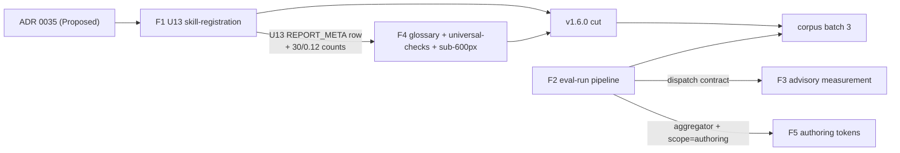

# v1.6.0 program plan - manifest completeness, made actionable (with the eval-loop maturing behind it)

> The plan for the next milestone. **v1.6.0** ships the first growth of the quality Standard since the v1.2.0 relaxation - an objective new check that catches a plugin silently shipping skills it never registered - and makes that grade *actionable* with a per-check glossary and the missing Bronze reference page. Three supporting efforts mature the improve loop and fill the last measurement gap; they land continuously, not as release gates.
> Created 2026-06-13. Owner: maintainer. Source of truth: [ADR 0035 (manifest-vs-disk skill-registration completeness)](../../decisions/0035-manifest-vs-disk-skill-registration-completeness.md), the eval-run record + METHODOLOGY (`docs/internal/eval-runs/`), the STATUS prioritized roadmap, and backlog E11/E12. Live status: [`docs/internal/STATUS.md`](../../STATUS.md). Baseline: `main` at **v1.5.2**, Gold, 29-check spine, Standard 0.11.
> Feature packets: [`F1-manifest-completeness/SPEC.md`](./F1-manifest-completeness/SPEC.md) | [`F4-report-ux/SPEC.md`](./F4-report-ux/SPEC.md) | [`F2-eval-run-pipeline/SPEC.md`](./F2-eval-run-pipeline/SPEC.md) | [`F3-advisory-quality/SPEC.md`](./F3-advisory-quality/SPEC.md) | [`F5-authoring-token-measurements/SPEC.md`](./F5-authoring-token-measurements/SPEC.md).

## What this delivers (plain language first)

**For anyone (non-engineer):** the toolkit builds, manages, and improves plugins for AI coding agents, with a published quality Standard as its trust anchor. This release does two visible things and three behind-the-scenes things. Visible: (1) it teaches the Standard to catch a real, common mistake - publishing a plugin whose catalog lists fewer skills than it actually ships, so some are invisible to anyone installing it (a real library we graded ships 49 and lists 47); and (2) it makes a grade easy to act on by explaining every check in plain language inside the report and adding the missing reference page for the foundational checks. Behind the scenes: it makes the way the toolkit grades other people's plugins repeatable, measures how good the optional AI-review opinion actually is, and fills in the last missing cost estimate (what it costs to author a component). The visible pair is v1.6.0; the behind-the-scenes work lands as it completes.

**For an engineer:** v1.6.0 = **F1** (the `U13` `skill-registration` Universal check, spine 29 -> 30, Standard 0.11 -> 0.12, shipping as a `warn` under the burndown) **+ F4** (the per-check report glossary, the new `docs/reference/universal-checks.md` page, and the sub-600px responsive pass). **F2** (the E11 eval-run pipeline), **F3** (advisory precision/recall measurement), and **F5** (authoring token measurements) are supporting IMPROVE/CREATE work that lands continuously and is documented here for rigor, not bundled into the v1.6.0 cut.

## 1. Goal (framed by the three pillars)

The toolkit is a Create / Manage / Improve system for cross-agent plugins, not "a grader" (of 23 skills, 13 Create, 8 Manage, 1 grade). This program is mostly **Improve-pillar** maturation, with one Create-facing piece, and it is careful not to measure progress by "did the grading surface grow" alone:

- **F1 (Improve, the backbone)** grows the deterministic Standard by one objective, portable check. This is the first Standard-version growth since `U10` was retired in v1.2.0, and it is the first live exercise of the warn-for-one-minor burndown that v1.3.0 built but never ran.
- **F4 (Improve, Create-facing)** makes a grade *actionable* for an author improving a plugin - the glossary and the Bronze reference page turn "U6 failed" into "here is what U6 is and how to fix it." This is the Improve loop serving the Create pillar's user.
- **F2 (Improve)** makes the eval-run loop reproducible (a command, not a hand procedure), so the toolkit's outward grading is dependable and cheap to repeat.
- **F3 (Improve)** makes the optional advisory layer measurable (precision/recall per model x effort), so the dossier's model guidance rests on numbers, not one anecdote.
- **F5 (Create-informing)** fills the token dossier's last unmeasured range (authoring cost), so a builder can budget a `askit-build-*` run.

The invariant across all five: the deterministic gate stays synchronous and model-free (Design Principle 3 / ADR 0023). F1 is a pure set comparison; F4 is presentation over frozen facts; F2's runner and F3's scorer are model-free (only the advisory dispatch they orchestrate involves a model, and it can never move the verdict).

## 2. The cut (read this first)

This is a **one-release cut with named continuous supporting work**, mirroring how `plan_v1.3.0` documented a multi-effort program in one folder.

| Release | Theme | Features | Why grouped |
|---|---|---|---|
| **v1.6.0** | manifest completeness, made actionable | **F1** (`U13` manifest-vs-disk completeness, the Standard 0.12 growth) + **F4** (per-check glossary + `universal-checks.md` + sub-600px) | F1 adds a graded requirement; F4 explains and documents it. Shipping a new check with no reference page and no in-report explanation is exactly the actionability/rubric gap F4 closes, so they are a coherent user-facing pair. They are documentation-coupled (F1 must add the `U13` `REPORT_META` row that F4's glossary renders; F4's `universal-checks.md` documents `U13`) but not code-coupled. |
| **continuous (post-v1.6.0)** | the improve loop matures | **F2** (E11 pipeline), **F3** (advisory measurement), **F5** (authoring tokens) | Internal IMPROVE/CREATE infrastructure with no user-visible gate or report change. They do not need to gate a release; F2 should land right before corpus batch 3 (so it is exercised), F3 follows F2's dispatch contract, F5 fills a doc range. Some may bundle into a later v1.6.x or v1.7.0 if a release is convenient, but none blocks v1.6.0. |

**Why not all five in v1.6.0:** F2/F3/F5 are infrastructure and measurement; coupling them to the user-facing F1/F4 would delay the headline and bloat the release with internal work that has no contract or report change. **Why a single release, not a v1.6.0 + v1.7.0 program:** unlike plan_v1.3.0 (where F2 was a large standalone user-facing feature that earned its own cut), F2/F3/F5 here are not user-facing milestones - naming them "v1.7.0" would imply a planned release boundary they do not warrant; "continuous supporting work" is the honest framing.

**Named deferrals (not built here):** the **marketplace SCOPE** for the gate (the biggest latent extension of the whole-library positioning - currently P3), the **Gemini emitter** (the named v1.x cross-agent reach target), the **E4-E10** borrowed security/SARIF/semver checks, the **Finding-5 murkier residual**, and **corpus batch 3** itself. Sec 7.

## 3. The features (one paragraph each; full contract in each SPEC)

### F1 - manifest-vs-disk skill-registration completeness, `U13` (v1.6.0, Improve-backbone)

Implements ADR 0035. A plugin can ship a skill directory on disk it never registered in its catalog, so the skill is delivered but invisible to installers (deanpeters: 49 on disk, 47 registered). F1 adds the Universal check `U13` `skill-registration`: it resolves the plugin's authoritative skill-registration list (`library.json.components.skills[]`, else `.claude-plugin/marketplace.json` `plugins[].source`, else none) and compares it against the on-disk skill set; on-disk-but-unregistered is the headline finding, registered-but-missing is the reverse. It is objective and portable (so it survives `--profile plain-plugin`), distinct from `U8` `manifest-drift` (generated-manifest-vs-`library.json`). Spine 29 -> 30, Standard 0.11 -> 0.12; per STANDARD.md sec 7.7 it ships as a `warn` for 0.12 (the burndown's first live customer) and graduates to `error` at 0.13. The toolkit registers all 23 of its skills, so its own gate is unchanged. Full contract: [`F1-manifest-completeness/SPEC.md`](./F1-manifest-completeness/SPEC.md).

### F4 - actionable report UX: glossary + universal-checks page + sub-600px (v1.6.0, Improve/Create-facing)

Implements backlog E12 and the rubric documentation gap. Three independent, zero-model, verdict-neutral pieces: a consolidated **per-check glossary** rendered once per report (every check with its one-line `why` from the existing `REPORT_META` table, so a reader understands the PASS/N/A rows too, not just findings); a new **`docs/reference/universal-checks.md`** page documenting `U1-U13` in the same format as the existing `silver-checks.md`/`gold-checks.md` (the Bronze reference page that was missing); and a **`@media (max-width:600px)`** block finishing the mobile work the `<=900px` table-scroll fix began. Full contract: [`F4-report-ux/SPEC.md`](./F4-report-ux/SPEC.md).

### F2 - the dependable eval-run pipeline, E11 (continuous, Improve)

Implements backlog E11. A pinned-sha corpus manifest, a deterministic runner (verify the pin, run the free gate, render conformance, emit a record skeleton, refuse a drifted/empty tree, forward-slash-normalize paths), the advisory dispatch contract (reviewer/grader templates with effort wording, the collection-scale sampling protocol, the plain-ASCII rule, the never-moves-the-verdict invariant), and record/aggregate automation into `eval-runs.md` and the dossier. Built right before corpus batch 3 so it is exercised. Full contract: [`F2-eval-run-pipeline/SPEC.md`](./F2-eval-run-pipeline/SPEC.md).

### F3 - advisory quality measurement (continuous, Improve)

Makes the model-assisted advisory layer measurable: a seeded-defect fixture with a scoring key (precision/recall per model x effort) and a replication of the R9/R10/R11 model triple on a structurally-defective target, to test the single-target "Sonnet/high matched Opus/high" parity claim (reading 16) where triage depth matters. Findings feed the dossier and METHODOLOGY; no check or verdict changes. Full contract: [`F3-advisory-quality/SPEC.md`](./F3-advisory-quality/SPEC.md).

### F5 - authoring token measurements (continuous, Create-informing)

Fills the dossier's last unmeasured range: measures a representative set of `askit-build-*` authorings across model x effort cells, records them with `scope: authoring`, and moves `token-usage-estimates.md`'s authoring rows from "not yet measured" to MEASURED. Deterministic rows stay at 0. Full contract: [`F5-authoring-token-measurements/SPEC.md`](./F5-authoring-token-measurements/SPEC.md).

## 4. Sequencing and dependencies

The ordering constraints:

- **F1 before F4 (within v1.6.0).** F4's glossary renders the `U13` row and its `universal-checks.md` page and count edits (30 / 0.12) assume `U13` exists. F1 also must add the `U13` `REPORT_META` entry to keep its own CI green (the renderer-coverage test), which F4 then renders. If developed in parallel, F4 rebases on F1 before its count edits.
- **F1 and F4 are documentation-coupled, not code-coupled.** F1 adds the check and the `REPORT_META` row; F4 adds the page and the glossary section. They ship as adjacent PRs so the public surface (a new check) and its documentation (the reference page + the in-report explanation) land together. The release should not cut F1 without F4's `U13` documentation.
- **F2 before corpus batch 3 and before F3/F5's automation.** F2 is the dependency: F3 uses F2's dispatch contract, F5 reuses F2's aggregator and the `scope: authoring` record path. F2 should land right before batch 3 so it is exercised immediately. F3 and F5 can each proceed once F2's relevant piece exists (or hand-add records following the schema if F2 slips).
- **The supporting efforts do not gate v1.6.0.** v1.6.0 cuts on F1 + F4; F2/F3/F5 land on their own cadence.

Each feature is one or more PRs against branch-protected `main`, each individually gate-green, each with a recorded 4-lens adversarial review before merge (sec 5).

## 5. Release mechanics

The proven flow, applied to the v1.6.0 cut:

1. **One PR per feature** against branch-protected `main`. F1 and F4 are adjacent PRs in the v1.6.0 line (F1 first). Each PR is gate-green (`node scripts/check.mjs .` -> Advanced 0/0; root is **positional**, never `--tier`) and CI-green before merge.
2. **A 4-lens adversarial review gates each significant merge.** Codex `/codex:review` is unreliable on this Windows setup (MEMORY); the MCP fallback works (codex-cli 0.137.0). Use it for F1's check logic and the F4 glossary/render path; confirmed findings fixed before merge; the review recorded in the packet.
3. **Admin squash-merge**, then confirm `main` green.
4. **A version-bump PR** once F1 + F4 are in: bump `library.json` (`version` 1.5.2 -> **1.6.0**, `standard` 0.11 -> **0.12**) and `package.json`; regenerate the native manifests + `manifest.generated.json` + `INDEX.md`; `git checkout --` the CRLF-only churn on `.claude-plugin`/`.codex-plugin`/`INDEX`/`manifest.generated`; update `CHANGELOG` `[Unreleased]` -> `[1.6.0]`, `RELEASE-NOTES` `## 1.6.0`, `STATUS`, and `RELEASE-HISTORY`. The `U8`/`U9` checks and the F1 version-consistency logic must be green on this PR; gate Advanced 0/0 on the **30-check** spine.
5. **Tag `v1.6.0`** -> `release.yml` mints the GitHub release behind the version-consistency guard.
6. **Re-pin the `product-on-purpose/agent-plugins` marketplace** entry to the new tag (new sha + entry version 1.6.0, registry `metadata.version` 1.22.0 -> **1.23.0**, keep the registry CHANGELOG complete), validate-registry, then smoke-verify the install. Use a dedicated git worktree clone (`E:/tmp/agent-plugins-repin-*`) to avoid the shared-worktree branch-switch hazard.
7. **STATUS + RELEASE-HISTORY finalize** PR.

Standard versioning under F1: v1.6.0 **does** bump the Standard (0.11 -> 0.12) because F1 adds a tier requirement. The bump is owned by the version-bump PR; F1's feature PR carries the `STANDARD.md` requirement text and spine-line edit. The burndown means the bump gates nobody (the new check is a `warn` in 0.12).

## 6. SPEC vs IMPL reconciliation and the cross-dependencies

The SPECs carry the fuller design vision; the IMPL-PLANs carry the canonical buildable scope. Where they diverge, **the IMPL-PLAN governs what v1.6.0 builds**. The divergences and cross-cutting decisions:

| Topic | SPEC | IMPL-PLAN | Canonical for v1.6.0 | Why |
|---|---|---|---|---|
| **F1 phantom registration (R-REG-3)** | bidirectional (on-disk-but-unregistered AND registered-but-missing), with a permitted marketplace-phantom deferral | bidirectional for both shapes (both reduce to a name set, so it is free) | **bidirectional (IMPL)** | The reverse check is free once both sources are name sets; no deferral needed. |
| **F1 empty `components.skills: []` on a library.json plugin** | not specified | **flag the on-disk skills as unregistered** (rung 1 = "a `library.json` with a `components` object present is an enumerating manifest," even if `skills` is empty) | **flag it (IMPL), pending ratification** | Closes the only obvious evasion (empty the array, keep skills on disk). Surfaced by F1's adversarial lens 1; the PR flags it for the maintainer to ratify. |
| **F1 `U13` `REPORT_META` row** | implied (F4 renders it) | **required in the F1 PR** (the renderer-coverage test gates F1's own CI) | **F1 owns the row, F4 owns the glossary/page** | F1 cannot merge green without it; documented in F1 IMPL Step 4. |
| **F4 glossary source** | "static from each check's docblock `why:`" (STATUS phrasing) | **from `REPORT_META.why`** (the polished report prose, kept complete by the coverage test) | **`REPORT_META` (IMPL)** | The docblock `why` is terse/internal; `REPORT_META.why` is the reader-facing prose the report already uses; one source for report prose. |
| **The v1.6.0 cut** | each effort has a SPEC + IMPL for rigor | **only F1 + F4 ship in v1.6.0**; F2/F3/F5 are continuous | **F1 + F4 (sec 2)** | F2/F3/F5 are internal infra/measurement with no contract or report change; they do not gate the release. |

## 7. Risks and mitigations

| Risk | Mitigation |
|---|---|
| **The Standard bump (0.11 -> 0.12) breaks a downstream consumer.** | Doubly cushioned: the burndown ships `U13` as a `warn` in 0.12 (gates nobody), and after the 0.13 graduation `applyStandardDowngrade` surfaces it as a `warn` for any plugin pinning 0.12 or below. The only plugin whose grade can ever change is one shipping invisible skills (the intended catch). No third party is known to grade against the Standard yet, so the timing is the lowest-risk moment (ADR 0035). |
| **`U13` false-fires on a plugin shape it does not understand** (the auto-discovery `plugin.json`). | The precedence resolver returns `null` (no finding) when no manifest enumerates skills; a golden fixture proves the auto-discovery shape is silent. Because `U13` is a `warn` in 0.12, even an undetected false positive gates nobody this release - the blast radius is a spurious warning. |
| **A plugin evades `U13` by emptying its `components.skills` array** while keeping skills on disk. | The IMPL tightens rung 1 to treat a `library.json` with a `components` object present as an enumerating manifest (so an empty `skills` with on-disk skills IS flagged); flagged for ratification in the F1 PR (sec 6). |
| **The F4 glossary drifts from the spine or moves the verdict.** | The glossary is derived from the status-matrix rows and the static `REPORT_META` table (kept complete by the renderer-coverage test), so it cannot list a check the matrix does not and adds no count; the fidelity test confirms the rendered counts/statuses/tier match the gate; the golden-snapshot diff is confined to style + the glossary section. |
| **F1 and F4 sequencing breaks CI** (F4's counts assume F1; F1's CI needs the `REPORT_META` row). | F1 first, with the `U13` `REPORT_META` row in its own PR (renderer-coverage); F4 rebases on F1 before its 30/0.12 edits. The release does not cut F1 without F4's `U13` docs. |
| **The eval-run pipeline (F2) introduces a silent coverage gap** (sampled but read as full). | The METHODOLOGY "no silent caps" rule is a requirement (R-PIPE-5): any bound is logged in the run output. The runner refuses a drifted/empty tree, closing the Windows backslash silent-empty-dir trap. |
| **The advisory measurement (F3) credits a hallucinated correction as a true positive** (reading 17's Haiku confabulation). | The scoring key is precise enough that a confabulated correction scores as FP + miss, not TP; the F3 adversarial lens checks exactly this; verify-before-calibrate governs the parity verdict. |
| **Marketplace re-pin on the wrong sha / shared-worktree branch switch by a parallel session.** | Re-pin via a dedicated git worktree clone; the version-consistency guard in `release.yml` refuses a tag whose version-bearing files disagree, so a wrong-sha release fails closed. Always `git fetch && git rev-parse --short HEAD origin/main` before trusting state (parallel sessions move `main`). |

## 8. Carried / deferred (named so the next pass owns them)

Recorded here, not built in this program:

- **Marketplace SCOPE for the gate (P3).** The gate has plugin and component scopes only; a marketplace scope would validate `marketplace.json`, iterate member plugins, and check cross-plugin overlap (phuryn's 9-plugin marketplace was graded as nine plugin runs by hand). This is arguably the biggest latent extension of the whole-library positioning and the natural next headline after manifest completeness.
- **The Gemini emitter.** The named v1.x cross-agent reach target (Create pillar); a third emitter beside Claude and Codex, orthogonal to this program.
- **E4-E10 borrowed checks.** SARIF/GitHub-annotation output (E4), semver-bump-vs-content-diff (E5), `curl|bash`/prompt-injection security (E6), the skill-creator eval-harness rigor for authoring quality (E7), and the rest of the comparison backlog.
- **Finding-5 murkier residual.** The remaining U6/U12 false-positive classes deferred after ADR 0032.
- **Corpus batch 3.** The next outward-grading batch, to be run on F2's pipeline once it lands.

## 9. Definition of Done

### v1.6.0 (F1 + F4)

- [ ] **F1:** `scripts/checks/skill-registration.mjs` (`U13`, universal, `since: "0.12"`, provenance `objective`) is registered after `U12`; it resolves the registration source by precedence and reports on-disk-but-unregistered and registered-but-missing skills; it emits `warn` (the burndown) and gates nobody in 0.12; it survives `--profile plain-plugin`; the deanpeters target shows exactly its 2 unregistered skills as warns.
- [ ] **F1:** the spine is **30** (`U1-U9`, `U11-U13`, `S1-S8`, `G1-G10`); `STANDARD.md` carries the `U13` requirement and the burndown note and reads 30 / 0.12; `library.json.standard === "0.12"`; the 30/0.12 sweep is complete across every asserted surface; a `U13` `REPORT_META` row exists (renderer-coverage green).
- [ ] **F4:** a per-check glossary renders once per report (HTML + MD) covering all 30 checks with their `why`, from `REPORT_META`, zero model tokens, no verdict/count change (fidelity test green); it has a stable anchor and is in the TOC.
- [ ] **F4:** `docs/reference/universal-checks.md` documents `U1-U9`, `U11-U13` in the silver/gold format incl. `U13`; it carries G7 frontmatter, is in the `docs/reference/README.md` inventory and `site/scripts/route-manifest.txt`; the site builds; both route/link guards pass; `conformance-and-tiers.md` links all three reference pages and reads 30 / 0.12.
- [ ] **F4:** a `@media (max-width:600px)` block lands with no horizontal page overflow at 375px/600px; the `<=900px` and print blocks are unchanged; golden snapshots regenerated (diff = style + glossary only).
- [ ] `node scripts/check.mjs .` -> Advanced 0/0 on the 30-check spine, unchanged by F1/F4 (the toolkit is clean at `U13`); `npm test` green; no em/en dashes in any changed file.
- [ ] Each feature PR passed a recorded 4-lens adversarial review; `main` green at every merge.
- [ ] `v1.6.0` tagged + released behind the version-consistency guard; the marketplace entry re-pinned (registry `metadata.version` 1.23.0) and the install smoke-verified; STATUS + RELEASE-HISTORY finalized.

### Continuous supporting work (F2 + F3 + F5)

- [ ] **F2:** a pinned-sha corpus manifest; a deterministic, model-free runner that verifies the pin, runs the free gate, renders the report, emits a record skeleton, normalizes paths, and refuses a drifted/empty tree; the advisory dispatch templates (effort wording + sampling protocol + plain-ASCII rule + never-moves-the-verdict invariant); record/aggregate automation; any coverage bound logged. Exercised on corpus batch 3.
- [ ] **F3:** a seeded-defect fixture + scoring key; a reproducible precision/recall harness per model x effort (a confabulated correction scores FP+miss, not TP); the model triple replicated on a structurally-defective target with the parity verdict recorded; the dossier and METHODOLOGY carry the numbers; no check or verdict change.
- [ ] **F5:** at least three authoring runs across component sizes and two model x effort cells, recorded with `scope: authoring`; the dossier's authoring rows moved to MEASURED with cited runs and a budget range + ceiling; deterministic rows stay at 0.
- [ ] Each lands as its own gate-green, reviewed PR on its own cadence; none gates the v1.6.0 cut.

See each feature's SPEC for the requirement-level acceptance criteria and each IMPL-PLAN for the phase-by-phase execution.
