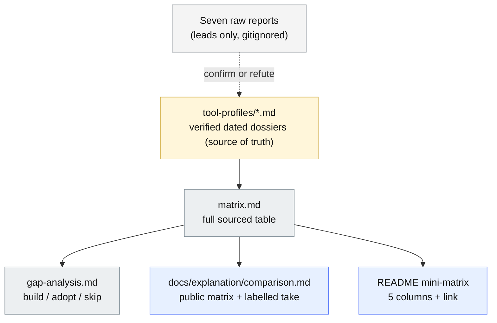
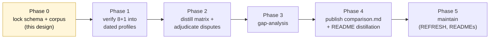

# Competitive landscape: verified comparison and best-in-class gap analysis - DESIGN

## TL;DR
- **What:** A verified, dated, primary-source comparison of `agent-skills-toolkit` against the 6-8 tools that actually compete with a tiered library Standard, plus the public matrix and a best-in-class gap analysis that come out of it.
- **Why:** The existing research base (seven cross-LLM reports in `_local/standards-comparison/`) contradicts itself on load-bearing facts and contains likely-fabricated tools and stats. For a project whose entire identity is deterministic rigor, "verified" cannot be a label we inherit from those reports - it must be a process we run.
- **How:** Co-design one schema where every dossier field maps 1:1 to a matrix column, verify each tool against primary sources into a dated profile, then distill the matrix, the gap analysis, and the public surfaces as views of that one dataset.
- **Status:** Approved design, re-based on v1.5.0 + the eval-target corpus run (2026-06-09; see section 3b). Next: implementation plan via writing-plans.

- **Date:** 2026-06-09
- **Deciders:** maintainer (jprisant), with Claude (Opus 4.8)
- **Builds on:** the verified competitive-positioning audit (`_local/audit/2026-05-29_skills-plugins-mcp.md`, the 108-agent pass), the README "What makes it different" section, and ADR 0021/0024/0026 (docs and site strategy).

---

## 1. Context and problem statement

The maintainer wants two things: (1) to understand how to make `agent-skills-toolkit` best in class, and (2) a verified, objective comparison of the toolkit against other widely used skill/plugin builder tools, living in `docs/`, the Astro site, and partly the README, backed by a dated, periodically-refreshed source-of-truth analysis per major tool.

There is already substantial raw material: seven cross-LLM research artifacts (Claude, ChatGPT, Gemini) in `_local/standards-comparison/`, and a verified competitive-positioning audit. The problem is that the seven reports are **uneven and contradictory**:

- The two Claude reports are careful (confidence labels, "what could not be verified" sections, a flagged live star-count discrepancy).
- The Gemini "Builder Tooling" report and the ChatGPT reports assert tools and statistics ranging from real-to-embellished (`mcpm.sh`, JFrog registry) to likely-fabricated (a cited arXiv ID `2604.16911`, "agentskills.in", "175k skills").
- They **disagree on a load-bearing fact**: whether the Agent Skills spec is governed by the Linux Foundation / AAIF. The careful Claude report says explicitly *not* as of June 2026 and sources it; the others assert it is.

A comparison matrix is only as credible as its weakest sourced cell. Publishing any unverified competitor claim on a rigor-branded project is an existential credibility risk. So the central design problem is: **how do we turn contradictory secondary research into a comparison we can defend cell-by-cell, and keep it cheap to refresh?**

## 2. Goals and non-goals

**Goals**
- A verified, dated, primary-source profile for each tool in a tight corpus.
- A neutral, fully-sourced comparison matrix distilled mechanically from those profiles.
- A best-in-class gap analysis (build X / adopt Y / deliberately-skip Z) grounded in the verified matrix.
- A public comparison surface (Astro page + README distillation) that survives scrutiny.
- An engaging, well-architected, diagram-rich record of the verification methodology itself.
- A refresh model that makes "keep it current" a mechanical chore, not a re-research.

**Non-goals**
- A comprehensive ecosystem census (20+ tools). The defensible comparison is against tools that grade or validate skill/plugin quality, not the whole landscape.
- Publishing the seven raw reports. They stay as gitignored, cited provenance.
- A new spine check or a Standard version bump. This is research and docs, not gate evolution.

## 3. Locked decisions

| # | Decision | Choice |
|---|---|---|
| D1 | Corpus scope | Tight and deep: 6 direct comparators + 2 baselines + 1 context entry |
| D2 | Verification | Agentic primary-source pass: each claim re-verified against the actual repo/official docs, dated, cited, confidence-labelled |
| D3 | Public framing | Neutral sourced matrix + a separately-labelled "where askit fits" take |
| D4 | Gap analysis | Included, as a dated internal roadmap input |
| D5 | Dossier folder | `docs/internal/research/tool-profiles/` (avoids "tools" overload) |
| D6 | Methodology doc | A first-class, verbose, engaging, mermaid-rich `METHODOLOGY.md`, written as a pre-registered protocol |

## 3b. Re-base on v1.5.0 and the eval-target corpus run (2026-06-09)

A parallel session shipped v1.5.0 (main `1fd44b7`; 358 tests; spine 29 / Standard 0.11 unchanged) and ran the first eval-target corpus batch while this design was being written. This initiative consumes that work; it does not duplicate it.

**Two axes, cross-wired (not merged):**
- *Proof axis (the corpus run):* runs askit's own gate AT real third-party libraries (`anthropics/skills`, `obra/superpowers`, `wshobson/agents`, ...) for graded reports + evaluator hardening. Answers "does our grader work on real code, and is it calibrated?" Lives in `_local/audit/anchor-runs/`.
- *Positioning axis (this initiative):* profiles the competitor TOOLS for a verified matrix + gap-analysis + public page. Answers "how does askit compare, and what makes it best in class?"
- They reinforce: the proof axis produces the evidence that makes the positioning credible.

**Integrations into this design:**
1. **`--profile plain-plugin` is the gate-run mechanism** (PR #118). Any verification step that runs askit against a competitor's repo uses the flag - no config is written into a tree we do not own. Supersedes the older "write askit.config.json into the target" approach.
2. **Provenance taxonomy is a new differentiator dimension** (dimension 16). ADR 0029 split askit's checks into objective / vendor-cited / house and turns house off for third-party grading. The matrix asks: "Does it separate portable-objective rules from house conventions?" askit does; competitors do not.
3. **Batch-1 findings are seed evidence.** The run already verified against primary sources, e.g. `anthropics/skills` ships a 1068-char description over the 1024 cap (U3) and `wshobson/agents` has broken reference links (U6). These are dated, citable facts for those tools' profiles, and the public `comparison.md` should LINK the rendered corpus reports as live proof.
4. **The U5 caveat keeps the gap-analysis honest.** askit's description scorer clusters good `use-when` descriptions at ~0.65 (under its 0.7 bar) and likely saturates; recalibration is pending. Any "description-quality" claim must note this. (ADR 0029 already made U5 house, so it does not affect outward grades.)

**Sharpened priority.** The gap-analysis is the prize: it is the one artifact that turns the landscape into a ranked best-in-class worklist and prioritizes every other effort, including which corpus targets and evaluator fixes matter. Sequence accordingly: profiles -> matrix -> gap-analysis first; treat publishing the public `comparison.md` as the lower-urgency tail that waits to cite a richer body of corpus reports.

## 4. The keystone: one schema, one dataset, three views

The design rests on a single idea: **every public artifact is a projection of one verified dataset.** Each profile answers the same fixed question set; each question is one matrix column. The matrix is not hand-maintained prose that drifts from its evidence - it is re-derivable from the profiles. Refreshing means re-verify, re-distill.



**Three densities of the same dataset:** the profile carries the full ~15 dimensions; the public matrix shows a curated ~10; the README shows 5. Progressive disclosure, applied to a comparison.

## 5. The corpus (8 profiles + 1 context entry)

**Direct comparators** (grade or validate skill/plugin quality):
1. `ccpi` / claude-code-plugins-plus-skills (jeremylongshore) - 100-point marketplace grader + package manager.
2. `plugin-eval` (wshobson/agents) - 3-layer static / LLM-judge / Monte Carlo certification + multi-harness generation.
3. `skill-check` (thedaviddias) - 0-100 SKILL.md linter, `--fix`, SARIF/HTML/GH-annotation output, GH Action.
4. `skills-check` (voodootikigod) - broadest single CI tool: semver-verify, lint, audit, budget, policy, eval-test, health.
5. `skills-validator` (moutons) - Rust 5-pass (spec / quality / refs / security / sizeyness).
6. `agent-skill-linter` (William-Yeh) - ~20 rules spec-compliance + publishing-readiness; delegates frontmatter to `skills-ref`.

**Baselines / anchors** (measured against, not rivals):
7. `skills-ref` (agentskills/agentskills) - the spec's canonical reference validator; the floor.
8. `skill-creator` (Anthropic) - the official authoring meta-skill with eval-driven iteration.

**Context entry** (lighter profile): Vercel `skills` CLI - de-facto cross-agent package manager + `skills.sh` telemetry; the distribution gravity well.

**Deliberately excluded, with reason:** `cclint` (scope is CLAUDE.md files, not skill packages); `davila7/claude-code-templates` (installer/monitor; validation is secondary); JFrog Agent Skills Registry (enterprise supply-chain; different category, and it appears only in the least-reliable source). Exclusions are recorded so the corpus is visibly deliberate, not arbitrary.

## 6. The shared schema (dossier field == matrix column)

**Per-profile header:** tool, repo URL, author/org, license, `last_verified: YYYY-MM-DD`, primary sources consulted.

**Dimensions** (each cell sourced + confidence-labelled). The first six are where askit is differentiated, so a neutral list that asks every tool these questions lets the position emerge from facts:

1. Unit of evaluation - per-skill / per-plugin / whole-library *(differentiator)*
2. Tiered and climbable? - none / pass-fail / score / tiered-with-burndown *(differentiator)*
3. Verdict basis - deterministic / LLM-judge / hybrid *(differentiator)*
4. Lifecycle coverage - which of author / validate / version / release / deprecate / govern *(differentiator)*
5. Cross-agent emission - none / single-format / multi-format native *(differentiator)*
6. Self-proving / dogfooded? - grades itself / runs its own gate in CI *(differentiator)*
7. Target spec(s) - agentskills.io base / Claude-extended / Codex / Gemini / multi
8. Validation depth - syntax / frontmatter-quality / refs+budget / strict-CI / manifest-vs-disk consistency
9. Versioning support - none / metadata.version / semver-enforced / contract-lock / provenance
10. Eval / test scaffolding - none / evals.json / should-trigger / regression / adversarial
11. Security posture - none / secret-scan / prompt-injection / sandbox / curl-pipe-bash
12. Output formats - human / JSON / SARIF / GH-annotations / HTML
13. Packaging / install - manual / git / npx-CLI / marketplace / GH Action
14. Maturity signal - stars / releases / last-commit (dated snapshot)
15. Governance / standing - first-party / community / foundation-track

The **public matrix** surfaces a curated subset (dimensions 1-8, 12, 14). The **README** surfaces dimensions 1, 2, 3, 5, 6.

## 7. File layout

**Internal (evidence + thinking), `docs/internal/research/`:**

```
docs/internal/research/
  README.md            <- folder inventory (G8)
  DESIGN.md            <- this spec
  METHODOLOGY.md       <- the verification protocol (engaging, mermaid-rich)
  matrix.md            <- full sourced comparison table (distilled)
  gap-analysis.md      <- build / adopt / skip, with rationale
  REFRESH.md           <- refresh runbook + cadence
  tool-profiles/
    README.md          <- inventory (G8)
    ccpi.md  plugin-eval.md  skill-check.md  skills-check.md
    skills-validator.md  agent-skill-linter.md  skills-ref.md
    skill-creator.md  vercel-skills-cli.md
```

**Public (distilled views):**
- `docs/explanation/comparison.md` - neutral matrix + a clearly-labelled "Where askit fits" take. Auto-renders to the Astro site (Pattern S generated view). Carries G7 frontmatter (`title`, `description`, `audience`, `level`).
- `README.md` - a 5-column mini-matrix + link, extending "What makes it different."

**Raw inputs:** `_local/standards-comparison/*` stay gitignored, cited as provenance, never published.

**Docs-to-site mechanism (verified):** `site/astro.config.mjs` runs `generate()` from `gen-docs-site.mjs` at config load, emitting the Diataxis quadrants from `docs/` into `site/src/content/docs/{quadrant}/` (gitignored, rebuilt every run). `docs/internal/**` is excluded, so the research artifacts carry no public-frontmatter or rendered-link burden. The one public page costs an entry in `site/scripts/route-manifest.txt` (ADR 0026 route-parity guard) and must pass the rendered-link guard.

## 8. The verification process (summary; full protocol in METHODOLOGY.md)

For each tool, a verification agent reads **primary sources only** (the actual GitHub repo, releases, official docs) and fills the schema, attaching to every cell a citation, a `verified` date, and a confidence label. The seven reports are leads to confirm or refute, never evidence.

- **Disputed claims get a second, skeptical pass.** The AAIF-governance contradiction is the worked example.
- **Embellishment guard:** any tool or stat appearing only in the unreliable sources is presumed false until a primary source is found; if none, it is recorded as "unverified - excluded."
- **Mechanism:** parallel verification subagents (the `deep-research` skill, one pass per tool). Optional escalation to an adversarial-refute Workflow on explicit go.

## 9. The methodology document (new first-class deliverable)

`METHODOLOGY.md` is not a terse internal note. It is a verbose, engaging, well-architected document that doubles as a credibility artifact and a reusable protocol. It is written **before** verification runs (pre-registration), so the dated profiles are evidence that the committed protocol was followed.

Required information architecture and diagrams:
- An at-a-glance overview diagram (the verification pipeline).
- The evidence hierarchy (what counts as primary vs secondary vs tertiary).
- The claim lifecycle as a state machine (lead -> candidate -> verified / refuted / unverified-excluded).
- The confidence-labelling rubric (a decision flow).
- The disputed-claim adjudication procedure, with the AAIF case worked end to end.
- The embellishment guard.
- The refresh loop.
- A short "how to read a profile" key.

A distilled "How we verified this" callout on the public `comparison.md` links back to it, so the public surface advertises the rigor rather than hiding it.

## 10. Build sequence



- **Phase 0** - lock schema + corpus (this design, ratified).
- **Phase 1** - verify the 8+1 into dated profiles (parallel subagents, primary sources). `METHODOLOGY.md` is finalized at the top of this phase, before any verification runs.
- **Phase 2** - distill `matrix.md`; record disputed-claim rulings in `METHODOLOGY.md`.
- **Phase 3** - `gap-analysis.md` from the verified matrix. **This is the prize:** the ranked best-in-class worklist that prioritizes every other effort, including which corpus targets and evaluator fixes matter.
- **Phase 4** - publish `comparison.md` (+ route manifest, frontmatter) and the README distillation. Publish is the lower-urgency tail: defer until a richer body of corpus reports exists to link as live proof.
- **Phase 5** - `REFRESH.md` + folder READMEs; optional light ADR recording the methodology/positioning stance.

## 11. Gate and convention interactions (handled in the plan)
- `G7` frontmatter on `comparison.md` (public page).
- `site/scripts/route-manifest.txt` updated for the new route; rendered-link + route-parity guards pass.
- `G8` README inventories for the two new `docs/internal/research/` folders.
- No spine change, no Standard version bump, no `library.json` `standard` change.
- All written prose avoids U+2014/U+2013 per the maintainer's global rule.

## 12. Risks and open questions
- **Fast-moving targets.** Star counts, releases, and even tool existence drift weekly; mitigated by dated snapshots and the refresh loop.
- **Adjudication load.** More than one report-level contradiction may surface; the protocol handles them uniformly, but Phase 2 should budget for several.
- **Verification mechanism.** Default is parallel `deep-research` subagents; an adversarial Workflow is available on explicit go for higher confidence on disputed cells.
- **Open:** whether to ship the optional positioning ADR in Phase 5, and whether the public page should embed a short methodology summary inline or link out only.
