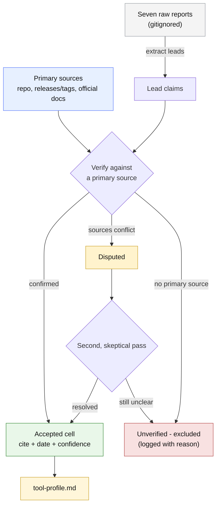
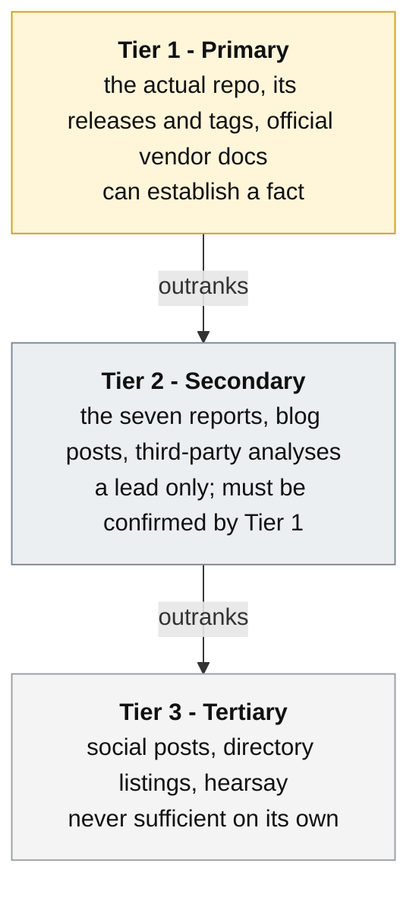
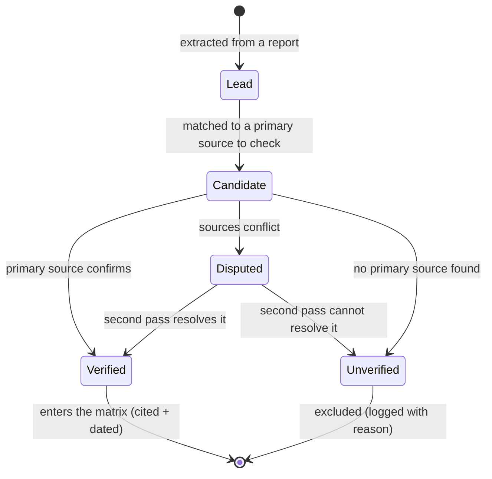
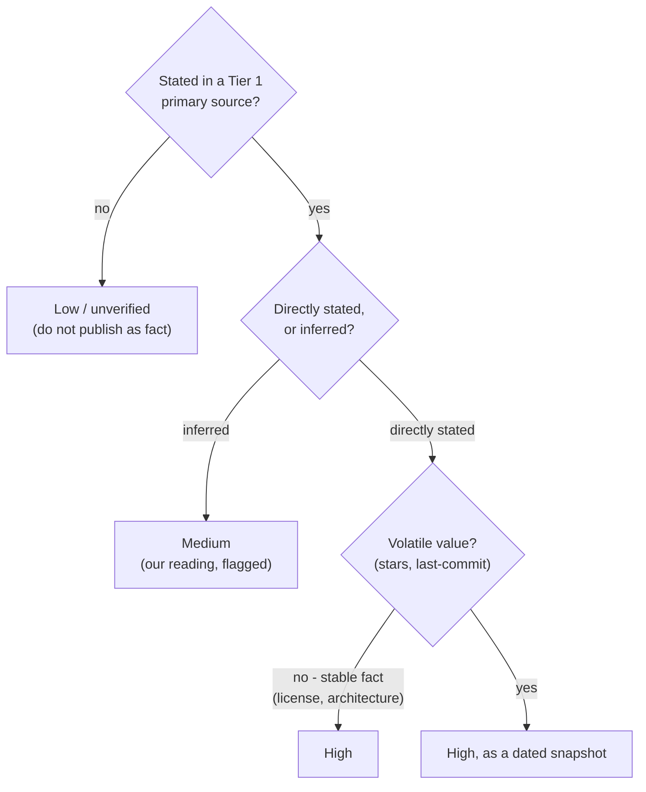
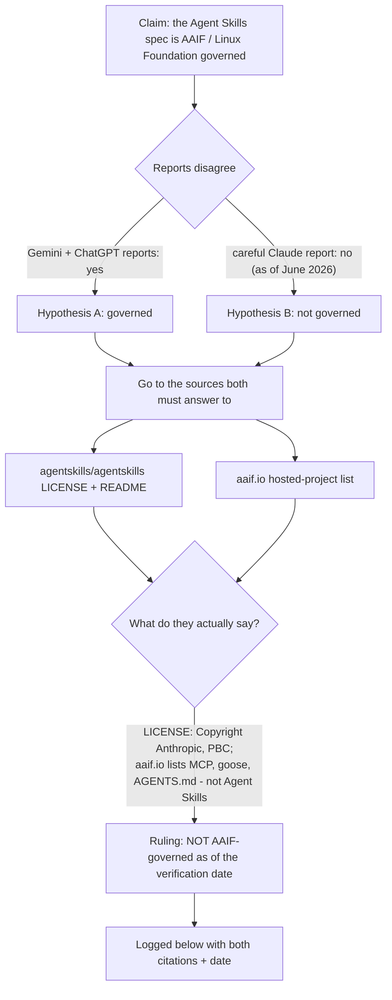
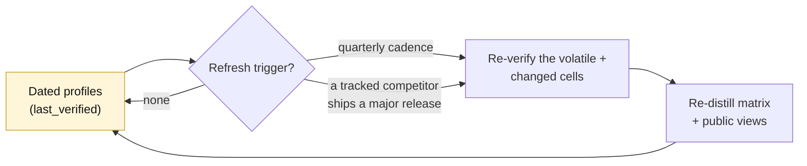

# How we verify: the comparison methodology

> A pre-registered protocol. We wrote down exactly how we would establish every fact **before** we went looking for the answers. The dated profiles in `tool-profiles/` are the evidence that we followed it. If a claim in the public matrix cannot be traced back through this protocol to a primary source, it is a bug, not a footnote.

## Why this document exists

Most comparison tables are an act of faith. Someone reads around, forms an impression, and writes confident cells: "Tool X: limited validation." You are asked to trust the author's diligence, because the work that would let you check it was never written down.

This project cannot trade on faith. Its entire claim is that quality should be **proven deterministically**, not asserted. A comparison that grades other tools by vibe while we sell rigor would be self-refuting. So we hold our own competitive research to the same bar we hold a plugin to: every load-bearing claim is sourced, dated, and reproducible, and the process that produced it is open for inspection.

That is what this document is. It is the protocol, the worked examples, and the rules of evidence. It is deliberately verbose, because the point is not to summarize the result but to make the *method* legible enough that a skeptic could re-run it and land in the same place.

There is a second reason. The raw material we started from is unreliable. We hold seven cross-LLM research reports in `_local/standards-comparison/`. Two of them (the Claude reports) are careful and self-aware. The others assert tools, statistics, and even an academic citation that range from embellished to fabricated, and they contradict each other on facts that matter, such as who governs the Agent Skills specification. A protocol is the only honest way to turn that pile of leads into something we are willing to publish.

## The protocol at a glance

Read it as a one-way street. Reports can only ever *suggest* a claim. A claim only becomes a matrix cell after a primary source confirms it. Anything that cannot reach a primary source does not get a quiet downgrade to "probably true"; it is excluded and the exclusion is logged.

## The rules of evidence

Not all sources are equal, and the whole protocol hangs on saying so out loud.

- **Tier 1, primary.** The tool's own repository (README, source, `package.json`/`Cargo.toml`, CI config), its GitHub releases and tags, and the official documentation of the vendor or spec it targets. Only Tier 1 can establish a fact that lands in the matrix.
- **Tier 2, secondary.** The seven reports, blog posts, and third-party write-ups. These are where leads come from. They never establish a fact by themselves; they tell us what to go check.
- **Tier 3, tertiary.** Social posts, marketplace listings, aggregator counts, and anything anonymous. Useful for discovering that a tool exists; never sufficient to assert anything about it.

The discipline is simple to state and easy to violate under time pressure: **a Tier 2 claim with no Tier 1 confirmation is not a weak fact, it is a non-fact.** It does not appear.

## The life of a claim

Every cell in the matrix began as a sentence in a report. Here is the journey it has to survive.

A claim is never "mostly there." It is Verified (with a citation and a date) or it is out. The two terminal states are the only two exits. This is the same spirit as the deterministic gate: a real verdict, not a sentiment.

## How a cell earns its confidence label

Verified is not binary in *strength*. A license stated in a `LICENSE` file is bedrock; a star count is true only on the day you read it. The confidence label encodes that difference so a reader knows how much weight a cell can bear.

- **High** - directly stated in a primary source and stable (license, supported spec, whether it ships a GitHub Action).
- **High, dated snapshot** - directly stated but volatile (stars, releases, last-commit). True as of `last_verified`, and labelled so no one mistakes it for permanent.
- **Medium** - our inference from primary evidence (for example, judging "validation depth" from reading the source), explicitly flagged as a reading.
- **Low / unverified** - not confirmable in Tier 1. Never published as fact; either excluded or shown as an explicit "unverified" with the reason.

## When sources fight: adjudication

The interesting cases are the contradictions. The protocol resolves them the same way every time: name the competing hypotheses, go to the primary sources both sides would have to answer to, and let those sources rule. The decision and its evidence are written into this document's adjudication log so the call is auditable.

Our canonical example is the governance of the Agent Skills specification, where the reports flatly disagree.

The point of the diagram is not the answer. It is that the answer is forced by primary sources that either side of the dispute would have to accept, rather than by which report sounded more confident. Every adjudication in this project follows that shape.

### Adjudication log

> Filled during Phase 2. Each entry: the claim, the conflicting sources, the primary evidence consulted, the ruling, and the date. The AAIF case is the first expected entry; others are added as contradictions surface.

| Claim | Conflicting sources | Primary evidence | Ruling | Date |
|---|---|---|---|---|
| _e.g._ Agent Skills spec is AAIF-governed | Gemini/ChatGPT reports (yes) vs Claude report (no) | `agentskills/agentskills` LICENSE + README; `aaif.io` project list | _to be recorded in Phase 2_ | _pending_ |

## The embellishment guard

Some of the raw reports invent things. A guard exists specifically to catch fabrication before it can launder itself into our matrix through repetition.

The rule: **a tool, capability, or statistic that appears only in the unreliable secondary sources is presumed false until a Tier 1 source is found.** If none is found, it is recorded as "unverified - excluded," with a one-line note on where the phantom came from. We do not silently drop it, because the absence is itself a finding worth keeping.

Known phantoms to watch for, drawn from the current report set: a cited arXiv identifier that does not resolve, a registry domain that does not exist, and skill-count statistics with no telemetry behind them. Each is a reminder that confident prose is not evidence.

## Anatomy of a profile (how to read one)

Every file in `tool-profiles/` follows the same shape, so the matrix can be distilled mechanically and a reader can scan any two profiles side by side.

1. **Header** - tool, repo URL, author/org, license, `last_verified: YYYY-MM-DD`, and the list of primary sources consulted.
2. **The fifteen dimensions** - one short, sourced answer each, with an inline citation and a confidence label. These are the matrix columns; the mapping is 1:1 by design.
3. **Notes** - anything that does not fit a cell: caveats, divergences, things that were checked and found absent.
4. **Open items** - claims we could not verify and what it would take to close them.

A cell without a citation is incomplete by definition. The structure makes that impossible to hide.

## Keeping it true: the refresh loop

A dated fact is honest about its own decay. The profiles carry `last_verified`, and the matrix is a projection of the profiles, so staying current is a bounded, mechanical loop rather than a fresh research project.

`REFRESH.md` holds the runbook: which cells are volatile (and so always re-checked), how to re-run the verification pass, and how to regenerate the matrix and the public surfaces from the refreshed profiles. The cadence is quarterly, plus an event trigger whenever a tracked tool ships a major release.

## Who does the work

Verification fans out: one agent per tool, each reading that tool's primary sources and filling the schema in isolation, so no tool's findings contaminate another's. The default engine is the `deep-research` skill, run once per tool. For cells that survive into "Disputed," or when a higher-confidence pass is wanted, an adversarial panel can be run as a multi-agent workflow whose job is to actively *refute* each shaky cell before it is accepted; that heavier mode is opt-in.

The eval-target corpus run is a standing source of seed evidence. Where it has already pointed askit's own gate at a tool's repository (under `--profile plain-plugin`), its dated findings are Tier 1 primary evidence a profile can cite directly, and the rendered reports under `_local/audit/anchor-runs/` are the live proof the public comparison links to. Gate-runs against a competitor's tree always use `--profile plain-plugin`, so no config is written into code we do not own.

Whichever engine runs, the rules above do not change. The engine decides how much horsepower we spend; the protocol decides what counts as true.

## The one rule, restated

If you remember nothing else: **a report can only suggest; a primary source decides; and anything that cannot reach a primary source does not appear.** Everything in this document is an elaboration of that sentence.
