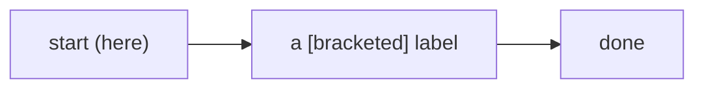
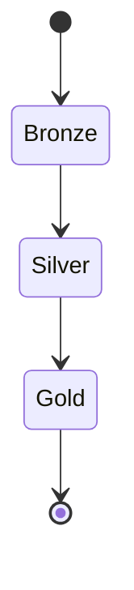

# A valid diagram

A flowchart whose labels contain quoted brackets and parens (which rule 3 ignores):

```mermaid
flowchart LR
  A["start (here)"] --> B["a [bracketed] label"]
  B --> C["done"]
```

And a second diagram using the longer `stateDiagram-v2` keyword:

```mermaid
stateDiagram-v2
  [*] --> Bronze
  Bronze --> Silver
  Silver --> Gold
  Gold --> [*]
```
