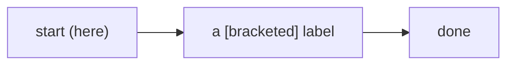
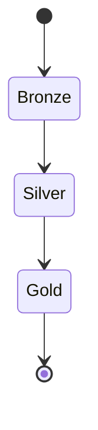
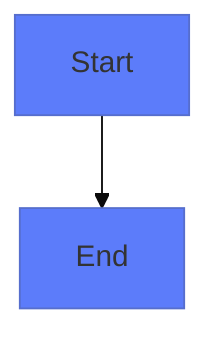
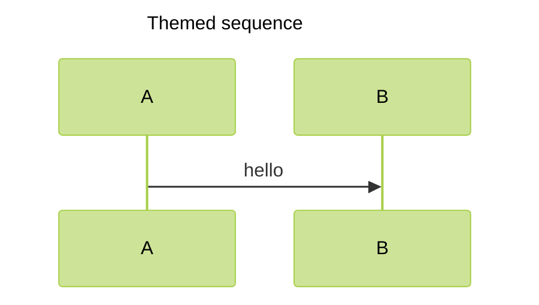

# A valid diagram

A flowchart whose labels contain quoted brackets and parens (which rule 3 ignores):

And a second diagram using the longer `stateDiagram-v2` keyword:

A branded diagram that opens with an `%%{init}%%` theming directive and a `%%` comment whose prose
carries a stray `(` bracket (both ignored before the keyword and bracket-balance rules):

And a diagram whose type is preceded by a `---` YAML config block:

